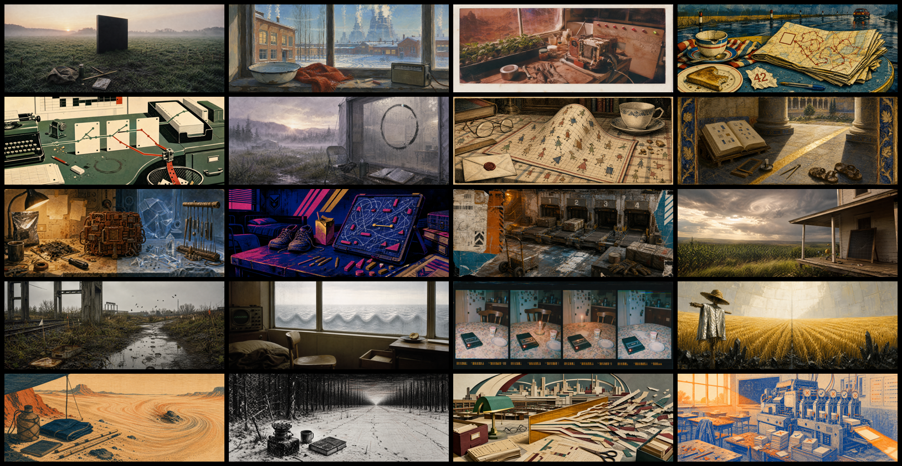

# Lost Science-Fiction Covers — Ranger Archive V2

这是为 20 个研究项目重新设计的原创科幻横幅。V2 不再追求统一的深空概念图，而把每个项目设计成一本来自不同年代、不同出版文化的“遗失科幻书”：

旧版图片仍保存在 [`assets/missions`](assets/missions)，[旧版总览](contact-sheet.png)也保留作比较；V2 图片位于 [`assets/missions-v2`](assets/missions-v2)。

## V2 视觉原则

- 画幅：`1983 × 793`，约 `2.5:1`，适合 PR 顶部横幅。
- 二十种出版媒介：风景摄影、水粉科普画、拍立得、漫画、丝网印刷、水彩、铜版画、蛋彩画、技术喷绘、街机印刷、拼贴、35mm 胶片、纪实摄影、艺术电影、家庭相册、文学绘画、木版画、炭笔版画、现代主义拼贴和孔版印刷。
- 人不一定出镜，但必须留下使用痕迹：围巾、搪瓷盆、土豆、胶带、杯子、鞋、手套、相册、旧外套、笔记本和灯。
- 科幻作品通过一眼可辨的普通环境或物件进入画面，不复刻演员、角色造型、飞船或电影镜头。
- 科学主题表现为现实里的一处异常，不再默认画成发光圆环、轨道和网络。
- V2 完全取消了统一的 Ranger 探测器。
- 图中不放标题、公式说明、品牌、作品角色或标识；文字由 PR 正文承载。
- 科幻作品只作为叙事隐喻，不复刻受版权保护的具体镜头、人物或美术资产。

## 二十个任务

| # | 研究项目 | 科幻作品镜头 | 画面叙事 | 文件 |
|---:|---|---|---|---|
| 01 | Issue #148：临界点比值与 √5 | 《2001：太空漫游》 | 黎明草地上的黑色石碑、测量包和两种种植网格 | [`01-issue-148-first-ratio-v2.png`](assets/missions-v2/01-issue-148-first-ratio-v2.png) |
| 02 | Issue #35：电声相互作用 | 《流浪地球》 | 雪窗、搪瓷盆和老收音机与远处行星发动机共同振动 | [`02-issue-35-planet-sings-v2.png`](assets/missions-v2/02-issue-35-planet-sings-v2.png) |
| 03 | Issue #114：Rust 张量库验证 | 《火星救援》 | 火星温室里的土豆、胶带和逐项受测的修补机器 | [`03-issue-114-untested-machine-v2.png`](assets/missions-v2/03-issue-114-untested-machine-v2.png) |
| 04 | Issue #71：隐函数恢复 | 《银河系漫游指南》 | 雨中公路餐桌上的毛巾、茶和从 42 倒推的破旧地图 | [`04-issue-71-answer-first-v2.png`](assets/missions-v2/04-issue-71-answer-first-v2.png) |
| 05 | Issue #82：Certified tensor DSL | 《我，机器人》 | 三张规则卡让正确纸带通过，把错误分支剪进废纸篓 | [`05-issue-82-language-of-rules-v2.png`](assets/missions-v2/05-issue-82-language-of-rules-v2.png) |
| 06 | Issue #73：2D-TFIM 几何相位 | 《降临》 | 雾地语言站的湿玻璃上，墨迹接缝留下微小相位偏移 | [`06-issue-73-phase-remembers-v2.png`](assets/missions-v2/06-issue-73-phase-remembers-v2.png) |
| 07 | Quantum Geometry | 《平面国》 | 维多利亚书桌上的格纹桌布从平面隆起为曲面 | [`07-quantum-geometry-curved-state-space-v2.png`](assets/missions-v2/07-quantum-geometry-curved-state-space-v2.png) |
| 08 | Issue #230：Bethe ansatz 能量密度界 | 《教典》 | 修道院两根柱子的阴影夹住唯一的金色证明区间 | [`08-issue-230-proof-horizon-v2.png`](assets/missions-v2/08-issue-230-proof-horizon-v2.png) |
| 09 | Issue #115：Occam Circuit Rust 移植 | 《挽救计划》 | 人类咖啡杯与异星材料之间，一台脆弱工具被重新造好 | [`09-issue-115-rebuild-the-tool-v2.png`](assets/missions-v2/09-issue-115-rebuild-the-tool-v2.png) |
| 10 | Issue #33：Extreme-efficiency VQE | 《安德的游戏》 | 宿舍战术棋盘上，一步金色短解穿过无数失败涂痕 | [`10-issue-33-efficient-path-v2.png`](assets/missions-v2/10-issue-33-efficient-path-v2.png) |
| 11 | Issue #36：Interacting Thouless pump | 《苍穹浩瀚》 | 小行星货运码头完成一个机械周期，货箱却前进一格 | [`11-issue-36-cycle-transports-v2.png`](assets/missions-v2/11-issue-36-cycle-transports-v2.png) |
| 12 | Issue #129：ED/FCI workbench | 《星际穿越》 | 玉米地、旧农舍、儿童模型和弯向天空异常的黑板网格 | [`12-issue-129-state-space-crossing-v2.png`](assets/missions-v2/12-issue-129-state-space-crossing-v2.png) |
| 13 | Issue #121：Sign-problem-free hunter | 《路边野餐》 | 雨后禁区中零件悬浮，只有普通泥脚印仍然安全 | [`13-issue-121-safe-path-v2.png`](assets/missions-v2/13-issue-121-safe-path-v2.png) |
| 14 | Issue #122：开放量子物质临界性 | 《索拉里斯星》 | 空椅、半只苹果和窗外重复示波器波形的海 | [`14-issue-122-ocean-answers-v2.png`](assets/missions-v2/14-issue-122-ocean-answers-v2.png) |
| 15 | Issue #123：非 Markovian Floquet 系统 | 《递归》 | 四张家庭相片中，旧日物件和影子侵入后来的时刻 | [`15-issue-123-memory-loops-v2.png`](assets/missions-v2/15-issue-123-memory-loops-v2.png) |
| 16 | Issue #15：Chiral graviton | 《死神永生》 | 黑色晶体土壤上的麦田向相反手性倒伏，留下银色外套 | [`16-issue-15-chiral-gravity-v2.png`](assets/missions-v2/16-issue-15-chiral-gravity-v2.png) |
| 17 | Hydrodynamics | 《沙丘》 | 木版沙漠中，单颗沙粒渐渐汇成宏观流线与涡流 | [`17-hydrodynamics-emergent-flow-v2.png`](assets/missions-v2/17-hydrodynamics-emergent-flow-v2.png) |
| 18 | Issue #158：长程 Mermin–Wagner | 《黑暗森林》 | 黑白雪林从随机枝干逐渐排列成长程秩序 | [`18-issue-158-long-range-order-v2.png`](assets/missions-v2/18-issue-158-long-range-order-v2.png) |
| 19 | Issue #128：Trotter 严格误差界 | 《基地》 | 图书馆纸带的众多未来被一把透明误差尺严格裁定 | [`19-issue-128-bounded-future-v2.png`](assets/missions-v2/19-issue-128-bounded-future-v2.png) |
| 20 | Issue #133：The Problem Factory | 《最后的问题》 | 清晨教室里的问题印刷机筛选卡片，送出下一张空白问题 | [`20-issue-133-question-seed-v2.png`](assets/missions-v2/20-issue-133-question-seed-v2.png) |

## PR 中的推荐用法

20 组可直接配图使用的英文＋中文原创题记见 [`CAPTIONS-v2.md`](CAPTIONS-v2.md)。

每个项目只使用自己的横幅，并在图片下方放置三层文字：

1. **作品短引文**：不超过一句，并在发布前核对版本与译文版权；
2. **原创题记**：把科幻母题转译为这个项目的认识论动作；
3. **项目状态句**：只陈述本 PR 真正完成、证明或尚未跨过的验收门。

整组总结 PR 仍可按照五幕顺序排列，每幕先给一段短序，再展示四张项目卡。V2 的系列感来自“二十本遗失的科幻书”，不再依赖同一个角色、配色或构图。
