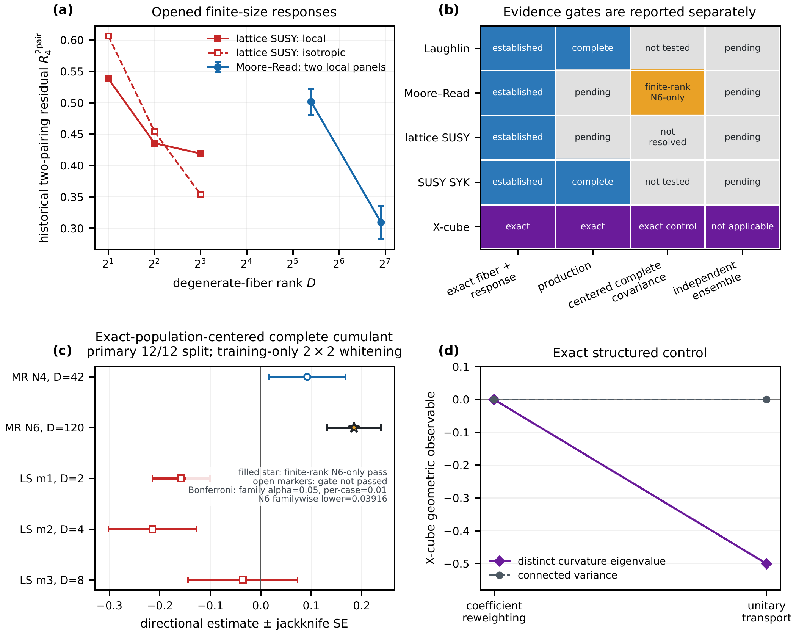
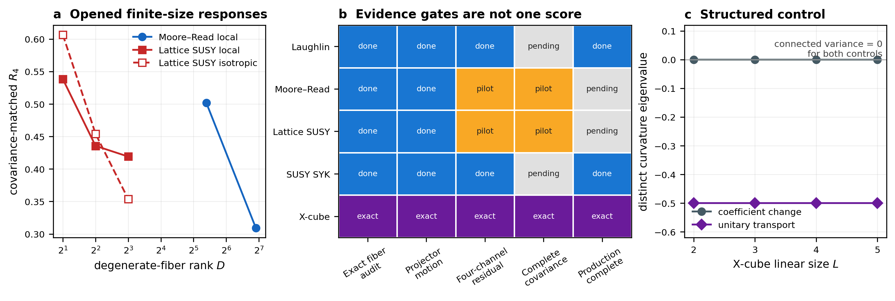

# task_05: Spectral Silence and Geometric Chaos
Status: 🟡 Ongoing
Last Updated: 2026-08-21 (v164) [Codex]

Provenance: `docs/plans/2026-07-28-large-scale-geometric-eth-companion-design.md`
Primary execution zone: `01_task_folder/task_05/script/`
Article target: `overleaf_sync/geometric_eth_large_scale/`
PRL submission target: `overleaf_sync/geometric_eth_prl/`
Cross-mechanism article target: `overleaf_sync/cross_mechanism_geometric_eth/`
Paper I PRB target: `overleaf_sync/exactly_degenerate_quantum_chaos_prb/`
Paper II theory target: `overleaf_sync/geometric_eth_theory/`
Main outputs: `script/output/spectral_silence_v2.{json,npz}`, `script/output/matrix_element_geometric_eth_v3.{json,npz}`, `script/output/topological_holonomy_v3.{json,npz}`, `script/output/protected_parent_audit_v4.json`, `script/output/matrix_free_regression_v4.json`, `script/output/protected_geometric_eth_v4.{json,npz}`, `script/output/protected_scaling_inference_v4.{json,npz}`, `script/output/geometric_eth_universality_inference_v6.{json,npz}`, `script/output/continuum_lll_replication_inference_v6.{json,npz}`, `script/output/moore_read_v9/moore_read_pilot_v9.json`, `script/output/lattice_susy_v10/lattice_susy_pilot_v10.json`, `script/output/xcube_v11/xcube_geometric_control_v11.json`, `script/output/cross_complete_covariance_v12.json`, `script/output/cross_mechanism_geometric_eth_v12.json`, and the immutable v1/v2/v3 artifacts
Article: `script/output/spectral_silence_and_geometric_chaos_v4.pdf`
PRL package: `script/output/geometric_eth_prl_main_v5.pdf`, `script/output/geometric_eth_prl_supplement_v5.pdf`, and `script/output/geometric_eth_prl_cover_letter_v5.pdf`
Cross-mechanism package: `script/output/mechanism_dependent_geometric_eth_v12.pdf` and `script/output/mechanism_dependent_geometric_eth_supplement_v12.pdf`
Paper I v13 package: `script/output/paper1_prb_v13/exactly_degenerate_quantum_chaos_v13.pdf`, `script/output/paper1_prb_v13/exactly_degenerate_quantum_chaos_supplement_v13.pdf`, and `script/output/paper1_prb_v13/delivery_audit_v13.json`
Paper II v14 package: `script/output/geometric_eth_theory_v14/geometric_response_exactly_degenerate_bundles_v14.pdf`, `script/output/geometric_eth_theory_v14/geometric_response_exactly_degenerate_bundles_supplement_v14.pdf`, and `script/output/geometric_eth_theory_v14/delivery_audit_v14.json`
Two-paper delivery: `script/output/two_paper_delivery_v14/two_paper_manifest_v14.json`, `../../docs/2026-08-21-two-paper-pr-body.md`, and `../../docs/2026-08-21-two-paper-reproducibility.md`
Paper II verdict: The exact finite-channel cumulant identity holds under independent centered-channel assumptions, but the prospective chiral-index random-channel closure fails at all three validation sizes.  The machine-readable title gate is false, so the delivered article uses the bounded title *Geometric Response of Exactly Degenerate Quantum State Bundles* and does not claim an established Geometric ETH.
Verdict: Exact degeneracy makes the energy connected SFF vanish while projector geometry remains informative. The v4 protected-parent extension realizes an exact two-parameter, noncommuting, quasi-local family with constant zero-mode degeneracy, an open gap, moving projector, and vanishing intrafiber tangent. Across the complete protected \(N=3,\ldots,7\) sequence and three density/bond/current classes, the four-channel non-Gaussian excess decreases but every preregistered simple asymptotic law fails N=6 and sealed N=7 prediction, selecting `no_controlled_universality`. An independently implemented continuum-LLL \(V_0\) parent passes all exact-zero-mode and response gates through \(N=5\), yet rejects every no-refit Kapit--Mueller law across the complete nine-case grid, selecting finite-size `parent_dependent_geometry`. The v7 extension supplies a genuinely different supersymmetric/cohomological protection mechanism: generic charge-resolved cubic $\mathcal N=2$ SYK has exact/coexact Hodge response branches; the complete $N=8,10,12$ pilot rejects both registered separable covariance nulls; and the independently sealed $N=14$ sparse pair does so again, selecting `cohomological_non_gaussian_class`. This establishes finite-size response memory beyond the frozen separable collapsed/Hodge covariance-null family, not intrinsic non-Gaussianity after complete nonseparable covariance matching and not asymptotic Geometric ETH. The frozen v5 PRL package remains unchanged, while v6/v7 define the cross-parent and cross-mechanism scientific boundary.

## Objective

Create an independent large-scale numerical companion, *From Local Repulsion to Global Geometry: Large-Scale Tests of Geometric ETH*. Expand the physical ensemble to 20000 tangent pairs, extend exact root-response calculations through \(D=800\) across the Jacobi boundary-atom transition, replace rough histograms and sparse bars with uncertainty-aware publication graphics, and deliver a separately audited PDF without importing task-04 executables or artifacts.

**Scope addendum (2026-07-28) [Human/Codex]:** Expand the same article around *Spectral Silence and Geometric Chaos in an Exactly Degenerate Topological Manifold*: contrast the identically trivial energy SFF with the nontrivial curvature SFF, add a same-parent structured tangent control, vary intrafiber spectral and projector-geometric chaos independently, derive the finite-Jacobi/atom form factor analytically, and retain explicit non-SUSY and nondynamical claim boundaries.

**Scope addendum (2026-07-28) [Human/Codex]:** Extend the delivered article with both approved post-delivery programs: a gauge-invariant four-channel Wick-factorization test on a genuine fixed-two-quasihole particle-number sequence, and a closed twist-torus calculation that separates fixed \(U(1)\) Chern topology from tunable \(SU(D)\) Wilson-loop holonomy.

**Scope addendum (2026-08-01) [Human/Codex]:** Freeze the audited v4 evidence base and complete the recommended PRL-first route: a standalone Letter within the current APS word-equivalent limit, self-contained Supplemental Material, cover letter, significance statement, submission checklist, deterministic one-command build, full-page visual audit, and fail-closed delivery manifest. External upload and journal submission remain human-authorized actions.

**Scope addendum (2026-08-01) [Human/Codex]:** Execute the approved high-ceiling third-model program: formulate a common one-sided/two-sided response-complex framework, implement generic charge-resolved $\mathcal N=2$ SYK as a genuinely SUSY/cohomological protection mechanism, build a pre-$R_4$ Hodge-resolved Gaussian null, and test it behind a sealed $N=14$ information barrier with an analytic decomposable-three-form control. Keep the existing v5 PRL package and v6 accepted artifacts immutable.

**Scope addendum (2026-08-04) [Human/Codex]:** Execute the approved complete-covariance follow-up: replace separable response nulls by an ambient, gauge-invariant three-pairing Wick U-statistic that exhausts covariance and pseudocovariance contributions to the registered four-channel invariant; validate it against an explicit small-$N$ real-augmented covariance oracle; develop and power the test on opened $N=8,10,12,14$ data; and reserve a newly sealed $N=16$ calculation for the prospective confirmatory verdict. Keep all v7 sources and accepted outcomes immutable.

**Scope addendum (2026-08-16) [Human/Codex]:** Extend the exact-degeneracy program across independent condensed-matter mechanisms: a bosonic Moore--Read three-body clustering parent, hard-core lattice supersymmetry on independence-complex cohomology, and an X-cube commuting-projector control. Apply one response convention, keep complete-covariance and production gates explicit, and do not infer asymptotic or cross-mechanism universality from opened finite-size panels.

**Scope addendum (2026-08-17) [Human/Codex]:** Replace the proposed single overloaded long manuscript by two back-to-back papers. Paper I, *Exactly Degenerate Quantum Chaos: Non-Abelian Quantum Geometry as a Probe*, will be an evidence-led PRB long article built from the audited condensed-matter, cohomological, and stabilizer calculations. Paper II, *The Geometric ETH: Statistical Closure on Degenerate Quantum State Bundles*, will enter research-article writing only after an independent effective-channel theorem, a sealed chiral-index test, and a primary-source BPS/black-hole literature audit pass. Preserve the v12 short article and Supplement as immutable historical delivery.

**Scope addendum (2026-08-21) [Human/Codex]:** The original 14--18-page Paper I estimate is superseded by the human request for a detailed, complete PRB long-form treatment. The accepted delivery contract is 20--26 pages, and the canonical main text is 23 pages. This presentation-scope change does not alter the frozen evidence registry, statistical gates, or scientific claim boundaries.

## Version Log

**v1 (2026-07-28) [Codex]:** Created task_05 from the human's request for substantially larger calculations, improved figures, and a separate PDF. Froze the independent-workspace rule, physical \(20000\)-pair train/validation/test design, fixed-eigenvalue-budget rank sequence through \(D=800\), exact atom handling, hierarchical inference, five-figure visual contract, manuscript architecture, and completion gates.

**v2 (2026-07-28) [Codex]:** Saved the eight-task implementation plan `docs/plans/2026-07-28-large-scale-geometric-eth-companion-implementation-plan.md`. It specifies task-local module interfaces, test-driven physical/covariance/scaling runners, exact atom labels, matrix-level statistical estimators, five figure contracts, a separate REVTeX source tree, and a fail-closed one-command delivery audit. Execution is inline because unrequested subagents are prohibited.

**v3 (2026-07-28) [Codex]:** Built the independent `lgeth` numerical package. Task 05 now owns its combinatorics, Kapit--Mueller lattice, channel, Jacobi, Grassmannian, root-operator, and statistics algorithms; an AST import audit forbids task-04 dependencies. Four focused tests verify \(D(3,20)=800\), \(M(3,20)=680\), \(120\) exact atoms on each boundary when \(r=800,M=680\), algebraic atom removal, and \(YY^\dagger=I\).

**v4 (2026-07-28) [Codex]:** Generated the preregistered \(20000\)-pair Kapit--Mueller physical ensemble in eight independently seeded blocks and 104.33 s. The fixed split is \(12000/4000/4000\); every sample has active and curvature rank \(50\), the parent kernel width is \(5.78\times10^{-16}\), the external gap is \(0.106672\), and no exact \(\pm1\) atoms occur. The reduced deterministic runner test passes.

**v5 (2026-07-28) [Codex]:** Fit the covariance model on \(1024\) training row spaces, selected the eigenvalue floor \(0.05\) from five candidates using validation data only, and generated \(10000\) Haar plus \(10000\) covariance-deformed spectra. On the untouched \(4000\)-matrix test set, the deformed model reduces density \(L^1\) error from \(0.290988\) to \(0.123720\) (\(57.48\%\)) while matching the mean gap ratio within \(6.06\times10^{-4}\). The registered outcome is `leading_covariance_capture`; six focused tests pass.

**v6 (2026-07-28) [Codex]:** Completed all seven root-response cases with no sample-count reduction: \(2000,2000,2000,1000,1000,500,250\) matrices at \(D=16,50,112,210,352,546,800\). Interior density error falls \(0.43375\to0.05226\), participation rises \(0.77394\to0.97000\), and the exact atom transition produces \(6+6\) atoms at \(D=546\) and \(120+120\) at \(D=800\). All checkpoint files are resumable, all six scaling gates pass, and the nine accumulated focused tests pass.

**v7 (2026-07-28) [Codex]:** Added \(10000\)-replicate seed-block/matrix-level simultaneous bands for density, \(P(r)\), number variance, rigidity, form factor, and moments through eighth order. Covariance improvement holds at every registered KDE bandwidth; local ratios are stable under bulk-window, unfolding, and binning choices. Finite-size fits favor a free density exponent \(p=0.5929\), \(D^{-1}\) for the gap-ratio difference, and \(D^{-1/2}\) for participation deficit, but are explicitly treated as finite-range evidence rather than a thermodynamic theorem. All six inference gates and three analytic statistics tests pass.

**v8 (2026-07-28) [Codex]:** Generated and visually audited five \(7.0\)-inch vector figures with \(2100\)-pixel, \(300\)-dpi previews: physical density/residuals/moments; the local-to-global hierarchy; continuous-spectrum/atom crossover; confidence-aware size fits; and the covariance mechanism. Removed two data-label collisions after original-resolution inspection. The figure manifest hashes all seven numerical inputs and every output, and generated LaTeX macros/tables carry the exact registered values.

**v9 (2026-07-28) [Codex]:** Wrote and compiled the independent REVTeX PRB-style article *From Local Repulsion to Global Geometry: Large-Scale Tests of Geometric ETH*. The 10-page PDF has correct authors and affiliations, five vector figures, an analytic signature-compression/Jacobi derivation, the exact \(r-M\) atom theorem, a covariance-deformed ETH ansatz, held-out physical results, finite-size limitations, and a numerical appendix. The final log has no undefined citations/references, overfull boxes, or stuck floats; PDF SHA-256 is `004a8615aa293e121b3cc20b5b2b9f80b19e10adbcecdafa91913b7feae1781f`.

**v10 (2026-07-28) [Codex]:** Clarified the random-matrix/ETH claim boundary. The project already contains exact finite-rank Haar--Jacobi theory, independent Wishart--Jacobi and covariance-deformed ensembles, and local-to-long-range spectral tests. Its ETH content is presently an operational covariance-deformed Geometric-ETH ansatz, not the conventional energy-resolved ETH matrix-element law or a thermodynamic theorem. The next priority is a gauge-invariant tangent-channel Wick-factorization test on a genuine many-body sequence, followed by a controlled comparison with intramultiplet spectral chaos and dynamics.

**v11 (2026-07-28) [Codex]:** Completed the fail-closed delivery workflow. The one-command runner regenerated \(20000\) physical matrices, \(10000\) Haar matrices, \(10000\) covariance-deformed matrices, \(8750\) rank-sequence matrices through \(D=800\), \(10000\)-replicate matrix-level confidence bands, all five vector figures, and the independent article. Twenty-nine bibliography records resolve online, 14 tests and all 27 delivery gates pass, and all 10 final PDF pages were rendered and visually inspected. The synchronized manuscript/archive SHA-256 is `aae68de7569aae83c7ff500718ab0e3635595f050f5b7afc0d60a0e63db55417`.

**v12 (2026-07-28) [Codex]:** Repositioned the proposed SFF expansion after a literature and falsification audit. The new recommended spine is “spectral silence versus geometric ramp,” but only with a same-rank/same-gap structured curvature control and independent \(PHP\) versus \(P(\partial H)Q\) interventions. Registered an A+B target: causal channel separation plus a finite-\(D\) Jacobi form-factor derivation, including exact boundary-atom terms. Saved the clickable research memo at `docs/2026-07-28-curvature-sff-research-positioning.md`; no implementation is approved yet.

**v13 (2026-07-28) [Codex]:** The human approved the recommended A+B expansion with “做吧.” Saved the frozen design at `docs/plans/2026-07-28-spectral-silence-geometric-ramp-design.md`. The primary structured control uses momentum-resolved cosine/sine tangent quadratures on the same Kapit--Mueller zero-mode projector; an exploratory audit finds full active rank \(50\) but only \(10\) distinct curvature eigenvalues. The approved analytic target is the unfolded finite-\(D\) Jacobi determinantal-kernel SFF plus the exact \(K_{c}^{\rm full}=(k/D)K_{c}^{\rm cont}\) boundary-atom theorem.

**v14 (2026-07-28) [Codex]:** Saved the eight-task test-driven implementation plan at `docs/plans/2026-07-28-spectral-silence-geometric-ramp-implementation-plan.md`. It freezes task-local v2 interfaces, registered control grids and sample counts, finite-Jacobi quadrature tests, simultaneous-band crossover rules, five argument-ordered figures, the retitled REVTeX article, and a fail-closed one-command delivery audit. Inline execution begins with the exact form-factor module.

**v15 (2026-07-28) [Codex]:** Implemented the exact form-factor core. A single \(1/D\)-normalized decomposition now returns raw, disconnected, and connected parts; the exactly degenerate energy band gives \(K_{E,\mathrm{raw}}=D\) and \(K_{E,c}=0\) to machine precision. The finite complex-Jacobi connected SFF is evaluated from the unfolded Gauss--Jacobi determinantal kernel, agrees with an independent rank-\(16\) Monte Carlo curve within the preregistered tolerance, and is stable at rank \(50\) between quadrature orders 384 and 512. The \(D>M\) theorem \(K_{c}^{\rm full}=(k/D)K_{c}^{\rm cont}\) and raw atom decomposition are executable and tested; 15 focused/regression tests pass.

**v16 (2026-07-28) [Codex]:** Implemented the two causal controls. All 24 nonzero \(5\times5\) Fourier tangent quadratures preserve the physical active rank \(D=50\) but have at most 10 distinct metric-normalized curvature eigenvalues, giving a full-rank structured negative control. The independent fixed-\(P\) interpolation moves the mean energy gap ratio from \(0.392116\) to \(0.598531\), while the numerically reconstructed target projector changes by at most \(1.13\times10^{-14}\) and the repeated curvature spectrum is invariant exactly. Thirteen focused/control regressions pass.

**v17 (2026-07-28) [Codex]:** Generated the registered `spectral_silence_v2` artifact in 113.03 s: 24 exact Fourier controls in 12 momentum-inversion orbits, \(7\times4000\) positive-\(g\) geometric-scrambling spectra, \(8\times4000\) fixed-projector energy spectra, the \(4000\)-matrix physical test set, \(10000\) independent Haar spectra, and form factors for all seven rank cases. At \(\tau=0.5\), \(K_{F,c}=4.476\) for the structured control, \(0.502\) for the physical ensemble, and \(0.501\) for the finite-\(D\) Jacobi kernel. The fixed-\(P\) energy ratio moves \(0.385645\to0.598677\); all ten production gates pass.

**v18 (2026-07-28) [Codex]:** Completed \(10000\)-replicate simultaneous-band inference. The physical curvature SFF is compatible with the exact finite-\(D\) Jacobi curve throughout the registered \(\tau\in[0.25,1.5]\) window, whereas the structured control is decisively rejected. Along geometric scrambling, the gap-ratio interval first overlaps Haar at \(g=0.20\), but a registered Jacobi SFF window first appears at \(g=0.40\). Number-variance compatibility ends at \(L=1\); at \(L=8\) the physical excess is \(0.12582\) with simultaneous interval \([0.11428,0.13736]\). All nine inference gates pass.

**v19 (2026-07-28) [Codex]:** Generated and visually audited the five-figure v2 package: spectral silence versus geometric ramp; the structured/physical/Jacobi falsification triangle; independent \(PHP\) and \(P(\partial H)Q\) channels; the controlled geometric correlation hierarchy; and the exact Jacobi boundary-atom form factor. Every figure is a 7-inch vector PDF with a 2100-pixel/300-dpi preview, synchronized hashes, generated TeX inputs, and exact scientific annotations. Both figure tests pass after replacing a nonmonotonic onset plot by the monotone RMS SFF residual.

**v20 (2026-07-28) [Codex]:** Rewrote the article as *Spectral Silence and Geometric Chaos in an Exactly Degenerate Topological Manifold*. The 12-page REVTeX manuscript now begins from the exact \(K_{E,\mathrm{raw}}=D,\ K_{E,c}=0\) theorem, derives the metric-normalized signature compression and unfolded finite-Jacobi determinantal-kernel SFF, proves \(K_{J,c}^{\mathrm{full}}=(k/D)K_{J,c}^{(k)}\) with exact boundary atoms, and organizes all five v2 figures as falsification and causal controls. Added verified AGP, Hilbert-space-geometry, and non-energy-SFF references; clean compilation has no undefined citations/references, overfull boxes, or stuck floats, and all 12 pages pass original-render visual inspection. A new fail-closed audit and delivery test pass on the current PDF.

**v21 (2026-07-28) [Codex]:** Executed the complete v2 one-command delivery at full registered scale: regenerated 24 Fourier controls, \(7\times4000\) geometric-interpolation matrices, \(8\times4000\) fixed-projector spectral matrices, all seven rank form factors, \(10000\)-replicate simultaneous bands, five vector figures, and the 12-page PDF. Both immutable v1 and live v2 delivery tests now coexist; 34/34 tests and 37/37 final gates pass. The final manuscript/archive SHA-256 is `5d51ad4997a8cc95fa60fdafa02ef5aa13ad86cd31f10764b61a8f8903c2895c`, and the newly rendered pages are pixel-identical to the manually inspected audit set.

**v22 (2026-07-28) [Codex]:** Triaged the post-delivery research program. The recommended next extension is no longer another curvature-spectrum statistic, but a covariance-whitened, gauge-invariant four-channel Wick-factorization test on a genuine many-body sequence. A closed two-cycle topology/holonomy calculation is the second priority, and a lifted-band dynamical comparison is retained only as external validation. This is a discussion-stage recommendation; no new implementation or numerical claim is approved.

**v23 (2026-07-28) [Codex]:** The human approved both post-delivery programs. Froze the joint design at `docs/plans/2026-07-28-matrix-element-geometric-eth-and-topology-design.md`: the Wick test uses fixed local operators rather than tautological Gaussian tangent combinations, the true many-body sequence is \(N=3,4,5\) at \(n_\phi=2N+2\), and the topology test uses a smooth periodic quasi-local ambient unitary orbit over the twist torus so exact degeneracy, the full energy spectrum, the gap, and \(C_1\) remain fixed while traceless Wilson holonomy can change. Preliminary feasibility checks validate the three registered kernel ranks and open gaps; no production result is yet claimed.

**v24 (2026-07-28) [Codex]:** Saved three test-driven implementation plans: `docs/plans/2026-07-28-matrix-element-geometric-eth-implementation-plan.md`, `docs/plans/2026-07-28-topological-holonomy-implementation-plan.md`, and `docs/plans/2026-07-28-geometric-eth-topology-article-integration-plan.md`. They define task-local module interfaces, exact sequence and mesh gates, covariance-matched finite-size references, isospectral topology controls, seven-figure manuscript integration, and fail-closed delivery. Execution is inline because unrequested subagents are prohibited.

**v25 (2026-07-28) [Codex]:** Completed the registered matrix-element production calculation on the genuine fixed-two-quasihole sequence \((N,n_\phi,D)=(3,8,16),(4,10,25),(5,12,36)\). All exact-kernel, open-gap, resolvent, support, gauge, and reference gates pass. The physical median \(R_4\) decreases \(0.37093\to0.24715\to0.20906\), but remains above the covariance-matched Gaussian medians \(0.21708\to0.14638\to0.12723\); the non-Gaussian excess decreases \(0.15385\to0.10078\to0.08183\). The registered branch is `deformed_geometric_eth`, not finite-size Wick compatibility.

**v26 (2026-07-28) [Codex]:** Generated and visually audited `figure_6_wick_factorization_v3` as a 7-inch vector PDF with a 2100-pixel preview. The four-panel figure exposes the exact many-body/gap sequence, finite-size Gaussian reference bands, physical and Fourier four-channel residuals, shrinking non-Gaussian excess, and covariance effective dimension. The independent matrix-element delivery audit passes all 18 scientific, provenance, isolation, reference-count, checkpoint, and figure-hash gates.

**v27 (2026-07-29) [Codex]:** Completed the closed-twist-torus Chern/Wilson production calculation for \((N,n_\phi,D)=(3,8,16),(4,10,25)\). A retained \(12\times12\) audit exposed one \(N=4,g=1\) plaquette-phase alias; upgrading the accepted convergence pair to \(16\times16\) and \(20\times20\) restores \(C_1=6,10\) for every one of eight noncommuting seeds, all five \(g\) values, and the commuting control. All ten topology, gap, branch, overlap, determinant/trace, gauge, and isospectral gates pass. Wilson gap ratios change significantly under the periodic ambient conjugation but remain far below CUE, selecting `fixed_chern_deformed_holonomy`.

**v28 (2026-07-29) [Codex]:** Generated and visually audited `figure_7_topological_holonomy_v3` as a 7-inch vector PDF with a 2100-pixel preview. Its four panels show fixed \(C_1\) and gap, fixed determinant winding with deformed local spectral flow, significant Wilson gap-ratio changes that remain outside CUE, and a structured Wilson SFF. The independent topology delivery audit preserves the coarse-mesh failure and passes every production, per-loop shape, checkpoint-hash, alias, figure, branch-recomputation, and negative-corruption gate; 21 focused tests pass.

**v29 (2026-07-29) [Codex]:** Integrated the matrix-element and topology results into the REVTeX article, including the gauge-covariant four-channel tensor, separable complex-Gaussian Wick law, Gram-spectrum reduction, periodic bundle-isomorphism proof for fixed \(C_1\), and connection-shift explanation for changing Wilson holonomy. The one-command v3 build now synchronizes Figures 6/7, validates 35 references, compiles and archives a clean 17-page PDF, passes all 24 delivery gates and 89 task-local tests, and survives original-resolution inspection of all pages. A fixed source-date epoch makes Figures 6/7 and the article byte-reproducible across consecutive clean builds; the final PDF SHA-256 is `68f565e7152d910e78ffb9c42e17e753f497fde1849dda5c4be8a08c5e50c985`.

**v30 (2026-07-30) [Codex]:** Designed the public Task 05 release around the innovation ladder from spectral silence to curvature statistics, gauge-invariant channel memory, and fixed-Chern holonomy. Added the public-release design and implementation plans, a reviewer-first artifact map, and tiered compact/full reproduction paths.

**v31 (2026-07-30) [Codex]:** Added the machine-readable release contract, quick and full runners, compact-checkout support, external-artifact provenance, citation metadata, and release tests. The manifest registers 14 compact artifacts, seven figures, 25 production records, exact result branches, and executable verification commands.

**v32 (2026-07-30) [Codex]:** Reframed the repository, Task 05 entry point, article, release notes, and technical report around the condensed-matter advance and the four new algorithms. Added the challenge draft, PR body, reviewer comment with `@OkongOyangO`, and public-release checklist. Figure 6 now presents the measured quantity directly as connected channel memory.

**v33 (2026-07-30) [Codex]:** Completed the PR-ready delivery audit. The quick path passes 17 release checks and 38 focused tests; the full compact suite reports 86 passing tests plus six manifest-activated production tests; the article audit passes 25/25 gates across 17 pages and seven synchronized figures. The final PDF SHA-256 is `a75377f76acd78eb3354e186a57933abdf11abbbe5e9a8abd43482ca8c4e05ad`. Task 05 remains 🟡 Ongoing for Issue-linked review and PR discussion.

**v34 (2026-07-30) [Codex]:** Reconciled the public landing page, citation metadata, and PR body with the repository's GNU GPL v3.0 license, then revalidated the quick release path before the final remote push.

**v35 (2026-07-30) [Codex]:** Linked the release to `QuantumBFS/quantum.harness#276` and sharpened the PR's direct answer: non-Abelian projector geometry over coupling space is the chaos probe that remains operative inside an exactly degenerate eigenspace. Synchronized the PR body, collaborator review comment, and public checklist for draft-PR submission.

**v36 (2026-07-30) [Codex]:** Submitted the self-contained Wander solution capsule as [QuantumBFS/quantum.harness#283](https://github.com/QuantumBFS/quantum.harness/pull/283). The Open, ready-for-review PR contains 177 files under `tracks/mps/solutions/Wander-276/`, preserves the 17-page paper and seven-figure release, links Issue #276, uses the canonical three-member Team block, and includes an `@OkongOyangO` scientific-review comment. GitHub reports the PR as mergeable.

**v153 (2026-08-16) [Codex]:** Added and audited three independent exact-degeneracy mechanisms. The continuum Moore--Read three-body parent has exact fixed-four-quasihole zero-mode ranks (42) and (120) at (N=4,6), open gaps, moving projectors, 24 local panels per size, and positive two-label complete three-pairing cumulants (0.19088\pm0.02777) and (0.19360\pm0.02483). The lattice-SUSY (C_6^{\sqcup m}) family has harmonic rank (2^m) for (m=1,2,3), nonzero exact/coexact responses, but no positive fixed-direction complete-covariance gate. The periodic X-cube code reproduces (log_2D=6L-3) for (L=2,3,4,5); coefficient reweighting gives exactly zero geometry, while local isospectral transport gives (F=-I/2) with zero connected variance. Cross-model inference selects provisional `domain_limited_geometric_eth`; Moore--Read (N=8) is remotely staged but submission is blocked by the existing 25-job group limit, and asymptotic/cross-mechanism universality remains unestablished.

**v154 (2026-08-16) [Codex]:** Ran the complete task-local regression after the v9--v12 delivery; all `436/436` tests pass in 52.41 s. The passing set includes the three new physical mechanisms, deterministic pilot runners, complete covariance and independent augmented-covariance oracle, cross-model contract rejection tests, publication assets, delivery hashes, and all pre-existing v1--v8 regressions.

**v155 (2026-08-16) [Codex]:** Added an exact Moore--Read resource estimator. For (N=8), it derives (44{,}044{,}000) constraint nonzeros and (24{,}576{,}552{,}000) nonzero-vector products per full LOBPCG parent action, retaining the case as a benchmark candidate. For (N=10), the final sparse/block lower bound fits 70% of 118 GiB, but one parent action requires (1{,}834{,}895{,}462{,}400) nonzero-vector products, so the registered classification is `solver_reformulation_required`; memory fit alone is not treated as computational feasibility.

**v156 (2026-08-16) [Codex]:** Delivered the standalone REVTeX article *Mechanism-Dependent Geometric ETH under Exact Degeneracy* and its Supplemental Material. Every empirical number and the mechanism table are generated from the audited v12 JSON chain; the vector figure, source hashes, branch, PDFs, and byte-identical task archives are checked by a fail-closed verifier. Original-resolution inspection passes for all three main-text pages and all three supplement pages after moving the evidence figure before the results and eliminating the supplement title-only page and broken table columns. The complete task-local suite passes `442/442` in 57.03 s, including a regression that prevents temporary figure builds from rewriting the canonical inference artifact. The live `shen` association still has exactly 25 expanded pending jobs and no Moore--Read N=8 job, so production remains staged without cancelling existing work.

**v157 (2026-08-16) [Codex]:** Built the GitHub-compatible v12 delivery branch from the already published v7 baseline, avoiding two unrelated historical blobs above GitHub's 100 MiB limit. Added the exact continuum-LLL, protected-response, full-Wick, covariance-inference, and v6 evidence dependency closure; tracked the two final LaTeX logs required by the fail-closed verifier; rebuilt both three-page PDFs and their byte-identical task archives; and passed the clean delivery-tree suite (`173` passed, `6` skipped). This public branch packages the v9--v12 mechanism comparison without rewriting or deleting the full local research history.

**v158 (2026-08-16) [Codex]:** Made both v12 delivery and manuscript reverification byte stable: when every scientific check and artifact hash is unchanged, the existing audit timestamp is preserved instead of rewriting the canonical JSON. Two explicit regressions cover this behavior; the combined focused delivery/manuscript suite passes `9/9`. The public branch and Harness capsule now support repeated verification without a dirty worktree.

**v159 (2026-08-17) [Codex]:** Froze the two-paper architecture in `docs/plans/2026-08-17-two-paper-geometric-eth-design.md` and wrote two independent execution plans under `docs/superpowers/plans/`. Paper I is a 14--18 page, seven-figure PRB article with a machine-readable evidence matrix, explicit missing cells, modular REVTeX source, citation/prose audit, and fail-closed v13 delivery. Paper II is gated by a weighted-channel cumulant theorem, response-algebra criterion, sealed chiral-index benchmark, verified ETH/BPS/black-hole bibliography, and a result-dependent title; it cannot reuse Paper I as a substitute for an independent theoretical result. The work continues on isolated branch `codex/two-paper-geometric-eth`; the first host baseline attempt exposed a missing PyYAML dependency in the system Python rather than a source regression.

**v160 (2026-08-21) [Codex]:** Built the additive Paper I v13 evidence and manuscript stack without modifying v1--v12 artifacts. The protected-response derivation now separates intrafiber splitting from off-fiber mixing and distinguishes exact generator transport from fixed-parent base-point probes. The corrected complete-cumulant calculation replaces the raw uncentered v12 moment residual by exact finite-population centering, a frozen 12/12 channel-whitening split, all three complex Wick pairings, a Student-$t_{11}$ finite-sample reference, and Bonferroni control across five primary cases. Only Moore--Read $N=6$ passes this finite-rank familywise gate; Moore--Read $N=4$ and lattice-SUSY $m=1,2,3$ do not, while reverse splits remain descriptive and unpooled. A generated registry, source-derived macros/tables, seven vector figures, detailed model/formalism/Laughlin/topology sections, and an 11-page supplement are present on `codex/two-paper-geometric-eth`; cross-mechanism results, front matter, final delivery verification, citation audit, and Paper II theorem work remain ongoing.

**v161 (2026-08-21) [Codex]:** Delivered Paper I v13 as a reproducible PRB long-form package. The 23-page main article and 11-page Supplemental Material incorporate the corrected Moore--Read Kato-response sign, the correct lattice-SUSY Hodge-Laplacian index, explicit exact/coexact response projectors, completed stabilizer controls, response-algebra classification, and a result-bounded discussion. The 23-key citation audit corrected the Huijse--Schoutens DOI and narrowed the Chen--Ludwig claim. The one-command delivery passes 56 tests and all ten fail-closed gates; both PDFs have zero undefined references, zero overfull boxes, fully embedded non-Type-3 fonts, no blank pages, and complete 180/300-dpi renders. All 34 pages were visually inspected. Canonical SHA-256 values are `994a55018aa8dc488fe176845fccbee6d5dd300fdae1093334ce4e71c2283175` for the article and `cecf8b38f6ad70dd976bcab2175bdf165fee6cde1df71740cf663fe912c09c4a` for the supplement. The scientific claim remains finite and mechanism dependent: only Moore--Read $N=6$ passes the registered familywise complete-cumulant gate; no asymptotic, universal, independent-ensemble, thermalization, or Lyapunov claim is made. Paper II remains an active gated program.

**v162 (2026-08-21) [Codex]:** Closed the Paper I transport-convention and byte-reproducibility audit. The exactly transported Moore--Read family is now described as an invertible constraint transport, matching the implemented $H(\lambda)=\Gamma_N(e^{\lambda G})H_0\Gamma_N(e^{\lambda G})^\dagger$ convention rather than calling it unitary; the Kato response and historical stored-response signs remain unchanged. Ghostscript figure conversion now removes volatile dates and identifiers and replaces the XMP document UUID by a source-hash-derived value; both REVTeX entry points suppress random trailer IDs. A new deterministic-figure regression raises the suite to 57 passing tests, all ten delivery gates pass, and an independent clean recompile in a second temporary directory reproduces both PDFs byte for byte. The superseding canonical SHA-256 values are `653248bf263b7d4aa21435863ea896ca7f191bdae8252eb674f00df4ba8ffb45` for the article and `f6f05a16e8a303822a7a8f931cb10f5a9ae870187ecd7e23498981c124740414` for the supplement.

**v163 (2026-08-21) [Codex]:** Delivered the separately gated Paper II v14 package under the fallback title *Geometric Response of Exactly Degenerate Quantum State Bundles*. The paper derives exact weighted finite-channel fourth-cumulant additivity with ordinary covariance and pseudocovariance, separates scalar-commutant irreducibility from statistical closure, and tests the conditional $N_{\rm eff}^{-1}$ specialization in a sealed chiral rectangular-kernel ensemble. All exact-nullity, gap, response, gauge, covariance, and control gates pass, but the three random-class values $1.2903$, $1.3650$, and $1.4814$ all exceed the frozen development band $[0.4476,1.2352]$, selecting `random_channel_failure`. The result therefore establishes neither the proposed random-channel closure nor an asymptotic, universal, thermalizing, or black-hole Geometric ETH. A 49-record primary-source audit bounds the BPS/SYK/super-JT/topology discussion; six vector figures and 27 focused tests pass; two cold builds reproduce the 18-page main PDF and 8-page supplement byte for byte; all 26 pages pass 180/300-dpi, font, metadata, citation, layout, and visual checks. Canonical SHA-256 values are `7627ac8dbba1193614869138e3c9064a437bf4b07a9f912806791283522ac2e8` and `e5684515554a8efa86b0b5352d73bbdec15bb2d3cd41c91f12badbe8f1048b15`.

**v164 (2026-08-21) [Codex]:** Closed the plan-level and PR-readiness audit for the back-to-back package. Paper II now consumes every empirical result through generated macros, cites the frozen companion Paper I for condensed-matter registry provenance, records per-figure visual verdicts and 180/300-dpi page hashes, and runs the complete 74-test theorem/chiral/seal/inference/manuscript/delivery suite. Five additional corruption contracts reject altered scientific hashes, unsupported gravitational claims, corrupted archives, audit rewrites, and missing page hashes. Both papers and the v14 citation record use `OkongOyangO`; the regenerated canonical PDF hashes are `257b1c10...`/`63d20a51...` for Paper I and `c44d172b...`/`ab98b5a3...` for Paper II. Root/task/paper READMEs, two cover-letter drafts, a submission checklist, Issue/PR templates, a reviewer guide, a reproduction guide, and a combined fail-closed manifest are present. The complete task-local regression passes 318 tests with 6 data-dependent skips. The new Issue number and remote PR remain intentionally pending human creation; no push or external submission was performed.

## Canvas

### Two-paper PR-ready delivery

The cross-paper manifest binds both independent audits, all four canonical PDFs, the three frozen planning documents, the Paper II fallback title, and the shared nonclaims. Paper I's 23-page length is recorded as a later human-authorized long-form scope change rather than a silent rewrite of the frozen plan. Paper II remains a conditional theorem plus a prospective negative result. The [Issue draft](../../docs/2026-08-21-two-paper-issue-draft.md), [PR body](../../docs/2026-08-21-two-paper-pr-body.md), [reviewer guide](../../docs/2026-08-21-two-paper-reviewer-guide.md), [reproduction guide](../../docs/2026-08-21-two-paper-reproducibility.md), and [submission checklist](../../docs/2026-08-21-two-paper-submission-checklist.md) are ready; only the new Issue number, final journal choice for Paper II, and author confirmations remain human decisions.

### Paper II v14 result-gated delivery

Paper II now contains a theorem, a prospective failure, and a clean claim boundary. For mutually independent centered complex channels with deterministic weights, ordinary covariance, pseudocovariance, and the connected fourth tensor add exactly. A conditional $N_{\rm eff}^{-1}$ reduction follows only when the standardized single-channel fourth cumulants are comparable. A separate commutant calculation decides whether the response algebra is irreducible; it does not imply Gaussian closure or ETH.

The independent chiral-index calculation fixes the nullity $D=n_a-n_b$ of $H=\begin{psmallmatrix}0&T^\dagger\\T&0\end{psmallmatrix}$, seals the estimator and development band before validation, and evaluates three tangent classes at three validation sizes with 64 base matrices and 16 tangents per base. The dense-random point estimates of $N_{\rm eff}R_4^{\mathrm{full}}$ are $1.2903355$, $1.3649631$, and $1.4814450$; all lie above the sealed interval $[0.4476289,1.2352060]$. The calculation rejects the combined finite-size specialization but does not isolate whether channel independence, standardized-cumulant comparability, finite-rank geometry, or the tangent model is responsible. No post-validation correction is fitted.

The [18-page article](script/output/geometric_eth_theory_v14/geometric_response_exactly_degenerate_bundles_v14.pdf), [8-page Supplemental Material](script/output/geometric_eth_theory_v14/geometric_response_exactly_degenerate_bundles_supplement_v14.pdf), [delivery audit](script/output/geometric_eth_theory_v14/delivery_audit_v14.json), [figure manifest](script/output/geometric_eth_theory_v14/figure_manifest_v14.json), and [49-record primary-source audit](../../docs/literature/2026-08-17-geometric-eth-bps-black-hole-audit.md) are canonical. The article retains the source-specific contrast between smooth/horizonless BPS sectors and the studied SYK/super-JT calculations, together with the selected-sector Chern-number result, but these literature facts do not rescue the failed title gate. The positive title *The Geometric ETH* remains reserved for future evidence.

### Paper I v13 canonical long-form delivery

Paper I is now a complete evidence-led article rather than a short mechanism note. Its logical chain is: exact degeneracy removes connected energy-level statistics; the Kato response $X_a=-R_Q(\partial_aH)P$ measures off-fiber motion; the algebra generated by $X_a^\dagger X_b$ separates frozen, central, structured, and stochastic response classes; and the statistical claim is evaluated only after the protection mechanism, tangent class, exchangeability unit, covariance, and pseudocovariance have been fixed. The model comparison contains two- and three-body fractional-quantum-Hall parents, random and local supersymmetric cohomology, a quasi-degenerate checkerboard control, and exact X-cube stabilizer controls.

The corrected fourth-order result uses exact finite-population centering for each registered tangent ensemble, a frozen 12-panel training split for the $2\times2$ channel whitener, all three complex Wick pairings on 12 disjoint inference panels, delete-one-panel jackknife errors, a Student-$t_{11}$ reference, and Bonferroni familywise control over five primary cases. Moore--Read $N=6$ gives directional estimate $0.1849006156$, standard error $0.05361877394$, one-sided $p=0.0027215497$, and familywise lower bound $0.0391605423$. Moore--Read $N=4$ and lattice-SUSY $D=2,4,8$ do not pass. The reverse split is descriptive and unpooled; Laughlin and random-SYK production data have not been evaluated with this corrected full-cumulant statistic.

The exact counterexamples fix the interpretation. Positive X-cube coefficient reweighting leaves the projector fixed and gives $F=0$. Local isospectral unitary transport moves the projector but produces scalar curvature $F_{12}=-P/2$ with zero connected variance. Large protected rank, a moving projector, or noncommuting ambient motion is therefore insufficient by itself; stochastic non-Abelian geometry requires a noncentral accessible response algebra and a declared sampling measure.

The canonical outputs are the [23-page article](script/output/paper1_prb_v13/exactly_degenerate_quantum_chaos_v13.pdf), [11-page Supplemental Material](script/output/paper1_prb_v13/exactly_degenerate_quantum_chaos_supplement_v13.pdf), [machine-readable delivery audit](script/output/paper1_prb_v13/delivery_audit_v13.json), and [primary-source citation audit](../../docs/literature/2026-08-17-paper1-prb-citation-audit.md). Paper II must still earn the stronger name *The Geometric ETH* through its independent theorem, operator-class criterion, sealed chiral-index test, and BPS/black-hole literature synthesis.

### Paper I v13 corrected statistical boundary (2026-08-21) [Codex]

The complete-covariance claim now uses the centered connected fourth cumulant rather than the historical two-pairing residual or the uncentered v12 three-pairing moment residual. Moore--Read centering is the exact uniform mean over all torus guiding-density anchors (zero by the traceless-generator identity); lattice-SUSY centering is an exact enumeration of the registered ordered local-coordinate channel marginals. Panels 0--11 fit only the $2\times2$ channel whitener, panels 12--23 form the primary inference set, and the reverse split is descriptive. Among the five registered primary cases, the only positive familywise result is Moore--Read $N=6$ at protected rank $D=120$; its Student-$t_{11}$ one-sided $p$ value is $0.00272$ and the Bonferroni lower bound is $0.03916$. This is finite-rank, fixed-Hamiltonian tangent-panel evidence. It is not an independent-Hamiltonian ensemble result, a growing-rank law, or an asymptotic/universal Geometric ETH theorem.

### Back-to-back paper program

The approved architecture is [Two-Paper Design for Exactly Degenerate Quantum Chaos and Geometric ETH](../../docs/plans/2026-08-17-two-paper-geometric-eth-design.md). It assigns detailed model calculations, finite-size evidence, exact counterexamples, and the protection--mixing separation principle to Paper I, while reserving the general ETH ansatz, effective-channel limit, BPS/black-hole application, and new predictions for Paper II. Shared notation is allowed; prose and figure narratives are not duplicated.

Paper I follows the [Exactly Degenerate Quantum Chaos PRB implementation plan](../../docs/superpowers/plans/2026-08-17-exactly-degenerate-quantum-chaos-prb.md). Paper II follows the separately gated [Geometric ETH theory-paper implementation plan](../../docs/superpowers/plans/2026-08-17-geometric-eth-theory-paper.md). The second plan contains an explicit fallback: if the theorem, sealed chiral test, or quantitative validation gate fails, the output becomes a bounded theory note and cannot carry the title *The Geometric ETH*.

### Cross-mechanism Geometric ETH: opened v9--v12 result

The new comparison changes both the origin of degeneracy and the expected geometry. Moore--Read zero modes arise from a three-body clustering constraint, lattice-SUSY zero modes from the cohomology of a nilpotent local supercharge, and X-cube degeneracy from commuting stabilizer constraints. All opened cases pass their exact-nullity, internal-bandwidth, positive-gap, projector-response, and reproducibility audits. The X-cube controls show why projector motion is necessary but insufficient: coefficient changes leave (P) fixed and give (g=F=0), whereas a local isospectral unitary orbit moves (P) but produces only scalar (F=-I/2), so its connected curvature variance is exactly zero.

The strongest opened stochastic result is the complete three-pairing panel U-statistic for Moore--Read. With two fixed channel labels and all (276) unordered pairs among (24) local panels, the normalized fixed-direction estimates are (0.1908758\pm0.0277690) at (N=4,D=42) and (0.1936048\pm0.0248286) at (N=6,D=120), with one-sided (p=3.13\times10^{-12}) and (3.15\times10^{-15}). The same protocol on lattice SUSY does not pass the positive directional gate at (m=1,2,3). The independent augmented-covariance oracle agrees with the U-statistic Wick tensor to relative error (1.14\times10^{-15}).

The selected cross-model branch is provisional `domain_limited_geometric_eth`, not a thermodynamic statement. The (24) realizations here are local tangent panels at a fixed base Hamiltonian, so panel exchangeability is an explicit condition; an independent Hamiltonian/disorder ensemble remains open. Moore--Read (N=8,D=275) fits the measured 118 GiB Slurm envelope, but the `shen` account currently has all 25 submission slots occupied by pre-existing work. The (N=10,D=546) explicit three-body factor would require about (31.1) GiB in final CSR form and roughly (149) GiB in the current Python-list construction, so it is not opened before a preallocated or matrix-free rewrite.

### Mechanism-dependent article v12

The paper delivery is [the three-page main article](script/output/mechanism_dependent_geometric_eth_v12.pdf) plus [the three-page Supplemental Material](script/output/mechanism_dependent_geometric_eth_supplement_v12.pdf), with source in [`overleaf_sync/cross_mechanism_geometric_eth/`](../../../overleaf_sync/cross_mechanism_geometric_eth/). The main article defines the common projector response, the covariance-complete fourth cumulant, all three protection mechanisms, the positive Moore--Read result, the failed lattice-SUSY transfer, and the exact X-cube counterexamples. The supplement records the Hodge split, three-pairing U-statistic, resource boundary, reproducibility contract, and exact nonclaims. The rebuilt public-delivery main and supplement SHA-256 values are `c0b1581c82a0333f41fa7fef8557e662fbaee020a35929d5bb382373d58a34f7` and `db75fdc679002903ef9057a33543ee3737918c4b6fc9722aaef582247037d7ff`.

The result is named Geometric ETH in the paper, but its status is explicitly domain limited. Projector motion is necessary for nontrivial geometry yet insufficient for chaos; a completely scalar X-cube curvature proves this exactly. The present positive fourth-order evidence is conditional on local-panel exchangeability in Moore--Read, while the independent lattice-cohomology family does not reproduce the registered positive direction. This is the supported mechanism-dependence statement; asymptotic closure, independent-Hamiltonian inference, and a universal cross-mechanism scaling law remain open.

### Covariance-complete next-gate formalism

The approved authoritative design is [Complete-Covariance Geometric Cumulant Under Exact Degeneracy](../../docs/plans/2026-08-04-complete-covariance-geometric-cumulant-design.md). Implementation must follow a separate test-driven plan and may not weaken the complete-pair, equivalence, prospective-size, or corruption gates for convenience.

The corresponding executable specification is the [complete-covariance implementation plan](../../docs/plans/2026-08-04-complete-covariance-geometric-cumulant-implementation-plan.md). It is organized into 14 independently testable tasks from algebra through PR delivery; execution is inline because this workspace forbids unrequested subagents.

The copy-ready result-independent theorem module is [complete-covariance manuscript formalism](../../docs/plans/2026-08-04-complete-covariance-manuscript-formalism-v8.tex), with its visually audited three-page [compiled PDF](script/output/complete_covariance_manuscript_formalism_v8.pdf). It is deliberately not included by the v7 Letter or Supplement before the v8 branch exists.

The current information boundary is executable rather than narrative: the development chain may create opened N8--N14 response/self/pair shards, but the N16 prediction artifact cannot be written until direction validation, prospective power, exact timing/resource preflight, and the independently reconstructed pair grid all pass. Once written, the prediction seal commits the directions, deterministic sparse/isotropic tangent panels, sample and reserve seeds, exact maps, equivalence bounds, thresholds, branch precedence, source hashes, and storage root. The scheduled seal job stops immediately after byte verification; outcome reading requires a later explicit, nonscheduler authorization bound to a safe pre-unseal audit.

The immediate objection left by v7 is not another missing sample count but an omitted two-point structure: the collapsed and Hodge nulls use Kronecker-separable channel/target/external covariance data. A defensible stronger null must be defined on the ambient fixed-charge occupation Hilbert space, where $A_a=(1-P)\partial_aP\,P=X_aU^\dagger$ is an actual operator independent of the chosen BPS and complement frames. This avoids treating frame-dependent coordinates as physical entries.

The formalization exposed a stronger route than fitting the full entrywise covariance. For independent realizations $i\ne j$, the three contractions $\operatorname{Tr}[(A_a^\dagger A_b)^{(i)}(A_c^\dagger A_d)^{(j)}]$, $\operatorname{Tr}[(A_dA_a^\dagger)^{(i)}(A_bA_c^\dagger)^{(j)}]$, and $\operatorname{Tr}[A_a^{(i)\dagger}A_b^{(j)}A_c^{(i)\dagger}A_d^{(j)}]$ give the two ordinary complex-Gaussian pairings and the improper-complex pseudocovariance pairing. Averaging them over ordered realization pairs therefore produces every two-point contribution that can enter the registered four-channel invariant, without materializing an $O(d^4)$ covariance matrix. Subtracting this full Wick U-statistic from the one-realization fourth moment is the new primary cumulant test.

The covariance hierarchy is now organized as an explanation ladder rather than as the confirmatory null: v7 separable Wick, cross-fitted low-separation-rank completion, then exact contracted full Wick. At $N=8$, an explicitly materialized real-augmented covariance must reproduce the U-statistic Wick tensor and synthetic Gaussian data must cover zero; a covariance-preserving planted fourth cumulant must be detected. A later $U(N)$-equivariant covariance theory remains the path from a finite-size contraction-complete result to an analytic symmetry-resolved law. Because the response matrices needed for the cross-realization contractions determine the physical four-point outcome, all such factors and pair tensors are outcome-bearing rather than safe data; the new $N=16$ seal must expose only identities, hashes, numerical gates, and a precommitted inference rule before explicit unsealing.

### Sealed $N=14$ response-complex result

The independent cubic $\mathcal N=2$ SYK calculation changes the protection algebra, not merely the microscopic parent: nilpotency creates orthogonal exact and coexact response branches. The complete $N=8,10,12$ pilot and separately sealed $N=14$ validation reject the two preregistered separable covariance closures. The resulting branch, `cohomological_non_gaussian_class`, is evidence that safe two-point Hodge geometry does not determine the observed four-channel response statistic within that frozen null family. It does not establish intrinsic non-Gaussianity against a fully matched nonseparable entrywise covariance operator, spatially local SUSY universality, or a thermodynamic concentration law.

### Scientific-writing repair before unsealing

The manuscript now states the logical bridge that the earlier compact draft left implicit: the complement response amplitudes are not merely an auxiliary numerical representation, but generate the matrix-valued quantum geometric tensor itself, $\mathcal Q_{ab}=X_a^\dagger X_b$, with its symmetric part giving the quantum metric and its antisymmetric part giving non-Abelian Berry curvature. The four-channel tensor therefore tests higher correlations of the same amplitudes that define the familiar geometric chaos probes.

This also sharpens the independent-mechanism claim. For $H=B^\dagger B$ and $BP=0$, $X=-H_\perp^+B^\dagger\delta B P$ occupies one response branch. For $H=\{Q,Q^\dagger\}$, nilpotency enforces the orthogonal exact/coexact split. The comparison is now expressed as an algebraic distinction between protection complexes, rather than as a second model name attached to the same observable. The text defines finite-size covariance-controlled Geometric ETH as a falsifiable higher-moment closure and states explicitly that neither coverage nor rejection on $N\le14$ is an asymptotic theorem.

### Discussion-stage SUSY/cohomological third-model design

The next high-ceiling test must change the protection mechanism rather than add another Laughlin parent. The canonical feasibility benchmark is generic cubic $\mathcal N=2$ SYK in a fixed central $R$-charge sector, because its harmonic BPS cohomology is exponentially large and its curvature chaos is independently established. Its role here is not to reproduce the seed paper's GUE spacing or SFF, but to test the same covariance-whitened four-channel response law used in the two non-SUSY parents.

The mechanism-level distinction is a Hodge decomposition. For $H=\{Q,Q^\dagger\}$ and a BPS projector $P$, a real coupling tangent gives $X=-H_\perp^+[Q\delta Q^\dagger+Q^\dagger\delta Q]P=X_-\oplus X_+$, with exact and coexact images orthogonal by $Q^2=0$. The existing positive-constraint Laughlin response is one-sided. Thus branch number, Hodge balance, branch covariance spectra, and branch effective ranks can be measured without opening the connected four-point outcome. A valid design will use those quantities only to freeze the null and qualitative branch, then seal an independent larger-size response result.

The source and competition boundary is recorded in [`docs/literature/2026-08-01-susy-cohomological-third-model.md`](../../docs/literature/2026-08-01-susy-cohomological-third-model.md). The human approved the mechanism-classification route on 2026-08-01. The frozen design is [`docs/plans/2026-08-01-susy-cohomological-geometric-eth-design.md`](../../docs/plans/2026-08-01-susy-cohomological-geometric-eth-design.md); implementation proceeds under a separate test-driven plan, and no numerical claim is inferred from design approval.

### First generic-SYK Hodge checkpoint

The complete $N=8$ pilot passes with 64 independent coupling realizations per sector and both registered panel kinds. Particle-hole symmetry produces an exactly balanced central response, $\eta_H=1$, while the adjacent response is strongly one-sided but not exactly so, with median $\eta_H\simeq0.07$. This directly verifies that the proposed Hodge signature resolves physical charge-sector structure rather than assigning every supersymmetric response to one fixed class.

The consistent banked analysis uses 128 safe null draws per realization, 2000 complete-realization null medians, and 10000 complete-realization physical bootstraps. All four physical medians reject both per-case 97.5% prediction intervals. The closest case, central isotropic, has physical median 0.21450 and bootstrap interval [0.21199,0.21710], above the collapsed interval [0.20830,0.21141] and below the Hodge interval [0.21919,0.22313]. Sparse panels remain much further from both nulls. This is robust $N=8$ evidence for a connected four-point memory not fixed by either safe two-point model; it is still pilot evidence, and no frozen branch is selected before $N=10,12$ and the sealed $N=14$ pair.

### Active sequential and held-out pipeline

The $N=10,12$ pilot completed as Slurm job `23067698`. Its eight physical workers covered all 160 registered logical sector-realization jobs by a deterministic stride-eight map, so queue bundling changed scheduling only and not the ensemble, seeds, panels, or null definitions. Every $N=12$ physical panel, null bank, source/hash gate, and Slurm exit code passed before aggregation.

The held-out analyzer now treats one complete coupling realization as the resampling unit. For each model and sector it selects one precomputed safe null draw per realization, forms 2000 medians, and freezes the central 97.5% interval; the central/adjacent sparse pair is primary, with isotropic panels secondary. The $N=14$ scheduler has an explicit dependency stop: safe response/null production is followed by an atomic prediction JSON/NPZ and SHA-256 seal, but no unseal command is scheduled. A separately invoked scorer must validate that seal before it can read the outcome sidecars and compute 10000 complete-realization median bootstraps.

Before $N=14$, the exact external covariance spectrum is now obtained from whichever of $SS^\dagger$ or $S^\dagger S$ has smaller dimension. This is an algebraic isospectral rewrite, not a low-rank approximation: for the central held-out sector it replaces a 11664-dimensional eigensolve by a 3432-dimensional one. Response production and null-bank production are separate dependency stages, so a failed or slow null panel can be restarted without recomputing a physical response, while the seal job still waits for the complete registered grid.

The complete $N=10,12$ opening strengthens the structured-memory interpretation rather than the Hodge-Gaussian one. In every group at both sizes the full physical-median bootstrap is separated from both 97.5% null bands. At $N=12$, central sparse is 0.376963 [0.369575,0.379332] versus Hodge [0.113205,0.113314], and adjacent sparse is 0.307999 [0.301795,0.313768] versus [0.117544,0.118168]. The adjacent Hodge balance rises from about 0.07 to 0.14 to 0.20 across $N=8,10,12$, while the central sector remains exactly 1. Thus the safe two-point geometry evolves coherently but still does not determine the physical four-point response. The frozen scientific branch remains unset until the sealed $N=14$ sparse pair is opened.

The held-out response stage is running as Slurm `23068327` from `/work/share/giggleliu/Chaos-of-Quantum-Geometry-N14-v7`, separate from the completed frozen-source N=10/12 pilot. Eight workers cover all 48 realizations. Complete six-worker null array `23068660` depends on every response element and covers the same 48 realization identifiers by a stride-six queue map. Prediction-only seal job `23068661` depends on the complete 96-panel null grid. No scheduler path can unseal outcomes.

The publication layer is now result-conditioned rather than prose-conditioned. Its four panels show the one-sided/two-sided response-complex map, Hodge-balance flow, complete-realization pilot intervals, and the sealed held-out pair. Every plotted scalar is copied into a JSON manifest with input/output hashes. The paired Markdown report names exactly one frozen branch, cites the primary SUSY/BPS sources with clickable links, and separates established results from nonclaims. The final files will not be generated until the N=14 inference artifact exists.

The independent response-complex manuscript uses the same fail-closed boundary. Before held-out completion it contains only the formalism, registered protocol, controls, and explicit nonclaims; generated LaTeX macros keep its result-bearing abstract, figure, and inference paragraph inactive. This prevents a scientifically attractive narrative from outrunning the sealed computation. It also makes the publication gate concrete: the current $N=8,10$ evidence establishes a second protection mechanism and finite-size structured response memory, while $N=12,14$ can strengthen a controlled finite-size sequence but do not by themselves prove asymptotic Geometric ETH.

The compact delivery path is now explicit: independently audited per-size pilot artifacts are merged only if their complete-realization protocol, hashes, 12-group grid, and 48 expected array blocks agree; the publication figure then consumes that combined artifact; and the manuscript asset builder cross-checks the figure manifest against both the combined pilot and the held-out inference before changing the source from fail-closed to result-bearing. This closes the main formatting/provenance gap between supercomputer completion and a reviewable paper package.

The one-command delivery script begins only after an explicit, separately audited unseal has already produced the held-out inference. It has no code path that can open sidecars. After manuscript compilation, a second verifier checks that the generated-result flag is enabled exactly once, the branch written into TeX matches the asset manifest, the copied vector figure is byte-identical to the audited source, the PDF has a valid container boundary, and the LaTeX log has no undefined citations/references or box overflows.

The external submission target is the already-open [Quantum Harness PR #283](https://github.com/QuantumBFS/quantum.harness/pull/283). Its current capsule contains the FQH-only v3 result. The prepared update worktree is isolated from the heavily modified general Harness checkout; after the sealed cohomological run completes, only the existing Wander-276 solution folder and PR metadata will be updated. The requested final title pattern is `🌠Wander: Issue #276 ...`, and the Team table will retain exactly Wander / Chenxi Wan, Yedi Shen, Junkai Wang / WangTheoPhys@outlook.com.

The final paper will be archived at `script/output/response_complex_memory_v7.pdf`. The compiled-manuscript audit requires it to be a valid PDF and byte-identical to the REVTeX build, and records both hashes. This gives the project repository, public research branch, and Harness capsule one stable result path.

### What now controls the journal ceiling

The two proposed themes are real ceiling gates, but they are not symmetric and they are not sufficient checkboxes. Independent mechanism replication is now substantive rather than aspirational: the Kapit--Mueller/Laughlin parent has a one-sided positive-constraint response, whereas generic fixed-charge cubic $\mathcal N=2$ SYK has orthogonal exact and coexact Hodge branches. Observing the same gauge-invariant four-channel question in both makes the paper about a response-complex classification across protection mechanisms rather than one engineered lattice example. The sealed $N=14$ pair can make this a strong finite-size, cross-mechanism statement if it reproduces the registered pilot branch.

Asymptotic Geometric ETH is a different standard. A sequence through $N=14$ can reject a candidate covariance law and reveal coherent finite-size flow, but it cannot alone establish a controlled $N\to\infty$ limit. That label should require either a derived scaling variable with a parameter-free limiting law, an analytic concentration theorem, or sufficiently broad sizes that distinguish zero, plateau, and competing power-law limits under held-out prediction. Without that, the honest result is `finite-size cohomological response memory`, not asymptotic ETH.

The publication mapping follows from the logical conjunction of contributions. A sealed cross-mechanism validation, exact Hodge-response identity, robust controls, and complete reproducibility can support a credible PRL/PRX Quantum submission even without an asymptotic theorem. PRX or Nature Physics would normally need one further change of claim level: a controlled large-$N$ law, a parameter-free dynamical/topological consequence, or a direct new implication for the BPS black-hole distinction. Completing both themes raises the ceiling sharply, but editorial acceptance still depends on novelty relative to the BPS Berry-curvature literature, conceptual economy, and whether the result predicts more than the data used to formulate it.

### Central numerical question

When the active rank and Monte Carlo resolution grow, do local correlations, smooth density, channel covariance, and higher Grassmannian cumulants approach the Jacobi law at the same scale?

The new paper tests a hierarchy rather than a single yes/no random-matrix gate:

$$\text{local repulsion}\ \longrightarrow\ \text{global density}\ \longrightarrow\ \text{higher Grassmannian cumulants}.$$

The \(D=546\) and \(D=800\) cases additionally cross the exact \(r=M\) boundary and expose forced \(\pm1\) atoms. This converts a previously rough finite-size extension into a qualitatively new geometric regime.

### Independent-core checkpoint

The executable namespace is now fully task-local. The first completion gate passes with `4 passed`: no task-05 Python source imports `task_04` or `gaccess`, the registered largest root space has \((D,M)=(800,680)\), the Jacobi intersection theorem fixes \(120\) eigenvalues at each of \(\lambda=\pm1\), and the normalized-curvature rows satisfy the numerical isometry identity.

### Physical high-statistics checkpoint

The physical anchor is now \((N,n,D,M)=(3,10,50,170)\), with one million normalized curvature eigenvalues. All \(20000\) tangent pairs are retained together with the tangent coefficients and eight seed-block labels. The train, validation, and test sets are disjoint, so covariance learning, hyperparameter choice, and the final density comparison cannot leak into one another.

### Held-out Geometric-ETH checkpoint

The physical row spaces are manifestly non-Haar: their mean-projector relative anisotropy is \(0.86743\), coordinate participation is \(0.62494\), mean frame overlap is \(12.8384\) versus the exact Haar value \(7.35294\), and the entry fourth ratio is \(3.32657\). Nevertheless, local eigenvalue repulsion is already Jacobi-like:

$$\langle r\rangle_{\rm phys}=0.599806,\qquad \langle r\rangle_{\rm Haar}=0.599395,\qquad \langle r\rangle_{\rm cov}=0.599200.$$

The covariance deformation explains most of the global one-point discrepancy and closely tracks moments through eighth order. The supported statement is therefore a hierarchical Geometric ETH: local correlations forget microscopic tangent structure before the global density and Grassmannian frame statistics do.

### Rank and boundary-atom checkpoint

The increasing-rank result separates two effects. Before the capacity crossing, the continuous root-response spectrum approaches the exact Jacobi law:

| \(D\) | \(M\) | matrices | \(\Delta\langle r\rangle\) | interior density \(L^1\) | participation |
|---:|---:|---:|---:|---:|---:|
| 16 | 80 | 2000 | 0.03023 | 0.43375 | 0.77394 |
| 50 | 140 | 2000 | 0.00767 | 0.22916 | 0.85413 |
| 112 | 216 | 2000 | 0.00403 | 0.14094 | 0.89476 |
| 210 | 308 | 1000 | 0.00173 | 0.09624 | 0.92125 |
| 352 | 416 | 1000 | 0.00290 | 0.06866 | 0.94097 |

After \(D>M\), the intersection theorem forces \((D-M)\) eigenvalues at each boundary while the algebraically stripped interior remains random-matrix-like:

| \(D\) | \(M\) | interior dimension | atoms at each boundary | \(\Delta\langle r\rangle_{\rm int}\) | interior density \(L^1\) |
|---:|---:|---:|---:|---:|---:|
| 546 | 540 | 534 | 6 | 0.00024 | 0.05149 |
| 800 | 680 | 560 | 120 | 0.00423 | 0.05226 |

Thus exact geometric modes at \(\lambda=\pm1\) do not destroy chaos in the complementary continuous sector. This coexistence is the companion paper's new structural result.

### Matrix-level inference checkpoint

Every visual confidence band is now based on independent matrices or the eight physical seed blocks. At the longest displayed scale \(L=8\), the number variance retains a measurable physical excess,

$$\Sigma^2_{\rm phys}(8)=0.696,\qquad \Sigma^2_{\rm Haar}(8)=0.570,\qquad \Sigma^2_{\rm cov}(8)=0.570,$$

while the connected form-factor ramp is already close at \(\tau=0.5\),

$$K_{c,\rm phys}(0.5)=0.502,\qquad K_{c,\rm Haar}(0.5)=0.495,\qquad K_{c,\rm cov}(0.5)=0.502.$$

This refines the hierarchy: short-range repulsion and the ramp are nearly universal, the one-point density is largely covariance controlled, and number variance at the largest available windows still resolves physical memory. Across bandwidths \(h=0.015\) to \(0.05\), the covariance model's density error remains \(0.105\)–\(0.119\), compared with \(0.280\)–\(0.290\) for Haar.

### Principal result figure

The v2 argument-ordered figure package is:

- [Structured/physical/Jacobi falsification triangle](script/output/figure_2_falsification_triangle_v2.png)
- [Independent spectral and geometric chaos channels](script/output/figure_3_independent_channels_v2.png)
- [Controlled geometric correlation hierarchy](script/output/figure_4_geometric_hierarchy_v2.png)
- [Finite-Jacobi and exact boundary-atom SFF](script/output/figure_5_jacobi_atoms_v2.png)

The v1 high-statistics density, covariance, rigidity, and finite-size figures remain immutable provenance and will be retained as supporting material rather than discarded.

### Independent article

[Spectral Silence and Geometric Chaos in an Exactly Degenerate Topological Manifold](script/output/spectral_silence_and_geometric_chaos_v2.pdf)

The article is deliberately positioned as a non-supersymmetric condensed-matter extension of Chen \emph{et al.}: exact degeneracy is supplied by a frustration-free fractional topological zero-mode manifold, not SUSY cohomology. The sharpened central result is that exact degeneracy removes the energy ramp while projector geometry retains a finite-Jacobi correlation ramp independent of intrafiber spectral chaos. For \(r>M\), exact \(\pm1\) atoms have multiplicity \(r-M\) per boundary and suppress the full connected plateau to \((2M-r)/r\), while the continuous complement remains Jacobi correlated.

### Random-matrix and ETH claim boundary

Random matrices have already been computed at three distinct levels:

1. The exact null model is the finite-\((D,M)\) complex Jacobi ensemble obtained by Haar compression of the signature matrix \(J\).
2. Independent Wishart--Jacobi samples provide \(10000\) Haar reference matrices at the physical anchor and matched references for every rank from \(D=16\) through \(D=800\).
3. A second \(10000\)-matrix ensemble uses the training-only channel covariance and tests a covariance-deformed random-plane law on an untouched physical test set.

The present Geometric-ETH statement is correspondingly specific. It decomposes the tangent-channel distribution into a deterministic two-point covariance envelope and a locally Gaussian random residual. The observed hierarchy is

$$\text{Jacobi local repulsion}\ \prec\ \text{covariance-controlled one-point law}\ \prec\ \text{non-Haar higher cumulants}.$$

This is not yet the conventional energy-resolved ETH ansatz, because all states in the target manifold are exactly degenerate and there is no internal frequency variable. It is also not yet a microscopic or thermodynamic Geometric-ETH theorem.

### Next decisive extension

The next calculation should test an invariant matrix-element form of Geometric ETH before adding more curvature histograms. For tangent channels

$$X_\mu=P(\partial_\mu H)Q\,[Q(H-E_0)Q]^{-1},$$

the target statement is that, after removing a smooth channel covariance, connected invariant cumulants approach their Gaussian Wick contractions along a many-body sequence:

$$\mathcal{K}^{(4)}_{\mu\nu\rho\sigma}=\operatorname{Tr}(X_\mu X_\nu^\dagger X_\rho X_\sigma^\dagger)-\operatorname{Wick}_{\mu\nu\rho\sigma}\longrightarrow0.$$

The implementation priority is:

1. Derive the two- and four-channel invariant contractions, their finite-\((D,M)\) Gaussian predictions, and the expected scaling of the connected residual.
2. Replace the fixed-\(N=3\) dilution sequence by a genuine many-body Laughlin/FCI sequence with increasing particle number, a fixed physical scaling prescription, an open external gap, and a growing exact multiplet.
3. Measure covariance-whitened channel cumulants, multi-curvature correlators, quantum-metric statistics, and the joint metric--curvature law rather than only eigenvalue statistics of one curvature matrix.
4. Add an independent intramultiplet perturbation \(PHP\) that crosses Poisson to GUE while leaving the full projector \(P\) fixed. This separates conventional spectral chaos from external geometric scrambling \(P(\partial_\mu H)Q\).
5. Compare the resulting geometric crossover with projected-operator ETH, entanglement, fidelity susceptibility, and, where feasible, an OTOC or dynamical structure factor. Berry curvature is decisive only if it detects chaos in the exactly degenerate limit where the internal spectrum remains silent.

The immediate paper-level target is therefore not “more RMT.” It is a falsifiable matrix-element Geometric-ETH law: two-point covariance sets the smooth envelope, Wick factorization controls the universal residual, and connected higher cumulants vanish with a script-derived finite-size exponent.

### SFF expansion: revised positioning

The curvature SFF is scientifically useful only if it survives the following objection: an arbitrary generic Hermitian matrix can display a ramp after unfolding. The revised design therefore does not treat the existing \(K_{F,c}(\tau)\) curve as a standalone chaos proof.

For the exactly degenerate target energies \(E_a=E_0\),

$$K_{E,\mathrm{raw}}(t)=D,\qquad K_{E,c}(t)=0,$$

under the task's \(1/D\) normalization. This analytic spectral silence should be placed beside the nontrivial connected curvature ramp, while displaying raw and connected conventions for both objects so that the comparison is statistically fair.

The decisive control is a three-way comparison at fixed rank, exact target bandwidth, external-gap condition, and topology:

$$\text{structured tangent geometry}\ \longleftrightarrow\ \text{physical scrambled geometry}\ \longleftrightarrow\ \text{Haar--Jacobi}.$$

The paper must then separate two independent mechanisms. An internal \(PHP\) intervention changes intramultiplet Poisson/GUE statistics at fixed projector \(P\), whereas an external \(P(\partial_\mu H)Q\) intervention changes the projector geometry while the target energy spectrum remains exactly degenerate. A \(2\times2\) quadrant figure—neither chaotic, spectral only, geometric only, both chaotic—would make Berry curvature's nonredundant role explicit.

Three routes were compared:

1. **A: spectral silence versus geometric ramp.** Best narrative and shortest causal test.
2. **B: exact finite-\(D\) Jacobi SFF and boundary-atom decomposition.** Best immediate analytic upgrade, but insufficient by itself to establish physical meaning.
3. **C: covariance-whitened matrix-element Geometric ETH and Wick factorization on a genuine many-body sequence.** Strongest ultimate theory, but most expensive and not required before repairing the main story.

The recommended synthesis is A+B now, with the first invariant four-channel cumulant from C as a final or supplemental result. The proposed main figures are: (1) exact energy silence versus geometric ramp; (2) structured/physical/Jacobi falsification triangle; (3) independent spectral and geometric chaos axes; (4) confidence-defined geometric correlation scale; (5) exact full versus atom-stripped Jacobi SFF across \(D=M\); and optionally (6) covariance-whitened Wick-factorization residuals. The current spectral-rigidity panel should move to the supplement.

The complete literature position, equations, figure contracts, acceptance gates, and overclaim boundaries are recorded in [the curvature-SFF research memo](../../docs/2026-07-28-curvature-sff-research-positioning.md). This remains a discussion-stage design pending human choice between Route A alone and the recommended A+B synthesis.

The human subsequently approved the A+B synthesis. The implementation ground truth is now [the spectral-silence/geometric-ramp design](../../docs/plans/2026-07-28-spectral-silence-geometric-ramp-design.md). Existing v1 scripts and artifacts remain immutable provenance; all extension code and results will use v2 names.

The structured control is now concrete rather than schematic. Its momentum quadratures are local site-potential operators evaluated through the same physical channel cache as the random-local ensemble. Because they remain full active rank but organize into only ten curvature eigenvalues, failure of RMT cannot be dismissed as an accessibility-rank artifact.

The fixed-projector control separately establishes the algebraic mechanism: \(PHP\) can develop GUE energy correlations while the complete fiber projector and its curvature do not move. This control is effective rather than a microscopic local path and will be labeled as such in the manuscript.

### Spectral-silence production checkpoint

The primary v2 artifact contains three genuinely different objects rather than three relabelings of one random ensemble:

1. the structured momentum-resolved curvature spectra, with exact magnetic-translation multiplets;
2. the physical random-local-potential curvature spectra and their continuous \(g\)-interpolation from the structured endpoint;
3. the independent finite-\(D\) Haar--Jacobi reference, including the exact boundary-atom normalization.

At the headline Fourier scale,

$$K_{F,c}^{\rm structured}(0.5)=4.476,\qquad K_{F,c}^{\rm physical}(0.5)=0.502,\qquad K_{J,c}^{(50,170)}(0.5)=0.501.$$

The structured control therefore fails in the opposite direction from a weak finite-size deviation: its unresolved symmetry multiplets create a large coherent form-factor excess despite full active rank. Along the geometric-scrambling axis, the mean gap ratio is already \(0.577596\) at \(g=0.02\) and approaches \(0.600307\) at \(g=1\). Whether the SFF residual is statistically compatible with Jacobi over a registered non-plateau interval is deferred to the simultaneous-band analysis rather than inferred from these point values.

The exact-parent checks remain unchanged throughout this axis:

$$\operatorname{bandwidth}(PHP)=5.78\times10^{-16},\qquad \Delta_{\rm ext}=0.106672.$$

The independent spectral axis gives

$$\langle r\rangle_{\alpha=0}=0.385645,\qquad \langle r\rangle_{\alpha=1}=0.598677,$$

with maximum reconstructed-projector distance \(1.15\times10^{-14}\) and zero repeated-curvature-spectrum error. Thus the two axes already realize the four logical quadrants required by the approved design; the next stage assigns confidence bands and registered crossover sets.

### Registered correlation hierarchy

The simultaneous-band analysis separates three correlation scales on the geometric-scrambling axis:

$$g_{\rm local}=0.20<g_{\rm ramp}=0.40,$$

where \(g_{\rm local}\) is the first coupling at which the mean adjacent-gap-ratio simultaneous interval overlaps the independent Haar interval, and \(g_{\rm ramp}\) is the first coupling with a nontrivial registered interval that remains compatible with the exact finite-\(D\) Jacobi form factor through \(\tau=1.5\). This ordering is not inferred from visual curve proximity; both endpoints are confidence-defined.

At the final physical ensemble, the exact Jacobi compatibility onset lies at the lower registered boundary,

$$\tau_{\rm geo}=0.25,\qquad 0.25\le\tau\le1.5,$$

while the long-range number-variance agreement survives only through

$$L_{\rm universal}=1.0.$$

The residual at the longest measured window is

$$\Sigma_{\rm phys}^{2}(8)-\Sigma_{\rm Haar}^{2}(8)=0.12582,\qquad \mathrm{CI}_{\rm simultaneous}=[0.11428,0.13736].$$

Thus the supported hierarchy is now causal and confidence-aware:

$$\text{local repulsion}\ \longrightarrow\ \text{finite-window ramp}\ \longrightarrow\ \text{unresolved long-range rigidity}.$$

No dynamical Thouless time is claimed. The extracted quantities are correlation scales in the unfolded curvature spectrum.

### Final delivery audit

The v2 task-local one-command pipeline now reproduces the entire numerical and manuscript chain. The authoritative audit records:

- \(20000\) original physical matrices with an exact \(12000/4000/4000\) train/validation/test split and a \(4000\)-matrix untouched physical SFF test set.
- \(24\) Fourier tangents in \(12\) independent momentum-inversion orbits, all at active rank \(50\) and with at most ten distinct curvature eigenvalues.
- \(28000\) positive-\(g\) geometric-interpolation matrices and \(32000\) fixed-projector spectral-interpolation matrices.
- \(10000\) independent Haar--Jacobi matrices, \(8750\) root-response matrices through \(D=800\), and \(10000\) simultaneous-band replicates.
- Five synchronized 7-inch vector figures with 2100-pixel, 300-dpi previews and exact scientific annotations.
- Thirty-four passing tests and 37/37 scientific, source, figure, citation, metadata, compilation, rendering, and archive gates.
- A 12-page PDF with the correct title, Thomas J. Wang and OKongOYangO authorship, Tsinghua University and The Pennsylvania State University affiliations, no undefined citations/references, no overfull boxes, and no stuck floats.
- All 12 final page-render hashes exactly match the manually inspected audit set.

The supported conclusion is deliberately bounded: \(K_{E,c}=0\) under exact degeneracy; the physical curvature SFF is finite-Jacobi compatible over \(0.25\leq\tau\leq1.5\); local and ramp onsets satisfy \(g_{\rm local}=0.20<g_{\rm ramp}=0.40\); number-variance universality ends at \(L=1\); and the \(D=800\) exact-atom plateau is \(0.7\). No physical time, full-Haar, conventional-ETH, or thermodynamic theorem is claimed.

The final PDF and archived deliverable are byte-identical with SHA-256 `5d51ad4997a8cc95fa60fdafa02ef5aa13ad86cd31f10764b61a8f8903c2895c`.

### Post-delivery next-step triage

The highest-value extension is to explain why the curvature ramp occurs, rather than to add another spectral statistic. Introduce the resolvent-dressed tangent-response channels

$$X_\mu=Q(H-E_0)^{-1}Q\,(\partial_\mu H)P,$$

remove their learned smooth two-point covariance, and test the connected gauge-invariant four-channel tensor

$$\mathcal C_{\mu\nu\rho\sigma}^{(4)}=\operatorname{Tr}\!\left(X_\mu^\dagger X_\nu X_\rho^\dagger X_\sigma\right)-\operatorname{Wick}_{\mu\nu\rho\sigma}.$$

The decisive numerical object should be a normalized residual \(R_4\) versus a genuine many-body size parameter, with the structured Fourier control, physical local tangents, and covariance-matched random channels shown together. If \(R_4\) decreases while the exact kernel and external gap survive, the curvature ramp acquires a microscopic Geometric-ETH mechanism: it is the spectral shadow of Wick factorization in projector-response channels. If \(R_4\) remains nonzero but stable, the result instead identifies a non-Gaussian or deformed Geometric ETH. Either branch is more informative than another fixed-\(D\) form-factor curve.

The second route is topology/holonomy. Construct a closed two-dimensional coupling surface, separate the central \(U(1)\) curvature from the traceless \(SU(D)\) fluctuations, and compare Chern number and Wilson-loop statistics while geometric scrambling is varied. Its sharp question is whether a fixed topological class can coexist with locally random non-Abelian curvature. This is closest to the moduli-space topology program of the BPS-microstate work, but it requires branch-stable discretization and a clean central/traceless decomposition.

The third route is a dynamics bridge: weakly lift the degenerate band or apply a controlled drive and compare the geometric diagnostic with adiabatic-gauge-potential norms, projected-operator ETH, or an OTOC-like response. This can test physical consequences, but it should follow the channel-cumulant calculation because lifting the band weakens the article's exact-degeneracy paradox.

Recommended order:

1. Gauge-invariant four-channel Wick factorization plus true many-body scaling.
2. Closed-cycle Chern/holonomy calculation.
3. Dynamical validation after the geometric mechanism is established.

More fixed-rank Monte Carlo, additional SFF normalizations, or another random-matrix ensemble are not current priorities. The design remains pending human choice between the matrix-element mechanism and the topology-first route.

### Approved matrix-element and topology extension

The human approved both routes. The implementation ground truth is [the joint design](../../docs/plans/2026-07-28-matrix-element-geometric-eth-and-topology-design.md).

The main conceptual correction is that random Gaussian linear combinations of tangent potentials cannot test Wick factorization: because the response is linear in the tangent, Gaussian coefficients make the response Gaussian by construction. The approved observable instead uses eight fixed simple local density operators, whitens only their measured channel-label covariance, and tests the gauge-invariant four-channel trace tensor against a covariance-matched finite-size Gaussian reference.

The true many-body axis is fixed before result inspection:

$$N=3,4,5,\qquad n_\phi=2N+2,\qquad D=16,25,36.$$

The topology axis is the closed twist torus. A periodic quasi-local ambient unitary conjugation preserves every energy eigenvalue, the exact kernel, the external gap, and the Chern class by construction, while its parameter dependence can modify local non-Abelian curvature and Wilson holonomy. The decisive comparison is therefore

$$\text{fixed }C_1\text{ and fixed spectrum}\qquad\text{versus}\qquad\text{structured or CUE-like }SU(D)\text{ Wilson statistics}.$$

The work now moves from approved design to two independently testable implementation plans.

The test-driven execution is split into [matrix-element numerics](../../docs/plans/2026-07-28-matrix-element-geometric-eth-implementation-plan.md), [topological holonomy](../../docs/plans/2026-07-28-topological-holonomy-implementation-plan.md), and [article integration](../../docs/plans/2026-07-28-geometric-eth-topology-article-integration-plan.md). The two scientific subprojects produce independent artifacts and audits before either can enter the manuscript.

### Matrix-element Geometric-ETH result

The genuine many-body sequence passes every mandatory numerical gate:

| \(N\) | \(n_\phi\) | \(D\) | \(\dim\mathcal H\) | external gap | median \(R_4\) | Gaussian median | excess |
|---:|---:|---:|---:|---:|---:|---:|---:|
| 3 | 8 | 16 | 120 | 0.055872 | 0.37093 | 0.21708 | 0.15385 |
| 4 | 10 | 25 | 715 | 0.103502 | 0.24715 | 0.14638 | 0.10078 |
| 5 | 12 | 36 | 4368 | 0.093593 | 0.20906 | 0.12723 | 0.08183 |

The \(N=5\) zero-mode frame is obtained by a complete block sparse solve with kernel residual \(3.59\times10^{-9}\). Its two-shift extrapolated site responses have maximum relative residual \(2.75\times10^{-7}\), maximum shift difference \(3.94\times10^{-4}\), and gauge-invariance error \(6.11\times10^{-16}\). Thus the persistent four-channel excess cannot be assigned to a missed degenerate direction or an unstable resolvent.

The supported branch is `deformed_geometric_eth`: the connected four-channel residual decreases along a true particle-number sequence, but the largest size remains outside the finite-size covariance-matched Gaussian interval \([0.12657,0.12797]\). The current evidence therefore supports progressive Gaussianization with a resolvable non-Gaussian operator-channel memory, not completed Wick factorization or a thermodynamic theorem.

The vector source is [Figure 6](script/output/figure_6_wick_factorization_v3.pdf), and the fail-closed evidence is [the matrix-element delivery audit](script/output/matrix_element_delivery_audit_v3.json).

### Fixed-Chern Wilson-holonomy result

The physical closed surface is the complete twist torus, not an open parameter patch. The accepted \(16\times16\) and \(20\times20\) meshes give

| \(N\) | \(D\) | \(C_1\) | minimum external gap | minimum branch margin | minimum overlap | base \(\langle r_W\rangle\) | final seed interval | CUE interval |
|---:|---:|---:|---:|---:|---:|---:|---:|---:|
| 3 | 16 | 6 | 0.051741 | 2.06643 | 0.85325 | 0.28849 | [0.30837, 0.35754] | [0.45932, 0.73219] |
| 4 | 25 | 10 | 0.094695 | 1.17980 | 0.83693 | 0.30998 | [0.32379, 0.34411] | [0.48664, 0.70911] |

The \(N=3\) seed-cluster bootstrap interval for the change in the Wilson circular gap ratio is \([0.02777,0.05068]\); for \(N=4\) it is \([0.01805,0.02835]\). Both exclude zero, so the parameter-dependent ambient unitary changes the non-Abelian holonomy reproducibly. Neither final interval overlaps the corresponding CUE interval, and the Wilson SFF also fails the simultaneous CUE gate. The supported result is therefore a fixed topological class with a tunably deformed, still structured Wilson sector—not complete circular-unitary randomness.

The complete energy spectrum and external gap are unchanged exactly because \(H_g(\theta)=\mathcal U_g(\theta)H_0(\theta)\mathcal U_g^\dagger(\theta)\). The bundle Chern class is unchanged because the globally defined periodic \(\mathcal U_g\) is a bundle isomorphism. Numerically, determinant and trace-log Chern estimators agree to better than \(10^{-13}\), all accepted plaquette branch margins are positive, and a random local frame gauge changes Chern by \(1.42\times10^{-14}\) and Wilson eigenphases by \(6.85\times10^{-15}\).

The failed coarse calculation is preserved at [the mesh-12 alias audit](script/output/topological_holonomy_mesh12_alias_audit_v3.json), while [the accepted production artifact](script/output/topological_holonomy_v3.json) hashes the \(16/20\) checkpoints and all raw per-loop/per-seed arrays. The vector source is [Figure 7](script/output/figure_7_topological_holonomy_v3.pdf), and the fail-closed evidence is [the topology delivery audit](script/output/topological_holonomy_delivery_audit_v3.json).

### Integrated v3 article and analytic result

The manuscript now gives the matrix-element statement in a frame-independent form. For complement-to-fiber response maps \(X_\mu\), independent frame changes act as \(X_\mu\mapsto U_Q^\dagger X_\mu U_P\), so the channel covariance and the four-channel trace tensor are gauge invariant. After whitening the channel labels, the separable complex-Gaussian null has two Wick contractions with coefficients fixed by the measured left and right covariances. The reported \(R_4\) is the normalized distance from that finite-\((D,M)\), covariance-matched prediction; it is not a fit to the same physical four-point data. The nonzero \(N=5\) excess is therefore a measured connected operator-channel cumulant.

The topology statement is likewise analytic rather than solely numerical. A globally defined periodic ambient unitary \(\mathcal U_g:T^2\to U(\mathcal H)\) gives a vector-bundle isomorphism \(E_g\simeq E_0\), hence \(c_1(E_g)=c_1(E_0)\). However, the pulled-back connection acquires the projected one-form

$$A_g=A_0+i\Phi_0^\dagger\mathcal U_g^\dagger d\mathcal U_g\Phi_0,$$

which is generally not an internal periodic pure gauge. Thus fixed spectrum and fixed \(C_1\) do not imply fixed non-Abelian Wilson holonomy. The accepted \(16/20\) mesh pair implements this separation with positive overlap and determinant-branch margins.

The final article deliberately stops at the two supported negative boundaries:

1. the shrinking four-channel residual does not establish completed Wick factorization or a thermodynamic exponent;
2. the deformed Wilson sector remains outside CUE, and the ambient orbit is a controlled isospectral construction rather than a generic microscopic phase diagram.

The archived [17-page v3 article](script/output/spectral_silence_and_geometric_chaos_v3.pdf) is byte-identical to the live compiled manuscript. [The combined delivery audit](script/output/geometric_eth_topology_delivery_audit_v3.json) records all 17 rendered-page hashes, the seven synchronized figures, exact result branches, author metadata, affiliations, claim-boundary text, and clean LaTeX gates. The task remains 🟡 Ongoing for human/external scientific review rather than because an approved computational deliverable is missing.

### Public-release and PR handoff

The public release presents one continuous advance: the energy connected SFF becomes exactly silent in the degenerate Laughlin manifold, while metric-normalized curvature develops finite-Jacobi local correlations; the invariant four-channel tensor then measures the remaining connected operator memory, and periodic ambient conjugation separates fixed Chern class from tunable non-Abelian holonomy.

The reviewer-facing package consists of the [Task 05 guide](README.md), [technical report](../../docs/2026-07-30-task05-technical-report.md), [release notes](../../docs/2026-07-30-task05-release-notes.md), [PR body](../../docs/2026-07-30-task05-pr-body.md), [review comment](../../docs/2026-07-30-task05-pr-review-comment.md), [public-release checklist](../../docs/2026-07-30-task05-public-release-checklist.md), and [challenge draft](../../docs/2026-07-30-quantum-geometry-harness-challenge-draft.md). The intended sequence is Issue publication, replacement of `ISSUE_NUMBER` in the PR body, PR submission from `codex/task-05-geometric-chaos-baseline`, and collaborator review through the prepared `@OkongOyangO` comment.

The release has three evidence layers. The compact checkout stores the article, seven public PNG figures, small JSON/TeX audits, and code. The manifest records 25 production-scale arrays and checkpoints with exact hashes and producers. `bash run_quick_verify_v1.sh` verifies the public contract and analytic core in under one minute, while `bash run_full_recompute_v1.sh` regenerates the production chain.
