# Hydrodynamic Evidence Atlas

Current evidence state: **convergence gate not accepted**. The figures show numerical evidence in the frozen snapshot; they do not claim a mathematically exact scalar closure.

Each figure is exported as PNG, PDF, and editable-text SVG.

## Atlas overview

### 00_atlas_contact_sheet

Nine-panel visual index of the argument-level evidence atlas. [PDF](figures/overview/00_atlas_contact_sheet.pdf) · [SVG](figures/overview/00_atlas_contact_sheet.svg)

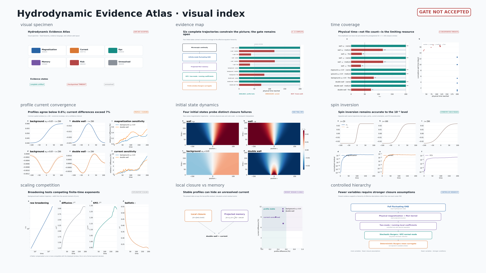

## Core argument

### 00_visual_specimen

Visual tokens and evidence-state language used throughout the atlas. [PDF](figures/hero/00_visual_specimen.pdf) · [SVG](figures/hero/00_visual_specimen.svg)

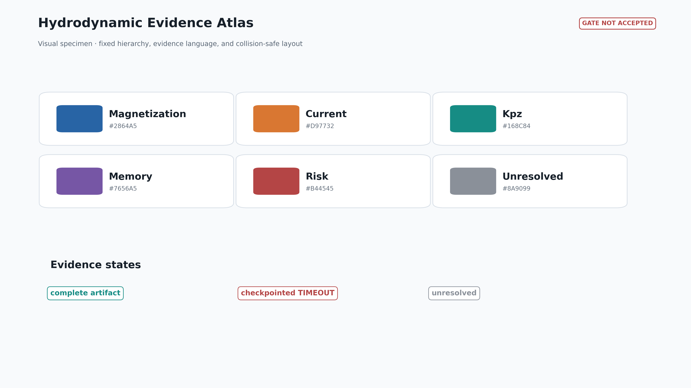

### 01_evidence_map

Current numerical coverage mapped onto the controlled hydrodynamic reduction hierarchy. [PDF](figures/hero/01_evidence_map.pdf) · [SVG](figures/hero/01_evidence_map.svg)

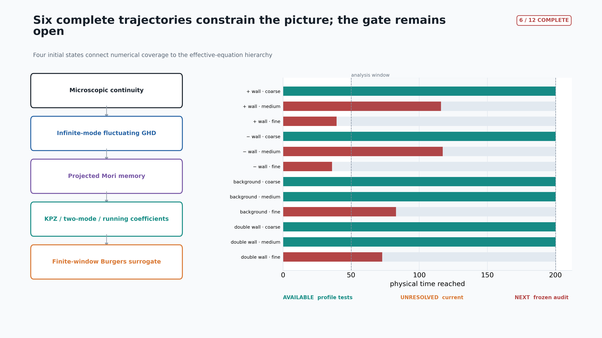

### 02_time_coverage

Physical-time coverage and cumulative wall-time cost for all twelve convergence jobs. [PDF](figures/hero/02_time_coverage.pdf) · [SVG](figures/hero/02_time_coverage.svg)

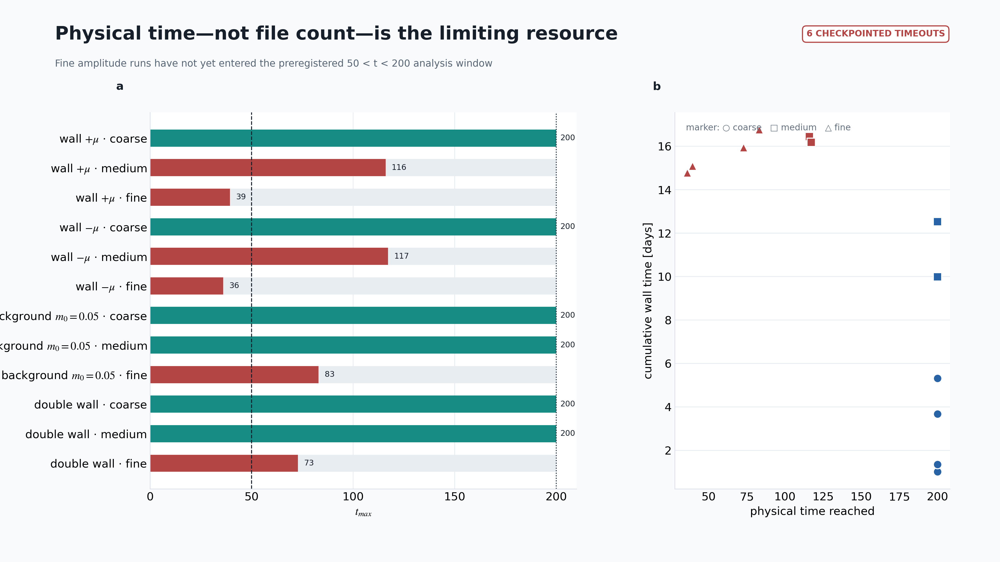

### 03_profile_current_convergence

Coarse--medium comparison of magnetization and current in the two fully completed resolution pairs. [PDF](figures/hero/03_profile_current_convergence.pdf) · [SVG](figures/hero/03_profile_current_convergence.svg)

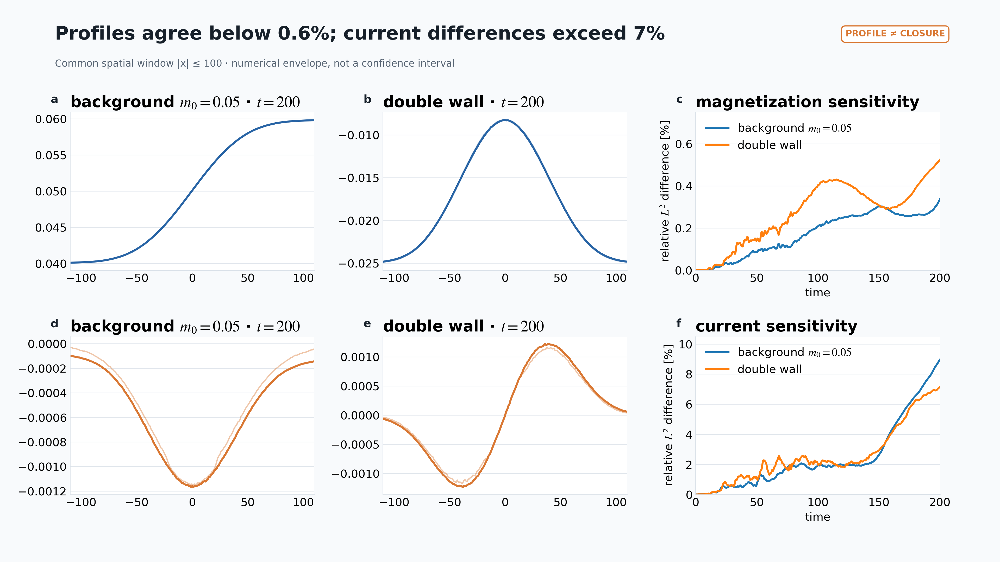

### 04_initial_state_dynamics

Time--space magnetization maps for the four complete coarse trajectories. [PDF](figures/hero/04_initial_state_dynamics.pdf) · [SVG](figures/hero/04_initial_state_dynamics.svg)

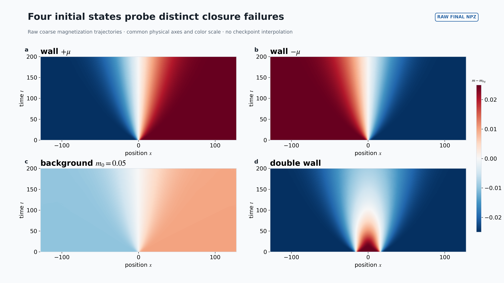

### 05_spin_inversion

Opposite-wall profile overlays and normalized spin-flip/FCS orientation residuals. [PDF](figures/hero/05_spin_inversion.pdf) · [SVG](figures/hero/05_spin_inversion.svg)

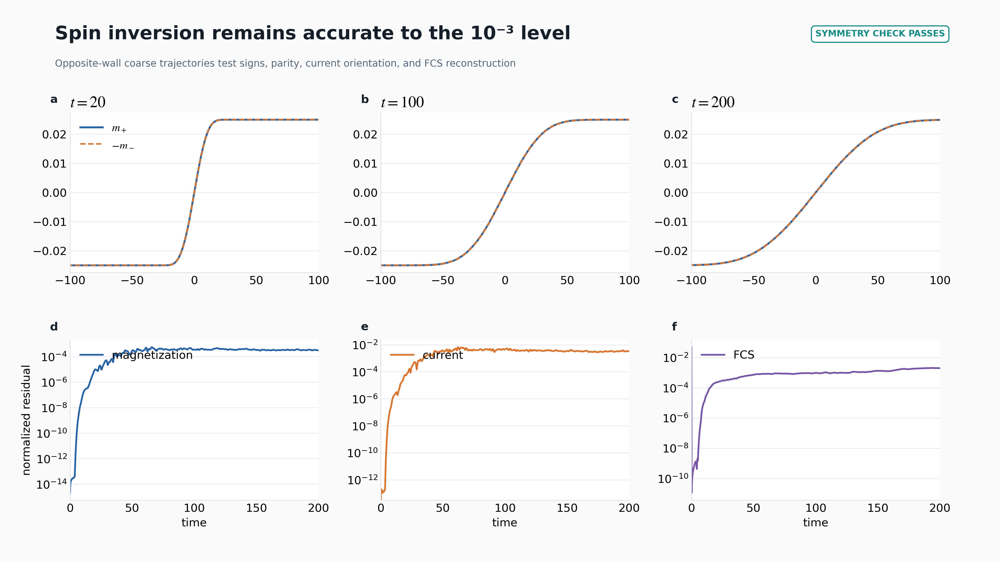

### 06_scaling_competition

Diffusive, KPZ, and ballistic compensation plots for the completed finite-background medium trajectory. [PDF](figures/hero/06_scaling_competition.pdf) · [SVG](figures/hero/06_scaling_competition.svg)

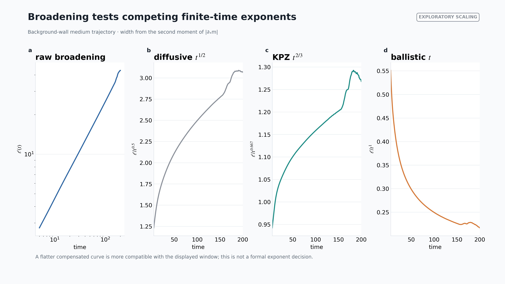

### 07_local_closure_vs_memory

Conceptual distinction between local closure and projected memory, located by observed coarse--medium differences. [PDF](figures/hero/07_local_closure_vs_memory.pdf) · [SVG](figures/hero/07_local_closure_vs_memory.svg)

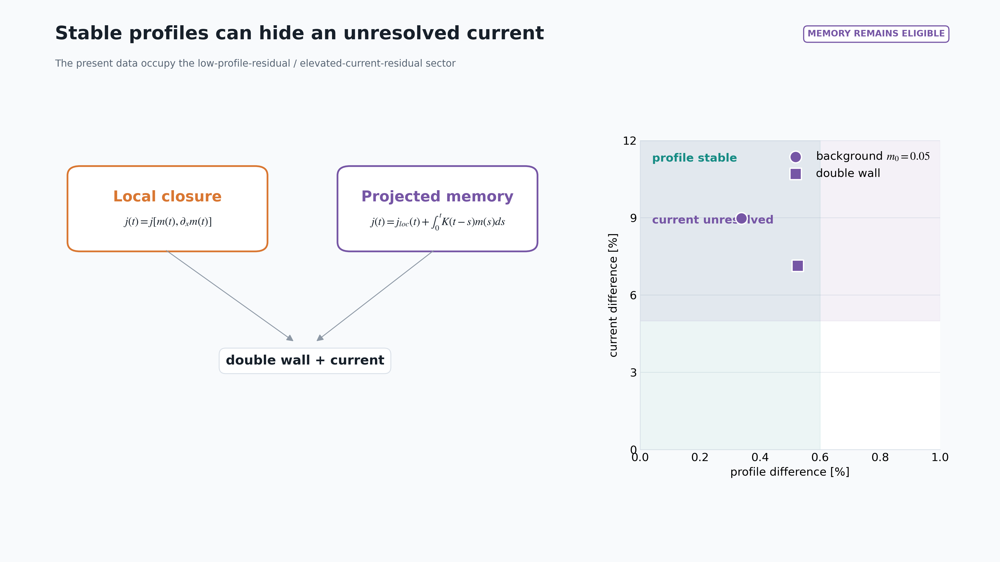

### 08_controlled_hierarchy

Controlled hierarchy from infinite-mode fluctuating GHD to a finite-window deterministic Burgers surrogate. [PDF](figures/hero/08_controlled_hierarchy.pdf) · [SVG](figures/hero/08_controlled_hierarchy.svg)

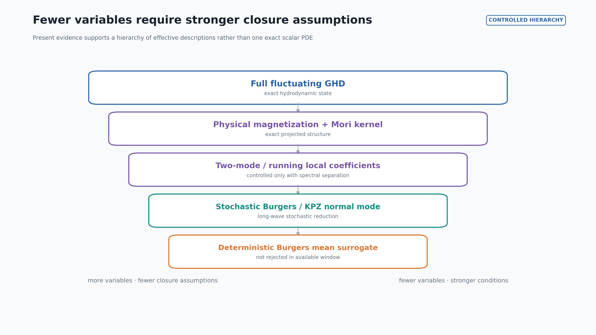

## Supporting views

### background_p005_up_m_profiles

Coarse--medium magnetization profiles at five representative times. [PDF](figures/support/background_p005_up_m_profiles.pdf) · [SVG](figures/support/background_p005_up_m_profiles.svg)

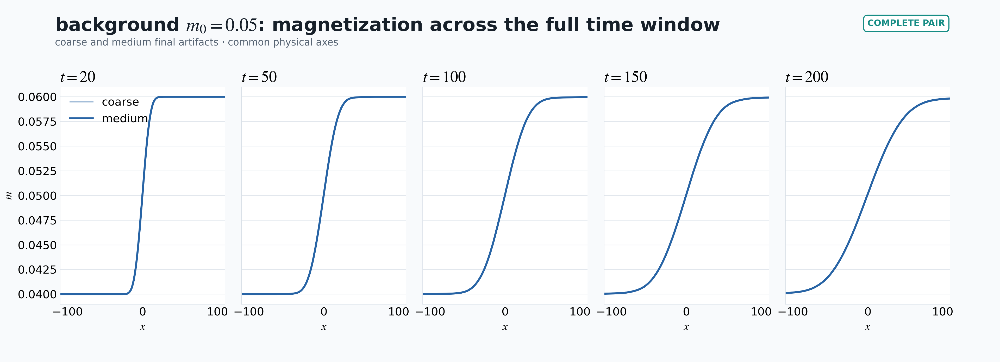

### background_p005_up_current_profiles

Coarse--medium current profiles at five representative times. [PDF](figures/support/background_p005_up_current_profiles.pdf) · [SVG](figures/support/background_p005_up_current_profiles.svg)

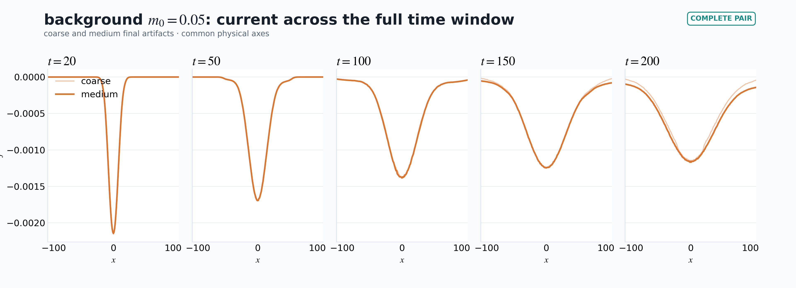

### shape_double_wall_m_profiles

Coarse--medium magnetization profiles at five representative times. [PDF](figures/support/shape_double_wall_m_profiles.pdf) · [SVG](figures/support/shape_double_wall_m_profiles.svg)

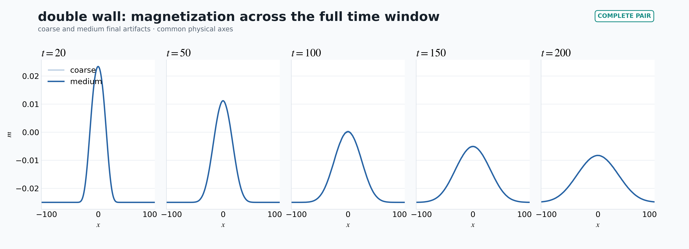

### shape_double_wall_current_profiles

Coarse--medium current profiles at five representative times. [PDF](figures/support/shape_double_wall_current_profiles.pdf) · [SVG](figures/support/shape_double_wall_current_profiles.svg)

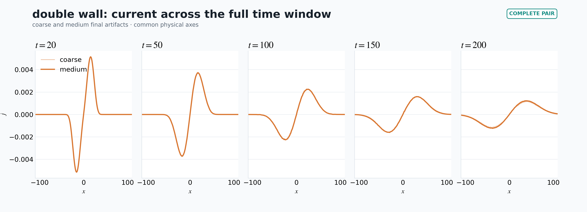

### convergence_error_curves

Time-dependent coarse--medium numerical sensitivity for profiles and currents. [PDF](figures/support/convergence_error_curves.pdf) · [SVG](figures/support/convergence_error_curves.svg)

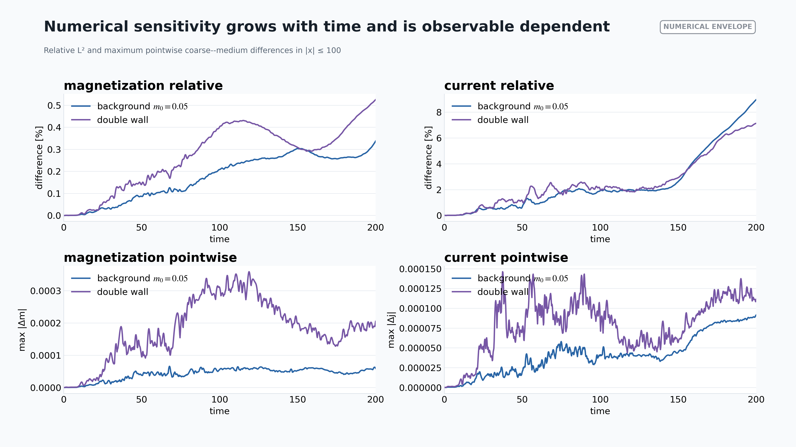

### resource_error_budget

Discarded weight, magnetization drift, and cumulative wall time for all convergence jobs. [PDF](figures/support/resource_error_budget.pdf) · [SVG](figures/support/resource_error_budget.svg)

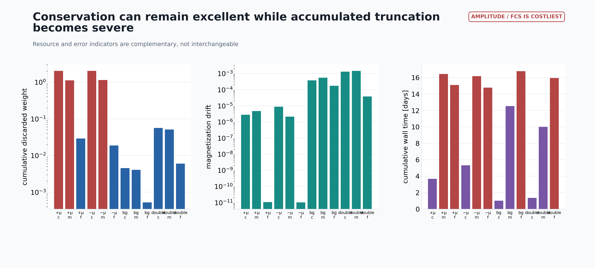

### amp_mu005_up_m_spacetime

Raw time--space field from the complete coarse trajectory. [PDF](figures/support/amp_mu005_up_m_spacetime.pdf) · [SVG](figures/support/amp_mu005_up_m_spacetime.svg)

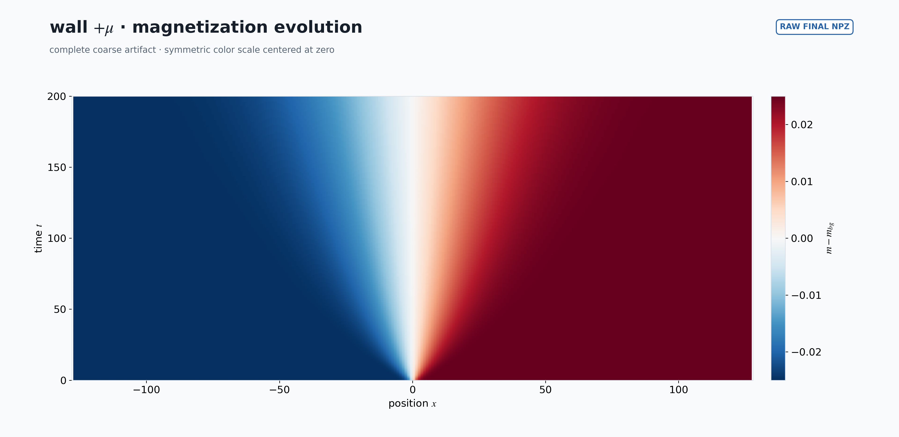

### amp_mu005_up_current_spacetime

Raw time--space field from the complete coarse trajectory. [PDF](figures/support/amp_mu005_up_current_spacetime.pdf) · [SVG](figures/support/amp_mu005_up_current_spacetime.svg)

### amp_mu005_down_m_spacetime

Raw time--space field from the complete coarse trajectory. [PDF](figures/support/amp_mu005_down_m_spacetime.pdf) · [SVG](figures/support/amp_mu005_down_m_spacetime.svg)

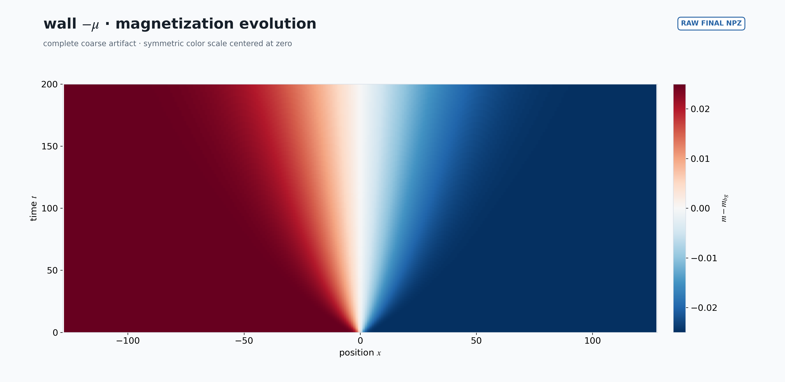

### amp_mu005_down_current_spacetime

Raw time--space field from the complete coarse trajectory. [PDF](figures/support/amp_mu005_down_current_spacetime.pdf) · [SVG](figures/support/amp_mu005_down_current_spacetime.svg)

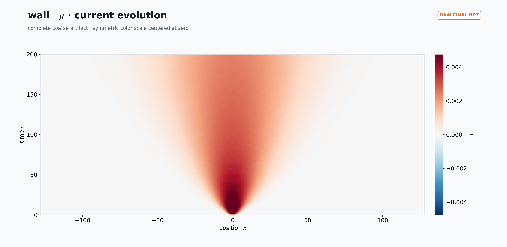

### background_p005_up_m_spacetime

Raw time--space field from the complete coarse trajectory. [PDF](figures/support/background_p005_up_m_spacetime.pdf) · [SVG](figures/support/background_p005_up_m_spacetime.svg)

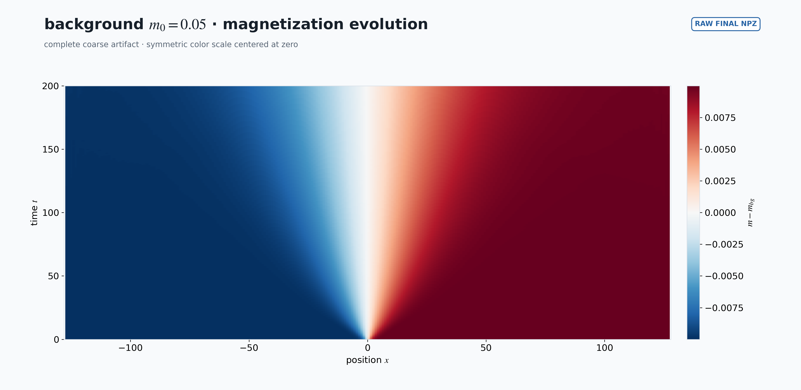

### background_p005_up_current_spacetime

Raw time--space field from the complete coarse trajectory. [PDF](figures/support/background_p005_up_current_spacetime.pdf) · [SVG](figures/support/background_p005_up_current_spacetime.svg)

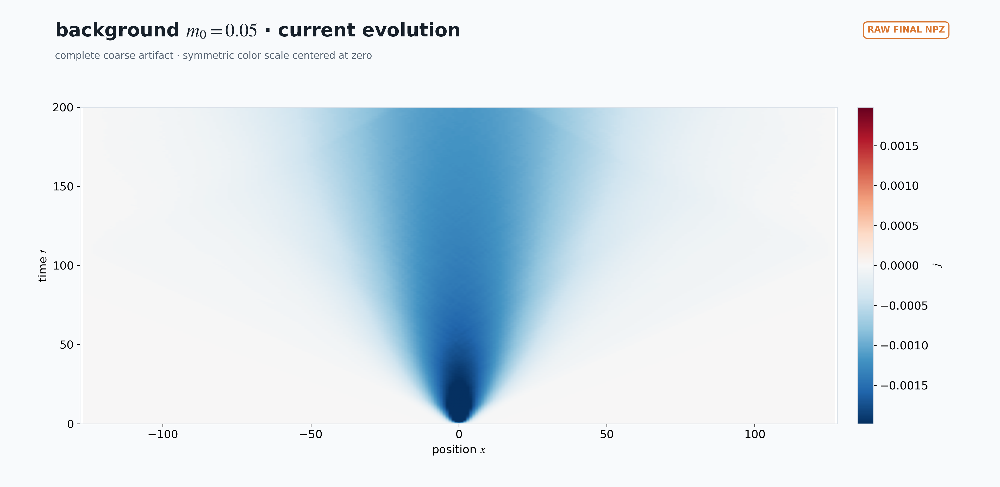

### shape_double_wall_m_spacetime

Raw time--space field from the complete coarse trajectory. [PDF](figures/support/shape_double_wall_m_spacetime.pdf) · [SVG](figures/support/shape_double_wall_m_spacetime.svg)

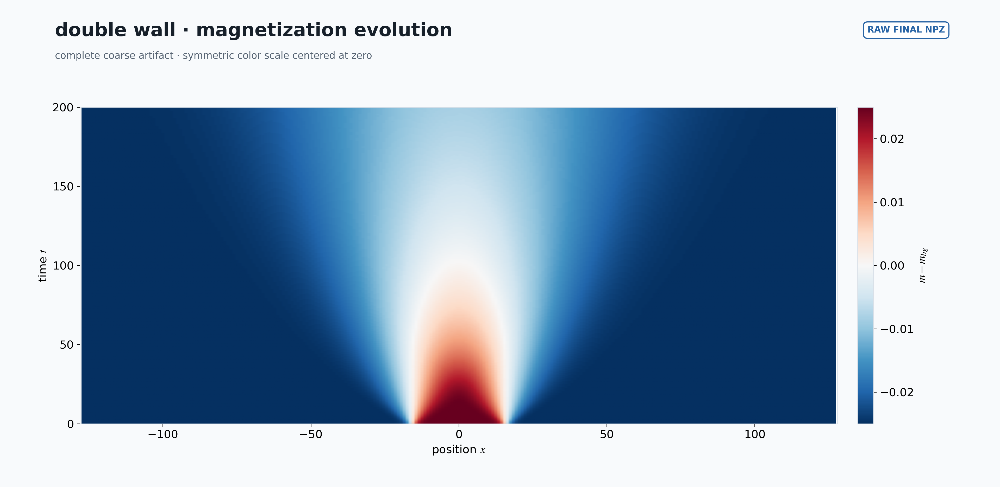

### shape_double_wall_current_spacetime

Raw time--space field from the complete coarse trajectory. [PDF](figures/support/shape_double_wall_current_spacetime.pdf) · [SVG](figures/support/shape_double_wall_current_spacetime.svg)

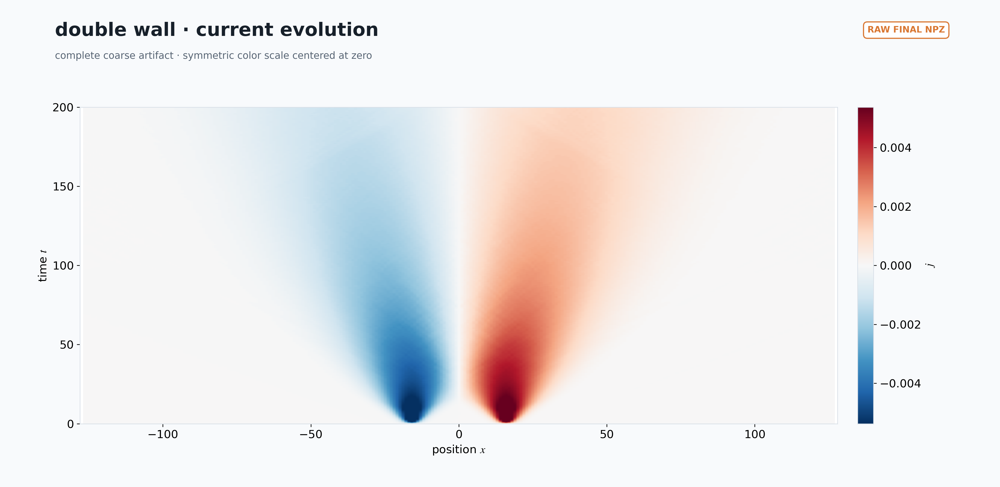
