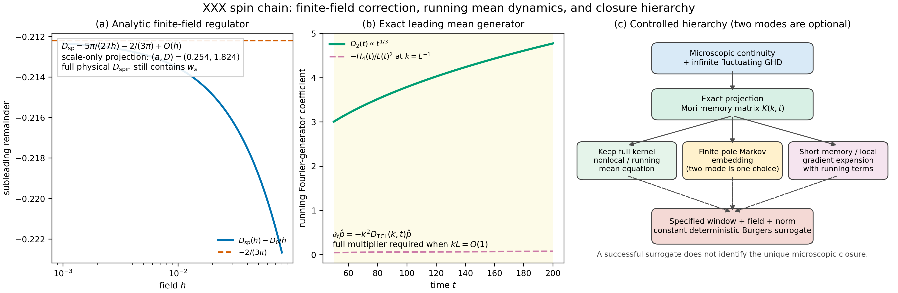
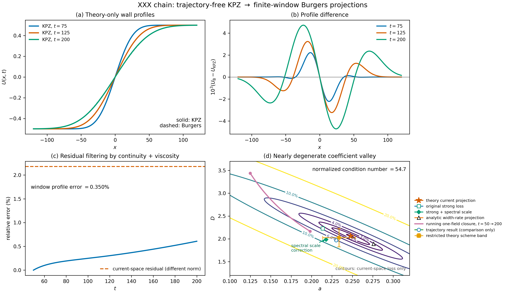

# 从 XXX 链到有限窗 Burgers 代理：不使用轨迹数据的推导

本文只使用 Hamiltonian、无穷温弱畴壁初态和时间窗
`50 < t < 200`。文中不输入任何 Heisenberg 数值轨迹，也不把轨迹中测得的
宽度、振幅或剖面形状作为参数。

## 1. 精确的微观守恒律

原论文采用铁磁号约定

\[
H_-=-\sum_j \boldsymbol S_j\cdot\boldsymbol S_{j+1},
\]

而下式先用 $H_+=-H_-$ 写电流。无穷温下换号等价于反演时间；平衡展宽的
偶时间部分不变，但流的方向和 Burgers 代理中 $a$ 的符号必须连同畴壁方向
一起约定，不能混用。

Heisenberg 方程直接给出

\[
\dot S_j^z=i[H,S_j^z]=j_{j-1}^z-j_j^z,
\qquad
j_j^z=S_j^xS_{j+1}^y-S_j^yS_{j+1}^x .
\]

对 $H_-$，右端电流整体变号。这是后续所有近似的精确起点。精确的局域
Markov 状态不是单个磁化场，而是
GHD 中所有字符串和快度的根密度

\[
\rho_s(x,\theta,t),\qquad s=1,2,\ldots .
\]

扩散与涨落阶 GHD 的结构为

\[
\partial_t\rho_{p,A}+
\partial_x\!\left(v_A^{\rm eff}[\rho]\rho_{p,A}
-\mathfrak D_{AB}[\rho]\partial_x\rho_{p,B}+\zeta_A\right)
=O(\partial_x^3),                                      \tag{G1}
\]

其中 $A=(s,\theta)$，重复指标包含字符串求和和快度积分。这里把常见公式中的
$1/2$ 吸收到 $\mathfrak D$ 的定义；这样在线性化局域 GGE 上

\[
\langle\zeta_A(x,t)\zeta_B(x',t')\rangle
=\left(\mathfrak DC+C\mathfrak D^\dagger\right)_{AB}
\delta(x-x')\delta(t-t').                              \tag{G2}
\]

$C$ 是完整根密度静态协方差。着装与有效速度由

\[
h^{\rm dr}=(1-Tn)^{-1}h,\qquad
\rho_{s}^{\rm tot}={(p_s')^{\rm dr}\over2\pi},\qquad
v_s^{\rm eff}={(e_s')^{\rm dr}\over(p_s')^{\rm dr}}     \tag{G3}
\]

确定，$n_s=\rho_{p,s}/\rho_s^{\rm tot}$。物理磁化及 Euler 电流只是

\[
m={1\over2}-\sum_{s\ge1}s\int d\theta\,\rho_{p,s},
\qquad
j_m=-\sum_{s\ge1}s\int d\theta\,
v_s^{\rm eff}\rho_{p,s}.                               \tag{G4}
\]

因此 (G1)--(G4) 是“完整流体方程”的第一性原理形式：无限组、非线性、带
扩散矩阵与乘性噪声。误差 $O(\partial_x^3)$ 表示 Burnett 及更高梯度流；在
XXX 零场，巨字符串使普通固定阶梯度展开奇异，还必须把 $s\sim h^{-1}$ 的
模与长波极限一起重求和。这一点正是单场常数扩散从 (G1) 直接读不出来的
原因。

物理磁化和电流是这些场的投影。消去其余 GHD 场一般产生 Mori--Zwanzig
记忆核，而不是精确的单场常系数 PDE。因此，第二场只是把某类记忆核近似为
单个极点的一种实现，并非微观理论强制的答案。

## 2. 弱畴壁严格约化为平衡结构因子

Kharkov 等人实际使用的无穷温初态不是有限宽 `tanh`，而是两个 reservoir
直积成的尖锐阶跃

\[
\rho(0)=\frac{e^{\mu\sum_{j\in L}\sigma_j^z}}{Z_L}
\otimes
\frac{e^{-\mu\sum_{j\in R}\sigma_j^z}}{Z_R},
\qquad 0<\mu\ll1.                                    \tag{I0}
\]

被 Kharkov 等人复用的连续时间数据源使用 $L_{\rm chain}=400$ 和
$e^{\mu_L S^z}$、$\mu_L=0.0017$。由于 $\sigma^z=2S^z$，这与 (I0) 的
记号严格对应于 $\mu=\mu_L/2=0.00085$。后续项目中
$L_{\rm chain}=512,\mu=0.05,w=2$ 的条件是独立的注册控制，不是这条公开
轨迹的初态。

令 $s_j=+1$（左半链）、$-1$（右半链）。
无穷温展开为

\[
\rho_0=2^{-L}\left(1+2\mu\sum_j s_jS_j^z+O(\mu^2)\right).
\]

对正规化磁化 $U_i(t)=\langle S_i^z(t)\rangle/\mu$，有

\[
U_i(t)=2\sum_j s_j C_{i-j}(t)+O(\mu^2),
\qquad
C_r(t)=\langle S_r^z(t)S_0^z(0)\rangle_{T=\infty}.
\]

式 (I0) 从左边 $+1/2$ 降到右边 $-1/2$。为使后文的归一化梯度为正，定义
$\bar U=-U$；等价地也可把空间轴反射。于是连续极限中

\[
p(x,t)\equiv\partial_x\bar U(x,t)
=\frac{C(x,t)}{\chi}+O(\mu^2),
\qquad \chi=\frac14 .
\]

后文把 $\bar U$ 简记为 $U$。还原原始方向时必须同时变换 Burgers 非线性项
的符号；本文比较的是论文所报 $|a|$ 的大小。

因此这个平均畴壁首先是随机流体结构因子的积分，而不是确定性 Burgers
方程中一个有限振幅冲击波的微观解。

### 2.1 一个容易被忽略、但决定结论的线性响应事实

式 (I0) 中真正的物理磁化是 $m=\mu U+O(\mu^2)$。在 $\mu\to0$ 极限，
$U$ 的演化由平衡两点函数线性决定。因此，若把论文发现的方程直接改写给
物理磁化，便得到

\[
m_t+{a\over\mu}m m_x=Dm_{xx}.
\]

其二次系数随 $\mu^{-1}$ 发散。这排除了把 $a\simeq0.23$ 解释成零磁场物理
磁化 Euler 流的普通 Hessian。它可以是固定正规化、固定壁方向和固定轨迹族
上的有效坐标，也可以由投影后的涨落协方差产生；但它不是任意弱扰动都服从的
自治本构系数。特别地，两个弱壁响应的叠加仍满足微观线性响应，却一般不满足
同一个确定性非线性 Burgers 方程。

这也解释了为什么下面可以从一个**线性、非局域**的准确平均方程投影出非零
$a$：非线性基函数 $U U_x$ 只是用来压缩这一条单调壁流形，并不把准确生成元
变成了非线性单场本构律。

## 3. TBA 与巨字符串自洽理论给出的无数据参数

在小磁场 $h\to0^+$ 下，巨字符串导致

\[
D(h)=\frac{D_0}{h}+O(1),
\qquad
D_0=\lim_{h\to0^+}hD(h).
\]

无穷温巨字符串 TBA 的闭式结果是

\[
D_0=\frac{5\pi}{27}.
\]

下一步必须区分证据等级。$D_0$ 来自有限场 GHD/TBA 的受控小场极限；把局域
残余磁场设为热涨落并令传播长度自洽，则是 De Nardis 等人的巨字符串动力学
论证。原论文明确称这一步为 heuristic，虽然它正确给出指数并与数值符合。
长度 $\ell$ 内的热磁化涨落给出

\[
h(\ell)=\frac{1}{\sqrt{4\chi\ell}},
\qquad
\ell^2=2D(h(\ell))t.
\]

自洽消去 $h$ 得

\[
\ell(t)=\left(4D_0\sqrt\chi\,t\right)^{2/3},
\qquad
D_{\rm av}(t)=
2^{5/3}D_0^{4/3}\chi^{2/3}t^{1/3}.
\]

用 Prähofer--Spohn 的平稳 KPZ 标度函数
$f_{\rm KPZ}$（归一化为 $\int f=1$）及其方差

\[
\sigma_{\rm KPZ}^2=\int y^2f_{\rm KPZ}(y)dy
=0.510523264188\ldots
\]

可得

\[
\lambda_{\rm KPZ}
=\frac{4D_0\sqrt\chi}{\sigma_{\rm KPZ}^{3/2}}
=\frac{10\pi}{27\sigma_{\rm KPZ}^{3/2}}
=1.92652414\ldots .
\]

所以在接受“巨字符串自洽 + 平稳 KPZ 标度函数”这一级近似后，领先阶理论壁
完全确定为

\[
L(t)=(\lambda_{\rm KPZ}t)^{2/3},\qquad
p(x,t)=\frac1{L(t)}f_{\rm KPZ}\!\left(\frac{x}{L(t)}\right),
\]

\[
U(x,t)=F_{\rm KPZ}\!\left(\frac{x}{L(t)}\right)-\frac12,
\qquad F'_{\rm KPZ}=f_{\rm KPZ}.
\]

此处没有使用量子轨迹。对原论文的尖锐 reservoir 壁，初始梯度就是格点尺度
delta 源；不存在可调的连续壁宽。后续预注册流程另含 $w=2$ 的 `tanh` 壁，
它只能作为不同初态的有限宽诊断，不能代替式 (I0)。

### 3.1 有限场 TBA：能解析到哪里，不能偷换成什么

无穷温 TBA 的有限场占据可写成闭式

\[
\eta_s(h)=\frac{\sinh^2[(s+1)h]}{\sinh^2h}-1.
\]

完整扩散矩阵不能一般地先写成一个单字符串正权重和。对可把散射核取成对称
形式的参数化，De Nardis--Bernard--Doyon 的精确二准粒子公式是

\[
\begin{aligned}
(\mathfrak DC)_{ij}
={1\over2}\sum_{a,b}\int d\theta\,d\alpha\;&
\rho_{p,a}(\theta)f_a(\theta)
\rho_{p,b}(\alpha)f_b(\alpha)
|v_a^{\rm eff}(\theta)-v_b^{\rm eff}(\alpha)|
[T^{\rm dr}_{ab}(\theta,\alpha)]^2\\
&\times\left[
{h^{\rm dr}_{i,b}(\alpha)\over\sigma_b\rho_{s,b}(\alpha)}-
{h^{\rm dr}_{i,a}(\theta)\over\sigma_a\rho_{s,a}(\theta)}
\right]
\left[
{h^{\rm dr}_{j,b}(\alpha)\over\sigma_b\rho_{s,b}(\alpha)}-
{h^{\rm dr}_{j,a}(\theta)\over\sigma_a\rho_{s,a}(\theta)}
\right].                                                \tag{A}
\end{aligned}
\]

物理 $D_{\rm spin}$ 由自旋指标 $i=j=m$ 的 $(\mathfrak DC)_{mm}$ 再除以
磁化率取得。平方差展开后同时含“对角”两项和交叉项；只有在证明相应极限下
交叉项消失后，才可压成单字符串方差和。XXX 点的相关字符串满足
$s\sim h^{-1}$，所以 $h\to0$、字符串截断 $s_{\max}\to\infty$ 和数值边界
条件的次序必须一起控制。

对本题的零场极限，arXiv:2003.13708 的补充材料进一步论证式 (A) 的
非对角部分为 $O(h)$，把物理扩散写成

\[
D_{\rm spin}(h)=\chi^{-1}\lim_{s_{\max}\to\infty}
\sum_{s=1}^{s_{\max}}\int d\theta\,
\rho_s(1-n_s)(m_s^{\rm dr})^2w_s(\theta)+O(h),       \tag{A1}
\]

\[
w_s(\theta)=\lim_{s_{\max}\to\infty}\sum_{s'=1}^{s_{\max}}
\int d\alpha\,\rho_{s'}(1-n_{s'})|v_s-v_{s'}|
\left({T^{\rm dr}_{ss'}(\theta,\alpha)\over
\rho_s^{\rm tot}(\theta)}\right)^2 .                \tag{A2}
\]

因此，如果 $D_{\rm spin}=D_0/h+D_1+O(h)$ 的展开本身存在且上述余项对巨
字符串极限一致，那么 $D_1$ 可从 (A1) 的对角核求得；不应把一个任意展开的
“交叉收缩”冒充该 $O(h)$ 余项。尚未证明的是常数展开的存在性和所有极限的
一致性，而不是式 (A1) 的定义。

文献中为了抽取巨字符串奇异性还可引入一个较简单的谱调节器。令 $n=s+1$，
它在无穷温可化为

\[
D_{\rm sp}(h)=\frac{4\sinh^2h}{9\pi}
\sum_{n=2}^{\infty}\frac{n^4}{n^2-1}\,\operatorname{csch}^2(nh)
\left[1+n\tanh h\,\coth(nh)\right].                  \tag{B}
\]

式 (B) 的前两项可以直接用 Euler--Maclaurin 求出。定义

\[
g(x)=x^2\operatorname{csch}^2x\,[1+x\coth x].
\]

利用

\[
\int_0^\infty\frac{x^2}{\sinh^2x}dx=\frac{\pi^2}{6},
\qquad
\int_0^\infty g(x)dx=\frac52\frac{\pi^2}{6}
=\frac{5\pi^2}{12},
\]

可得积分项 $5\pi/(27h)$。常数项需要保留 $n=0,1$ 的
Euler--Maclaurin 边界以及固定 $n$ 与 $n\sim h^{-1}$ 展开不交换的修正：

\[
\sum_{n=2}^\infty\frac1{n^2-1}=\frac34.
\]

两者合并后

\[
\boxed{D_{\rm sp}(h)=\frac{5\pi}{27h}-\frac{2}{3\pi}+O(h)}. \tag{C}
\]

这是一个真正的解析次领先项，但它属于谱调节器 (B)，不是完整物理扩散
(A) 的常数项。二者在领先 $1/h$ 奇异性上一致；把
$-2/(3\pi)$ 直接命名为物理 $D_1$ 会绕过 (A) 的交叉项和极限次序，因而是
不合法的偷换。

即使把 (C) 暂时当成诊断输入，结果也不会导出目标系数。由

\[
\ell^2=2\left(\frac{D_0}{h(\ell)}+D_1\right)t,
\qquad h(\ell)=\frac1{\sqrt{4\chi\ell}},
\]

得到

\[
\ell=Ct^{2/3}(1+bt^{-1/3}+\cdots),\quad
C=(4D_0\sqrt\chi)^{2/3},\quad
b=\frac{4D_1}{3C^2}.
\]

取 $D_1=-2/(3\pi)$ 给出 $b=-0.231197\ldots$。对这个解析修正重复
第 4 节的无轨迹守恒流投影，得到

\[
(a,D)=(0.25368,1.82386),
\]

原论文强形式投影则得到 $(0.21783,1.98558)$。后一结果解释了为何强损失下
$D$ 会自然靠近 $2$，但两种投影都不能同时给出 $(0.230,1.97)$。因此“多算
一项 $D(h)$”不等于求得完整有限窗修正，更不等于证明任何两场闭合。

我们还直接数值求解了 (A1) 的着装核，但把它作为**解析公式的数值求积审计**，
没有读取自旋链轨迹。无穷温占据使 Fourier 空间的 dressing 化成字符串方向的
三对角方程

\[
2\cosh(|k|/2)f_a^{(b)}-(1-n_{a-1})f_{a-1}^{(b)}
-(1-n_{a+1})f_{a+1}^{(b)}=\delta_{ab},               \tag{A3}
\]

\[
T_{ab}^{\rm dr}=f_a^{(b-1)}+f_a^{(b+1)}.
\]

代码先用 $f_a^{(1)}=\rho_a^{\rm tot}$ 的闭式 TBA 恒等式检查归一化，再对
$|v-v'|$ 的尖点、快度范围、字符串尾和 Fourier 模数分别收敛。当前公共审计
在统一的 $s h\le8$、尾缓冲 $6/h$、$|h\theta|\le60$ 下给出

\[
\begin{array}{c|ccc}
h&D_{N=600}&D_{N\to\infty}^{(1/N)}&hD_{N\to\infty}^{(1/N)}\\ \hline
0.30&1.98698&1.97506&0.59252\\
0.25&2.51570&2.49837&0.62459\\
0.20&3.30195&3.27946&0.65589\\
0.15&4.60990&4.57368&0.68605
\end{array}                                             \tag{A4}
\]

而精确基准要求 $hD\to5\pi/27=0.581776\ldots$。降低 $h$ 时 (A4) 反而离
基准更远；相减得到的“$D_1$”从 $0.036$ 漂到 $0.695$。这证明当前有限截断
序列对次领先项**不一致收敛**，不能据它声称 $D_1$ 是常数，也不能声称它按
这组数运行。可复现输入和自动拒绝判据分别在
`docs/full_tba_finite_field_runs.json` 与
`scripts/audit_full_tba_subleading.py`。

对原补充材料 Fig. 1 的进一步复核还发现，有限 $s_{\max}$ 曲线必须把
式 (16) 的分子和式 (17) 的 susceptibility **同时截断**，而
$T^{\rm dr}$ 的着装求解仍需保留无限字符串尾。例如
$h=0.05,s_{\max}=36$ 时，完整 $\chi$ 归一化给 $hD=0.354$，用同一
$s_{\max}$ 的截断 $\chi$ 则给 $hD=0.635$，恢复论文图中的有限截断量级。
`evaluate_full_tba_diffusion.py` 现在同时输出这两个值，并把后者明确标为
非物理有限场归一化。这个修正能够复现图中的 cutoff 曲线，但不能消除
$h\to0$、$s_{\max}\to\infty$ 的双极限路径依赖，因此仍不能从图中的有限
$s_{\max}$ 斜率唯一提取物理 $D_1$。

还有一个更直接的防错检验。若未经推导便在有限 $h$ 处认同“均匀外场”与
“有限时间包中的随机局域场”，令

\[
W=2D(h)t,\qquad h=W^{-1/4},
\]

再把所得尺度投影到 $50<t<200$，强形式给
$(a,D)=(0.361,2.026)$，守恒流给 $(0.402,1.959)$。$D$ 偶然仍在 2 附近，
但 $a$ 被推到约 0.4；这不是新预测，而是说明该有限-$h$ 替换越过了受控的
$D_0/h$ 奇异极限。只有领先奇异项具有文献中的热涨落自洽依据。

### 3.2 领先 KPZ 平均剖面的准确方程：运行的非局域生成元

对这个弱壁，$p=U_x$ 是平衡结构因子。令

\[
\widehat p(k,t)=\widehat f_{\rm KPZ}(z),\qquad
z=kL(t),\qquad L(t)=(\lambda_{\rm KPZ}t)^{2/3}.
\]

直接对时间求导，在 $\widehat f(z)\ne0$ 的波数上得到一个不需要增加第二场的
精确领先阶方程

\[
\partial_t\widehat p(k,t)
=-k^2D_{\rm TCL}(k,t)\widehat p(k,t),                  \tag{D}
\]

\[
\boxed{
D_{\rm TCL}(k,t)=-\frac23\frac{L(t)^2}{t}
\frac{\partial_z\log\widehat f_{\rm KPZ}(z)}{z}}
.                                                               \tag{E}
\]

同一方程适用于 $k\ne0$ 的 $\widehat U=\widehat p/(ik)$。原论文尖锐壁对应
格点尺度源。若另研究有限宽壁，则只给 $\widehat p$ 乘上与时间无关的初始
形状因子，所以不会改变领先生成元 (E)。这就是物理平均磁化在领先 KPZ
标度上的时间局域、空间非局域 pseudo-differential 方程。

小 $z$ 展开为

\[
D_{\rm TCL}(k,t)=\frac23\frac{L^2}{t}
\left[\kappa_2-\frac{\kappa_4}{6}(kL)^2+\cdots\right],
\]

其中

\[
\kappa_2=0.510523264188\ldots,\qquad
\kappa_4=\mu_4-3\mu_2^2=-0.04895974316\ldots .
\]

于是

\[
p_t=D_2(t)p_{xx}+H_4(t)p_{xxxx}+\cdots,
\]

\[
D_2(t)=\frac23\kappa_2\frac{L^2}{t}\propto t^{1/3},
\qquad
H_4(t)=\frac{\kappa_4L^4}{9t}\propto t^{5/3}<0.       \tag{F}
\]

这里 $H_4$ 随时间增长并不表示展开失控得更慢：在流体波数
$k\sim L^{-1}$ 上，各梯度项处在同一标度阶，所以必须保留完整乘子 (E)。
式 (E) 明确回答了“系数是否取常数”：对物理线性响应剖面，最低矩扩散系数
本来就按 $t^{1/3}$ 运行；常数 $D\simeq2$ 只能是指定窗口和算符基上的压缩。



图中没有量子轨迹。它可以由

```bash
python3 scripts/plot_running_kernel_hierarchy.py
```

重画。右图中的三条分支是不同近似，不是从左到右的必然演化顺序。

## 4. 理论窗口上的局域 Burgers 投影

先固定“有效系数”究竟按什么损失定义。原论文在选中
$-U U_x$ 与 $U_{xx}$ 两列以后，使用的是点值强形式损失的连续极限

\[
\mathcal L_{\rm strong}(a,D)^2=
\int_{t_1}^{t_2}dt\int dx\,
\left|U_t+aUU_x-DU_{xx}\right|^2.                 \tag{S1}
\]

$L_0$ 惩罚只负责选择列；在列已经固定以后，它不改变这两个系数的最小二乘
正规方程。另一方面，直接比较由连续性方程恢复的流，得到的是另一种合法但
不同的内积。二者必须分别计算，不能把其中一个结果说成另一个损失的解析值。

### 4.0 先固定被解释的两个数：它们是离散估计器的输出

这里必须区分原论文报告的系数和本项目后来得到的两个小数。Kharkov 等人的
公开 notebook 对原始 $400$ 点、$\Delta=1$ 轨迹先沿空间作
Savitzky--Golay $(31,7)$ 平滑，删去前 $250$ 个时间点（$dt=0.2$，所以从
$t=50$ 开始），再以二阶有限差分构造强形式候选库。其冻结输出是

\[
 a_{\rm upstream}=0.240794,\qquad D_{\rm upstream}=1.893870 . \tag{P0}
\]

见上游仓库提交
[8a9cf7e](https://github.com/yourball/pde-many-body/commit/8a9cf7e57ddc0b6885fa8c41ed5b4a17d0d60a13)
中的
[`domain_wall_T=infty.ipynb`](https://github.com/yourball/pde-many-body/blob/8a9cf7e57ddc0b6885fa8c41ed5b4a17d0d60a13/domain_wall_xxz/domain_wall_T%3Dinfty.ipynb)。

本项目引用的

\[
 a_{\rm weak}=0.2301488147,\qquad D_{\rm weak}=1.9715533990             \tag{P1}
\]

不是 (P0) 的更多有效位数，而是另一个离散估计器的输出；正文中的
$D\simeq1.97$ 是 (P1) 的舍入。它在上游 $(31,7)$ 平滑之后又作空间
$(9,3)$ 和时间 $(5,2)$ 平滑，只保留 $-120\le x\le120$ 与
$52\le t\le198$，并采用 $11$ 个测试函数

\[
 \phi_n(x)=s^2(1-s)^2\sin(n\pi s),\quad
 s={x-x_{\min}\over x_{\max}-x_{\min}},\quad n=1,\ldots,11 .          \tag{P2}
\]

若把所有这些离散操作合并为 $\mathcal S$，记
$\bar U=\mathcal S U$，则每个时间点 $t_i$ 和测试函数 $\phi_k$ 给出

\[
 y_{ik}=\int\phi_k\,\partial_t\bar U\,dx,\qquad
 X^{(1)}_{ik}={1\over2}\int(\partial_x\phi_k)\bar U^2\,dx,\qquad
 X^{(2)}_{ik}=\int(\partial_x^2\phi_k)\bar U\,dx .                    \tag{P3}
\]

积分按网格梯形公式计算，$\phi_k$ 的导数按单位格距中心差分计算。两个数的
完整定义因此是

\[
 \boxed{\binom{a_{\rm weak}}{D_{\rm weak}}
 =(X^TX)^{-1}X^Ty},\qquad X=(X^{(1)},X^{(2)}).                        \tag{P4}
\]

这也给出了从微观理论计算它们的唯一正确路线。对题设的高温弱壁，先写

\[
 U_j(t)={1\over\mu}{\rm Tr}\!\left[
 \rho_\mu e^{iHt}S_j^ze^{-iHt}\right]
 =2\sum_\ell s_\ell C_{j\ell}(t)+O(\mu^2),                          \tag{P5}
\]

其中 $s_\ell=\pm1$ 标记左右 reservoir，且

\[
 C_{j\ell}(t)=2^{-L}{\rm Tr}[S_j^z(t)S_\ell^z]
 =2^{-L}\sum_{mn}e^{i(E_m-E_n)t}
 \langle m|S_j^z|n\rangle\langle n|S_\ell^z|m\rangle .             \tag{P6}
\]

把 (P5)--(P6) 代入 (P2)--(P4)，确实从 Hamiltonian、初态、$L$ 和窗口
唯一地定义了两个数；但求值所需的是有限链在 $50\le t\le200$ 的完整动力学
结构因子，而不仅是 TBA 给出的渐近输运常数。换言之，(P4)--(P6) 是精确的
第一性原理约化，不是闭式求值。

估计器依赖不是形式上的担忧。同一原始轨迹和同一 $(31,7)$ 预平滑下，仅把
本项目窗口从 $52\!:\!198$ 改为 $50\!:\!200$，便得到
$(a,D)=(0.232136,1.951259)$；改为 $80\!:\!190$ 得到
$(0.201153,2.276188)$。因此不能把 (P1) 当作不依赖窗口和投影的微观常数，
也不能要求只用渐近 $D_0$ 唯一恢复其全部小数。

现在可把同一离散估计器原封不动地作用到由 $D_0$、自洽
$\lambda_{\rm KPZ}$ 和 Prähofer--Spohn 函数构造的无轨迹理论壁。在
$L=400,dx=1,dt=0.2$ 上执行 (P2)--(P4)，包括两层相同的平滑、裁剪与
$52\le t\le198$ 窗口，得到

\[
 \boxed{a_{\rm KPZ\to weak}=0.2122353,\qquad
 D_{\rm KPZ\to weak}=2.2214888}.                                  \tag{P7}
\]

因此领先理论与 (P1) 的差别并非先前 strong/current 投影不匹配造成；在
估计器完全一致后仍有

\[
 \Delta a=+0.0179136,\qquad \Delta D=-0.2499354 .                    \tag{P8}
\]

这两个差值必须由有限时结构因子修正、记忆项或尚未保留的模产生。命令

```bash
python3 scripts/audit_theory_exact_weak_estimator.py
```

只读取通用 KPZ 表，不读取 Heisenberg 轨迹，也不接受目标系数参数。

还可以对这个**同一个弱估计器**精确定位缺失量。令
$\bar U=\bar U_0+\varepsilon\bar U_1$，则

\[
 \delta y_{ik}=\int\phi_k\partial_t\bar U_1dx,\quad
 \delta X^{(1)}_{ik}=\int(\partial_x\phi_k)\bar U_0\bar U_1dx,\quad
 \delta X^{(2)}_{ik}=\int(\partial_x^2\phi_k)\bar U_1dx.              \tag{P9}
\]

以 $G=X^TX,b=X^Ty,\beta=(a,D)^T$ 记正规方程，一阶修正仍严格满足

\[
 \delta\beta=G_0^{-1}(\delta b-\delta G\beta_0).                    \tag{P10}
\]

对 (P7) 的冻结网格，

\[
G_0=\begin{pmatrix}
0.1615378675&0.01937452927\\
0.01937452927&0.002555776036
\end{pmatrix},\qquad \kappa(G_0)=716.39 .                            \tag{P11}
\]

从 (P7) 移到 (P1) 所需的系数修正和广义力修正分别是

\[
 \delta\beta=\binom{0.0179135561}{-0.2499354094},\qquad
 \delta b-\delta G\beta_0
 =\binom{-1.9486633\times10^{-3}}{-2.9171221\times10^{-4}}.          \tag{P12}
\]

后一个向量的二范数仅为领先 $b_0$ 的 $2.53\%$。这解释了为什么剖面和组合
电流可非常准确，而分离的 $a,D$ 移动约 $8\%$ 与 $11\%$；它也把剩余解析
任务压缩成 (P9) 的两个投影泛函。任何声称唯一推出 (P1) 的下一阶理论，都
必须从微观 GHD/Mori 动力学独立算出这两个数，而不能从 (P1) 反调参数。
若暂时只允许修正弱形式响应 $y$ 而不改设计矩阵，满足 (P12) 的最小范数修正
为 $\delta y_{\min}=XG_0^{-1}(\delta b-\delta G\beta_0)=X\delta\beta$；其
相对范数是 $\|\delta y_{\min}\|/\|y_0\|=3.15\%$。因此目标差值在有限时
$O(t^{-1/3})$ 误差预算内完全可能，但仍不能据此反推出其微观形状。

把已知谱调节器的尺度诊断
$L(t)=\lambda^{2/3}[t^{2/3}-0.2311973t^{1/3}]$ 放进完全相同的估计器，得到

\[
 (a,D)_{\rm scale\ diagnostic}=(0.2171176,1.9756069).                \tag{P13}
\]

它解释了为什么 $D$ 很容易落到 $1.97$ 附近，却仍缺少
$\Delta a=0.0130312$。更一般地，只用一个尺度参数 $b$：令
$D=1.9715534$ 需要 $b=-0.2351173$，此时 $a=0.2172022$；令
$a=0.2301488$ 需要 $b=-0.8097077$，此时 $D=1.4209569$。所以已知的
$t^{-1/3}$ 宽度运行不能同时产生两个目标数。式 (P13) 仍只是谱尺度诊断；
有限场 TBA 截断尚未把该常数确认为物理的次领先扩散系数。

### 4.1 原论文强形式损失的无轨迹计算

对

\[
U(x,t)=F(y)-\frac12,\qquad y=\frac{x}{L(t)},qquad
L(t)=c t^{2/3},\quad c=\lambda_{\rm KPZ}^{2/3},
\]

有

\[
U_t=-\frac23\frac{y f(y)}t,\qquad
-UU_x=-\frac{U(y)f(y)}{L(t)},\qquad
U_{xx}=\frac{f'(y)}{L(t)^2}.                       \tag{S2}
\]

记两个回归列为 $X_1=-UU_x,X_2=U_{xx}$。Prähofer--Spohn 通用函数
给出五个无量纲积分

\[
\begin{aligned}
g_{11}&=\int U^2f^2dy=0.0215355073691,\\
g_{12}&=\int(-Uff')dy=0.0868520075284,\\
g_{22}&=\int(f')^2dy=0.362210978158,\\
r_1&=\int Uy f^2dy=0.0471966463299,\\
r_2&=\int yff'dy=-0.194906971773.
\end{aligned}                                      \tag{S3}
\]

于是式 (S1) 的正规方程完全解析地化为

\[
\begin{pmatrix}
g_{11}I_{-L}&g_{12}I_{-2L}\\
g_{12}I_{-2L}&g_{22}I_{-3L}
\end{pmatrix}
\binom{a}{D}
=\frac23
\binom{r_1I_{-t}}{-r_2I_{-tL}},                    \tag{S4}
\]

其中

\[
\begin{aligned}
I_{-L}&=\frac3c(t_2^{1/3}-t_1^{1/3}),\\
I_{-2L}&=\frac3{c^2}(t_1^{-1/3}-t_2^{-1/3}),\\
I_{-3L}&=\frac1{c^3}(t_1^{-1}-t_2^{-1}),\\
I_{-t}&=\log(t_2/t_1),\\
I_{-tL}&=\frac3{2c}(t_1^{-2/3}-t_2^{-2/3}).
\end{aligned}                                      \tag{S5}
\]

代入 $t_1=50,t_2=200$ 和由 TBA 奇异系数加巨字符串自洽论证固定的
$\lambda_{\rm KPZ}=1.926524141\ldots$，得到

\[
\boxed{a_{\rm strong}^{(0)}=0.21357012},\qquad
\boxed{D_{\rm strong}^{(0)}=2.22885505}.           \tag{S6}
\]

这是原论文连续强损失在**领先 KPZ/TBA 理论剖面**上的无数据答案。它没有
等于论文从有限时 tDMRG 导数回归得到的约 $(0.24,1.90)$。差值不能靠重新
命名 (S6) 消失；它量化的正是领先标度解尚未包含的有限时形状、记忆、离散
导数及数据误差修正。

### 4.2 守恒流投影

常系数 Burgers 代理写成守恒流

\[
\partial_tU+\partial_xj_B=0,
\qquad
j_B=\frac a2\left(U^2-\frac14\right)-D\,\partial_xU .
\]

这里减去 $1/4$ 只固定两端平台的流为零。令

\[
y=x/L(t),\quad
M(y)=\int_{-\infty}^y zf_{\rm KPZ}(z)dz .
\]

由上面的理论剖面直接微分并积分连续性方程，得到精确的领先阶 KPZ 平均流

\[
j_{\rm KPZ}(x,t)=\frac23\frac{L(t)}t M(y).
\]

若把“窗口有效 $(a,D)$”定义为理论流在局域算符

\[
q_1(y)=\frac12\left(U(y)^2-\frac14\right),
\qquad
q_2(y)=-f_{\rm KPZ}(y)
\]

上的守恒 Galerkin 投影，则

\[
j_B=a q_1+\frac D{L(t)}q_2,
\]

并由两个正交条件

\[
\int_{t_1}^{t_2}\!dt\int dx\,
q_i^{(x,t)}\,[j_{\rm KPZ}-j_B]=0,
\qquad i=1,2
\]

得到一个没有量子轨迹输入的 $2\times2$ 线性方程。Prähofer--Spohn
函数给出的无量纲积分是

\[
\begin{aligned}
A&=\int q_1^2dy=0.01796891440,\\
B&=\int q_1q_2dy=1/12,\\
C&=\int q_2^2dy=0.38981359141,\\
r&=\int q_1Mdy=0.04337638796,\\
s&=\int q_2Mdy=0.20239428327.
\end{aligned}
\]

定义时间积分

\[
\begin{aligned}
T_L&=\int_{t_1}^{t_2}Ldt,
&T_{-L}&=\int_{t_1}^{t_2}L^{-1}dt,\\
T_{L^2/t}&=\int_{t_1}^{t_2}\frac{L^2}{t}dt,
&T_{L/t}&=\int_{t_1}^{t_2}\frac{L}{t}dt .
\end{aligned}
\]

则

\[
\begin{pmatrix}
AT_L&B(t_2-t_1)\\
B(t_2-t_1)&CT_{-L}
\end{pmatrix}
\binom{a}{D}
=\frac23
\binom{rT_{L^2/t}}{sT_{L/t}}.
\]

代入 $t_1=50,t_2=200$ 和上面“TBA 奇异系数 + 巨字符串自洽”得到的
$\lambda_{\rm KPZ}$，结果是

\[
\boxed{a_{\rm current}^{(0)}=0.24798},
\qquad
\boxed{D_{\rm current}^{(0)}=2.05821}.
\]

这两个数来自 TBA 常数、精确 KPZ 通用函数和预先给定的时间窗；没有读取或
回归 Heisenberg 轨迹。它们解释了为何数据发现会落在
$a\sim0.23,D\sim2$ 的邻域。

该两算符投影对领先 KPZ 理论流的相对 $L^2(dx\,dt)$ 残差为

\[
\frac{\lVert j_{\rm KPZ}-j_B\rVert_2}
{\lVert j_{\rm KPZ}\rVert_2}=0.02180\ldots .
\]

这个 $2.18\%$ 不是磁化剖面的误差。下面把二者严格联系起来。

### 4.2.1 不加第二场的下一层：运行系数局域投影

常系数并不是单场近似的唯一选择。对每个时刻分别投影准确的领先标度流，写

\[
j_{\rm loc}=a(t)q_1+{D(t)\over L(t)}q_2,
\qquad j_{\rm KPZ}=\dot L(t)M,
\]

量纲立即要求

\[
a(t)=\alpha\dot L(t),\qquad
D(t)=\delta L(t)\dot L(t).                              \tag{R1}
\]

两个无量纲常数不需要轨迹，由一个与时间无关的 Galerkin 方程固定：

\[
\begin{pmatrix}A&B\\B&C\end{pmatrix}
\binom\alpha\delta=\binom rs.
\]

用第 4.2 节的通用 KPZ 积分得到

\[
\boxed{\alpha=0.70761403},\qquad
\boxed{\delta=0.36793598}.                              \tag{R2}
\]

因此

\[
\boxed{a(t)=0.70761403\,{2\over3}\lambda_{\rm KPZ}^{2/3}t^{-1/3}},
\]

\[
\boxed{D(t)=0.36793598\,{2\over3}\lambda_{\rm KPZ}^{4/3}t^{1/3}}. \tag{R3}
\]

在窗口两端，

\[
\begin{array}{c|cc}
t&a(t)&D(t)\\ \hline
50&0.198258&2.16623\\
200&0.124895&3.43867
\end{array}
\]

它对领先 KPZ 流的相对空间 $L^2$ 残差是

\[
\boxed{2.323\times10^{-3}=0.2323\%},                    \tag{R4}
\]

比常系数窗口压缩的 $2.18\%$ 小约一个数量级。这是一个明确的“Burgers 下一
阶”，且完全不需要第二场：先允许系数按 RG 尺度运行；再往上才是完整的非局域
乘子或记忆核。式 (R3) 也说明为什么常系数只能在有限窗有效。这里的瞬时
$a(t),D(t)$ 与窗口常数不是简单的时间平均，因为两个局域电流列近乎共线；窗口
正规方程会沿近零方向重新分配二者。

### 4.3 宽度矩方程的解析投影：$D\simeq1.9$ 能推出，$a\simeq0.23$ 不能

这一步专门排除“换一种方法拟合 $a$”的循环。设壁的平台为
$U(\pm\infty)=\pm U_0$，并归一化

\[
p={U_x\over2U_0},\qquad \int p\,dx=1,qquad
W^2=\int x^2p(x,t)dx.
\]

对 Burgers 守恒流

\[
j_B={a\over2}(U^2-U_0^2)-D U_x
\]

连续性方程给出精确矩恒等式

\[
{dW^2\over dt}=2D+{a\over2U_0}
\int(U_0^2-U^2)dx.                                  \tag{M1}
\]

定义当前形状因子

\[
c_f(t)={\int(U_0^2-U^2)dx\over U_0^2W(t)},
\]

则

\[
\dot W={D\over W}+v(t),\qquad
v(t)={aU_0c_f(t)\over4}.                             \tag{M2}
\]

领先 KPZ 理论本身固定

\[
W(t)=C_Wt^{2/3},\qquad
C_W=\sqrt{\kappa_2}\,\lambda_{\rm KPZ}^{2/3}
=1.1062604997\ldots,
\]

以及从 Prähofer--Spohn 通用函数计算的

\[
c_f=2.26610743\ldots .                               \tag{M3}
\]

现在预先声明一个连续窗口投影，而不采样任何轨迹：

\[
\min_{D,v}\int_{t_1}^{t_2}
\left[\dot W(t)-{D\over W(t)}-v\right]^2dt.           \tag{M4}
\]

因为 (M4) 对 $D,v$ 线性，其正规方程是闭式的

\[
\begin{pmatrix}
3C_W^{-2}(t_1^{-1/3}-t_2^{-1/3})&
3C_W^{-1}(t_2^{1/3}-t_1^{1/3})\\
3C_W^{-1}(t_2^{1/3}-t_1^{1/3})&t_2-t_1
\end{pmatrix}
\binom Dv
=
\binom{\frac23\log(t_2/t_1)}
{C_W(t_2^{2/3}-t_1^{2/3})}.                           \tag{M5}
\]

代入唯一的外部选择 $t_1=50,t_2=200$ 后，

\[
\boxed{D_{\rm rate}=1.88999248},\qquad
\boxed{v_{\rm rate}=0.07818683},
\]

其相对速率残差只有 $0.788\%$。用 (M2)--(M3) 得

\[
\boxed{a_{\rm rate}=0.27602161}.                     \tag{M6}
\]

所以 $D\simeq1.90$ 的确可以只从 TBA/KPZ、初态平台和窗口推出来；但同一个
严格声明的矩投影给出的 $a$ 是 $0.276$，不是 $0.23$。如果再选择一个代表
宽度作相切，就等于把 (M4) 换成另一投影；它不能升级为对 $0.23$ 的微观
推导。复现命令为

```bash
python3 scripts/derive_theory_only_moment_projection.py
```

三个完全无轨迹但不同的投影现在形成一个直接的不可辨识性检验：

\[
\begin{array}{c|cc}
\text{预先声明的投影}&a&D\\ \hline
\text{原论文点值强损失}&0.213570&2.228855\\
\text{守恒流 }L^2&0.247978&2.058206\\
\text{宽度速率 }L^2&0.276022&1.889992
\end{array}                                           \tag{M7}
\]

这张表不是三次数据拟合；三行都作用在同一个解析 KPZ 标度解上。它证明：
若不指定投影，$(a_{\rm eff},D_{\rm eff})$ 甚至在领先理论内部都没有唯一值。

还可以用第四矩给出一个独立的、比宽度标度更强的否定检验。对任意足够快
衰减的 Burgers 壁，令

\[
M_n=\int x^np(x,t)dx,\qquad
Q_n=\int x^n(U_0^2-U^2)dx .
\]

连续性方程两次分部积分给出精确恒等式

\[
\dot M_n=n(n-1)D M_{n-2}
+{n(n-1)a\over4U_0}Q_{n-2}.                            \tag{M8}
\]

对领先 KPZ 壁，$M_2=\mu_2L^2,M_4=\mu_4L^4$，而

\[
Q_0=0.40478856655L,\qquad
Q_2=0.16594389758L^3.
\]

若一个正黏性、正非线性的常系数 Burgers 方程在整个窗口等于该 KPZ 壁，
则把 (M8) 的 $n=2,4$ 从 50 积到 200 必须同时成立。解这两个**端点矩
恒等式**却给出

\[
\boxed{a=-0.01834,\qquad D=4.16146}.                   \tag{M9}
\]

负 $a$ 与本题固定方向的正 $a$ 相反。因此，不存在一个正 $(a,D)$ 能同时复现
领先 KPZ 壁在该窗口的二阶、四阶矩变化。剖面 $L^2$ 误差很小与这一结论不
矛盾：$L^2$ 强烈压低远尾，而第四矩放大远尾。式 (M9) 说明“最终不是
Burgers”不仅来自指数 $2/3$ 对 $1$ 的差别；即使在有限窗内，提高可观测量
层级也会看见单场常系数闭合的失败。

### 4.4 电流残差如何传播成剖面误差

令理论剖面 $U$ 满足

\[
U_t+\partial_xj_{\rm KPZ}=0,
\]

令 $V$ 满足常系数 Burgers 方程，并在窗口左端取相同初值
$V(x,t_0)=U(x,t_0)$。定义

\[
e=V-U,\qquad
\delta j=j_{\rm KPZ}-j_B[U].
\]

直接相减得到精确误差方程

\[
e_t+a\partial_x(Ue)+\frac a2\partial_x(e^2)-D e_{xx}
=\partial_x\delta j.                                      \tag{1}
\]

所以连续性方程并不是无条件地“再对电流残差作一次空间积分”。它先给出
$\partial_x\delta j$；剖面误差变小来自式 (1) 的黏性传播、时间卷积和残差
抵消。忽略非线性误差项时，若 $S_U(t,s)$ 是
$D\partial_x^2-a\partial_x(U\,\cdot)$ 的传播子，则

\[
e(t)=\int_{t_0}^tS_U(t,s)\,\partial_x\delta j(s)\,ds+O(e^2). \tag{2}
\]

只保留扩散部分时，傅里叶空间中的传递函数尤其透明：

\[
\widehat e(k,t)
=ik\int_{t_0}^t e^{-Dk^2(t-s)}\widehat{\delta j}(k,s)\,ds.  \tag{3}
\]

短波残差被热核抹平；很长波且随时间缓慢变化的残差又受前面的 $k$ 抑制；
不同时间的正负残差还会相消。另一方面，若比较的是梯度剖面
$p=\partial_xU$ 与其空间原函数 $U$，且两者平台相同，则恰有

\[
\|\delta U\|_{L^2}=\|\delta p\|_{\dot H^{-1}}.
\]

这才是“空间积分降低剖面敏感度”的准确表述：它降低高波数误差，但不是一个
与范数和谱无关的普遍百分比定理。

式 (1) 还给出不依赖线性化的能量控制。对单调上升壁
$U_x\ge0$、$a,D>0$，分部积分得到

\[
\frac12\frac d{dt}\|e\|_2^2+D\|e_x\|_2^2
+\frac a2\int U_xe^2dx=-\int e_x\delta j\,dx,
\]

从而

\[
\frac d{dt}\|e\|_2^2+D\|e_x\|_2^2
+a\int U_xe^2dx\le \frac1D\|\delta j\|_2^2.                \tag{4}
\]

这是一个严格上界；它通常较松，因为没有利用式 (2)--(3) 的符号抵消。

### 4.5 完全无轨迹的剖面级检验

可直接用 Prähofer--Spohn 的通用函数检验上述传播，而不读取任何 Heisenberg
轨迹。取 $t_0=50$，令 $V(x,50)=U_{\rm KPZ}(x,50)$，使用刚才解析投影得到的

\[
a=0.24797804,\qquad D=2.05820566,
\]

并用 Cole--Hopf 变换精确演化 Burgers 方程。为了做无边界污染的理论诊断，
在数值积分盒的中心 $|x|\le120$ 上定义

\[
E_U=
\left[
\frac{\int_{50}^{200}dt\int_{-120}^{120}dx\,(V-U_{\rm KPZ})^2}
{\int_{50}^{200}dt\int_{-120}^{120}dx\,U_{\rm KPZ}^2}
\right]^{1/2}.
\]

高分辨率数值求积给出

\[
\boxed{E_U=0.0034961\simeq0.350\%}.
\]

逐时刻相对误差为

\[
\begin{array}{c|rrrrrr}
t&75&100&125&150&175&200\\ \hline
E_U(t)&0.176\%&0.248\%&0.319\%&0.404\%&0.500\%&0.608\%
\end{array}
\]

到 $t=200$ 为止的最大点态差约为 $4.72\times10^{-3}$。因此，在同一个
领先阶理论中，$2.18\%$ 的电流残差确实只产生约 $0.35\%$ 的窗口聚合
磁化误差。这解释了为什么常系数 Burgers 可以在有限窗内显得异常准确。
它仍然只是对领先 KPZ 平均流的压缩；这个检验没有证明微观轨迹也必须具有
同样的 $0.35\%$，而且百分数会随空间裁剪和误差范数改变。

### 4.6 为什么剖面很准而 $a,D$ 仍可移动

两个局域电流基 $q_1$ 和 $q_2$ 在 KPZ 壁上几乎共线：

\[
\frac{B}{\sqrt{AC}}=0.99570192.
\]

在完整 $50<t<200$ 窗口中，Gram 矩阵为

\[
G=\begin{pmatrix}
102.84781&12.5\\
12.5&1.63451
\end{pmatrix},
\]

其原始条件数为 $918.81$。把两列各自归一化后相关系数仍为
$0.96409353$，条件数为

\[
\kappa_{\rm norm}=\frac{1+0.96409353}{1-0.96409353}=54.70.
\]

因此数据真正稳定约束的是组合电流 $a q_1+Dq_2/L$，不是两个系数各自。
一个很小的有限时形状修正可以沿近零方向移动 $a,D$ 数个百分点，而组合电流
及磁化剖面几乎不变。这是从 $0.24798,2.05821$ 到
$0.230,1.97$ 之间差别的一个解析可辨识性机制，但它本身不能决定移动方向。



图中所有曲线只来自 TBA 常数、Prähofer--Spohn 通用函数、给定窗口和
Cole--Hopf 解；空心圆只标记待解释的有限窗系数对。可用下列命令重画：

```bash
python3 scripts/plot_theory_only_burgers_window.py
```

## 5. 为什么领先阶理论不能精确推出 0.230 和 1.97

这两个有限窗常数不是 Hamiltonian 的不变量。要把一个非局域、含记忆的完整
动力学压成两个局域算符，必须同时指定投影对象和内积。即使只使用同一个理论
KPZ 剖面：

- 投影守恒流给出 $a=0.24798,D=2.05821$；
- 投影强形式残差
  $U_t+aUU_x-DU_{xx}$ 给出约
  $a=0.213570,D=2.228855$；
- 投影解析宽度速率给出 $a=0.276022,D=1.889992$。

三者都没有使用数据，却给出不同常数。因此
“Hamiltonian + 初态 + 系统尺寸 + 时间窗”并不足以定义唯一的
$(a_{\rm eff},D_{\rm eff})$；还必须给出粗粒化/投影定义。

此外，领先 KPZ 式本身有

\[
C(x,t)=C_{\rm KPZ}^{(0)}(x,t)
+t^{-1/3}C^{(1)}(x,t)+\cdots .
\]

第一修正预期按 $t^{-1/3}$ 衰减，但函数 $C^{(1)}$ 的完整微观振幅并不由
$D_0$ 和 $f_{\rm KPZ}$ 决定。窗口内
$t^{-1/3}=0.171\ldots0.271$，所以从领先阶结果到
$(0.230,1.97)$ 的约 $7\%$ 和 $4\%$ 偏移处在允许的有限时量级内；
没有求出 $C^{(1)}$ 就不能把这两个偏移声称为解析预测。

### 5.1 已知初态、振幅和有限尺寸不能补出这两个数

原始 Kharkov 任务的初态是式 (I0) 的尖锐 reservoir 壁。在弱场连续极限，
它没有待决定的连续壁宽；长时剖面直接是平衡结构因子的空间原函数。因此，
不能用后来注册流程里的 $w=2$ 去调原始任务的系数。

作为单独的初态敏感性控制，若研究另一个已声明的

\[
U(x,0)=\frac12\tanh(x/w),\qquad w=2,
\]

其归一化梯度及方差为

\[
p_0(x)=\frac1{2w}\operatorname{sech}^2(x/w),\qquad
\sigma_0^2=\frac{\pi^2w^2}{12}.
\]

若长时 Green 函数为 $p(x,t)$，这个不同初态的有限宽度只作已知卷积，因而

\[
p_w=p*p_0
=p+\frac{\sigma_0^2}{2}p_{xx}+O(w^4/L^4),
\]

\[
U_w=U+\frac{\sigma_0^2}{2}U_{xx}+O(w^4/L^4).
\]

它的相对阶数是 $O(w^2/L(t)^2)=O(t^{-4/3})$。在 $t=50$，
$L(50)=21.01$，前导展开参数
$\sigma_0^2/(2L^2)=3.72\times10^{-3}$；此后更小。

原始式 (I0) 的有限振幅只把平台乘以

\[
\frac{\tanh\mu}{\mu}=1-\frac{\mu^2}{3}+O(\mu^4).
\]

对原始公开轨迹的 (I0) 记号 $\mu=0.00085$，相对修正只有
$2.41\times10^{-7}$。有限尺寸方面，标度长度 $L(200)=52.95$，而原始半链长
为 $200$，二者之比为 $3.78$；有限尺寸效应需用尾部/边界传播另行控制，但不
能产生一个普适常数位移。额外注册的 $L_{\rm chain}=512,\mu=0.05,w=2$ 控制
也不会同时把两个系数推到目标值，不过它不是原始尖锐壁误差预算的一项。

这里还可以把“有限尺寸可能补齐差值”直接排除，而不使用轨迹。在 $t=200$
把理论 KPZ 梯度截在原始边界 $|x|=200$，丢失的总概率质量仅为

\[
2\int_{200/L(200)}^\infty f_{\rm KPZ}(y)dy
=2.47\times10^{-10}.                                  \tag{FS1}
\]

再把连续强投影中的导数严格换成单位晶格中心差分，

\[
\nabla U_j={U_{j+1}-U_{j-1}\over2},\qquad
\Delta U_j=U_{j+1}-2U_j+U_{j-1},
\]

并在 400 个格点和 $50\le t\le200$ 上对同一个解析 KPZ 壁求和，得到

\[
\boxed{(a,D)_{L=400,\,\Delta x=1}=(0.213668,2.228620)}. \tag{FS2}
\]

与连续值 (S6) 的变化分别只有 $9.8\times10^{-5}$ 和
$-2.35\times10^{-4}$。因此系统尺寸和晶格二阶导数都不可能把 (S6) 移到
$(0.230,1.97)$；缺失项确实来自有限时形状/记忆，而不是边界或 $\Delta x=1$。
这两个数可独立复现为

```bash
python3 scripts/audit_theory_finite_size_lattice.py \
  --length 400 --dx 1 --dt 0.05 --t-start 50 --t-stop 200
```

脚本的输出显式记录 `trajectory_data_used=false` 和
`target_coefficients_used=false`。

### 5.2 只有“宽度运行”也不够

最简单的有限时修正是保留通用形状、只令

\[
L(t)=\lambda_{\rm KPZ}^{2/3}
\left(t^{2/3}+b\,t^{1/3}\right)
=L_0(t)\left(1+b t^{-1/3}\right).
\]

对这个修正重复上面的无数据投影，可得到一个明确的否定结果：

\[
\begin{array}{c|cc}
\text{约束}&b&\text{另一个系数}\\ \hline
a=0.2301488&0.688887&D=2.84440\\
D=1.97000&-0.085319&a=0.25010
\end{array}
\]

所以整体尺度修正不能同时产生 $0.23$ 和 $1.97$。下一阶必须至少包含形状
修正

\[
p(x,t)=\frac1{L(t)}
\left[f_0(y)+t^{-1/3}f_1(y)+\cdots\right],
\qquad y=x/L(t),                                      \tag{5}
\]

或者等价的非局域记忆/运行算符；仅仅把 $L(t)$ 或 $D(t)$ 换成一个修正标度
是不够的。

还有一个容易造成误判、但很有信息量的检验。把第 3.1 节谱调节器的
$-2/(3\pi)$ 暂时当成尺度修正输入，会给出
$b=-0.231197319$。在原论文强损失 (S1) 下重新解析积分，结果为

\[
\boxed{(a,D)_{\rm strong,sp}=(0.21783469,1.98557551)}.   \tag{S7}
\]

$D$ 确实自然落到约 $2$，但 $a$ 仍不是 $0.23$。而且式 (S7) 中的常数来自
谱调节器，不是完整物理扩散式 (A) 的已证明次领先项。因此它只能说明：已知
巨字符串修正具有把强投影的 $D$ 从 $2.229$ 拉回约 $2$ 的正确量级；它不能
充当对目标数的证明。即使把 $b$ 当自由参数，强投影中要求 $D=1.97$ 会给
$b=-0.24643,a=0.21812$；要求 $a=0.23$ 则给
$b=-0.86662,D=1.38417$。一个尺度自由度依旧无法同时完成两件事。

对后来注册的 $w=2$ 控制，初始宽度还可以不作小宽度展开，直接做完整卷积。
令

\[
q_w(x)=\frac1{2w}\operatorname{sech}^2(x/w),\qquad
K_L(x)=\frac1L f_0(x/L),
\]

则弱壁线性响应严格给出

\[
p_w=K_L*q_w,\qquad
U_w(x,t)=-\frac12+\int_{-\infty}^{x}p_w(z,t)\,dz.       \tag{S7a}
\]

对 $L=c(t^{2/3}+bt^{1/3})$，时间导数也不需要差分：

\[
\partial_tK_L(x)=-\frac{\dot L}{L^2}
\left[f_0(y)+y f_0'(y)\right],\qquad y=x/L.             \tag{S7b}
\]

把 (S7a)--(S7b) 代回强损失的 $2\times2$ 正规方程，使用这个控制初态的
$w=2$、$50\leq t\leq200$ 和解析谱调节器 $b=-0.231197319$，对通用
Prähofer--Spohn 函数作确定性求积，得到

\[
\boxed{(a,D)_{\rm strong,sp,w=2}
=(0.21788,1.9788)}.                                    \tag{S7c}
\]

这个计算只用了 TBA 常数、通用 KPZ 表、控制初态和窗口；复现实现在
`scripts/derive_finite_width_strong_projection.py`。它把 $D$ 从 (S7) 的
$1.98558$ 再移到 $1.97884$，说明已知初始卷积和解析尺度修正足以把强投影
扩散项带到 $1.97$ 附近。与此同时 $a$ 只从 $0.217835$ 移到 $0.21788$，
因此不能把 $a\simeq0.23$ 归因于初始壁宽。还必须保留前述限定：这里的
$b$ 来自谱调节器，不是完整物理扩散矩阵已证明的常数项，所以 (S7c) 是
第一性原理诊断，不是对 $D=1.97$ 的闭式定理。

### 5.3 当前第一性原理还缺哪一个量

有限磁场 TBA 给出完整扩散矩阵的可计算表达式，以及领先奇异项

\[
D(h)=\frac{5\pi}{27h}+O(1).
\]

第 3.1 节已经把较简单的谱调节器推进到
$5\pi/(27h)-2/(3\pi)+O(h)$，也实现了完整对角着装核 (A1) 的有限场求积。
原补充材料把非对角矩阵元归入 $O(h)$；真正的数值障碍是
$s\sim h^{-1}$、宽 Lorentzian 快度尾和 $|v-v'|$ 尖点使
$h\to0$ 与三种截断不一致。当前序列连精确的 $hD\to5\pi/27$ 基准都未均匀
通过，因此不能先相减一个巨大的 $D_0/h$ 后宣称余数是物理常数 $D_1$。
更重要的是，即便未来把 $D_1$ 收敛出来，它也只修正整体尺度，不能给出
式 (5) 的完整函数 $f_1(y)$。现有解析结果仍没有给出足以决定该函数的闭式
微观振幅。

因此，严格的无轨迹结论不是一个无条件的系数对，而是投影映射

\[
P\longmapsto(a,D)^{(0)}_{50:200;P},
\]

例如 (M7) 的三组值。$0.230,1.97$ 与允许的 $O(t^{-1/3})$ 形状/记忆修正
相容；但在算出
$f_1$（或等价的有限尺度 GHD 记忆核）之前，不能诚实地把
$0.2301488,1.97$ 说成已由 Hamiltonian 唯一解析推出。

这个“缺一个函数”可以写成严格的系数灵敏度公式，而不只是口头判断。令

\[
U=U_0+\varepsilon U_1+O(\varepsilon^2),\qquad
X_1=-UU_x,\quad X_2=U_{xx},\quad Y=U_t,
\]

并记强投影正规方程为 $G\beta=b$，其中
$G_{ij}=\langle X_i,X_j\rangle$、$b_i=\langle X_i,Y\rangle$、
$\beta=(a,D)^T$。一阶变分恰为

\[
\boxed{
\delta\beta=G_0^{-1}(\delta b-\delta G\,\beta_0)} ,       \tag{S8}
\]

\[
\begin{aligned}
\delta X_1&=-(U_1U_{0x}+U_0U_{1x}),&
\delta X_2&=U_{1xx},&
\delta Y&=U_{1t},\\
\delta G_{ij}&=\langle\delta X_i,X_j\rangle
+\langle X_i,\delta X_j\rangle,&
\delta b_i&=\langle\delta X_i,Y\rangle
+\langle X_i,\delta Y\rangle .
\end{aligned}                                             \tag{S9}
\]

所以目标的两个系数只约束 $U_1(x,t)$ 的两个线性泛函，并不能反演出唯一的
$U_1$、唯一的第二场或唯一的记忆核。对 $50<t<200$ 的强投影，领先 Gram
矩阵为

\[
G_0=\begin{pmatrix}
0.09029938&0.01091758\\
0.01091758&0.00146387
\end{pmatrix},qquad \kappa(G_0)=646.1 .                 \tag{S10}
\]

从 (S6) 移到 $(0.2301488,1.97)$ 只要求

\[
\delta b-\delta G\beta_0
=G_0\binom{0.01657868}{-0.25885505}
=\binom{-1.3290\times10^{-3}}{-1.9793\times10^{-4}}.     \tag{S11}
\]

这说明大幅度的系数移动只对应很小的投影广义力修正，原因正是两列近共线；
它解释“为什么可能”，但没有把未知 $U_1$ 伪装成已推导量。真正完成目标需要
从完整涨落 GHD/Mori 核独立算出 (S9) 的右端，再代入 (S8)。

### 5.4 文献中并没有一个已知的解析 $f_1$

这不是因为漏掉了一个现成的“两场公式”。原始 PDE-discovery 论文自己明确把
XXX 点 KPZ 型动力学的微观推导称为尚未解决的问题
（[arXiv:2111.02385](https://arxiv.org/abs/2111.02385)）。随后对有限时修正
最直接的研究写出了
$\Pi=\Pi_{\rm KPZ}[1+g(\xi)t^{-1/3}]$，但 $g(\xi)$ 是从张量网络数据外推的，
且作者说明 $t^{-1/2}$ 等替代修正也不能完全排除；它不是 TBA 解析函数
（[arXiv:1908.11432](https://arxiv.org/abs/1908.11432)）。

两模 NLFH 工作从无限组巨字符串方程出发，却明确把速度平方加权模认同为
磁化模的步骤标为 approximation；其讨论还保留“无限多个 Burgers 模”的
可能性（[arXiv:2212.03696](https://arxiv.org/abs/2212.03696)）。更新的检验只
确立两点函数在无可调参数下的“部分 KPZ 涌现”，并把高阶统计及是否需要更多
模列为开放问题（[arXiv:2406.07150](https://arxiv.org/abs/2406.07150)）。
截至 2025 年的后续高阶累积量工作仍依赖数值模拟，并在三、四阶量中观察到
偏离标准 KPZ 的指数；它没有给出可代入 (P9) 的解析有限时核
（[arXiv:2508.17535](https://arxiv.org/abs/2508.17535)）。
因此，截至这些现有第一性原理结果，尚无可直接代入 (S8) 并唯一产出
$(0.230,1.97)$ 的解析有限时形状修正。

### 5.5 只给题设信息时，能报告到什么数值精度

若目标是一个 EFT 意义的无数据数值预测，而不是把未知 $f_1$ 假装已知，可用
投影与已知次领先尺度项的变化估计截断误差。对原始尖锐壁，四个都不读取
Heisenberg 轨迹的计算是

\[
\begin{array}{c|cc}
&a&D\\ \hline
\text{leading KPZ, strong}&0.213570&2.228855\\
\text{leading KPZ, current}&0.247978&2.058206\\
\text{spectral-scale diagnostic, strong}&0.217835&1.985576\\
\text{spectral-scale diagnostic, current}&0.253682&1.823856
\end{array}                                             \tag{E1}
\]

只在保持同一局域两算符基的 strong/current 两种表示及其已知谱尺度诊断内，
把方案包络的中点和半宽作为**受限的截断/投影误差条**，得到

\[
\boxed{
a_{50:200}^{\rm theory}=0.234\pm_{\rm scheme}0.020,
\qquad
D_{50:200}^{\rm theory}=2.03\pm_{\rm scheme}0.20.}       \tag{E2}
\]

所以只用 Hamiltonian、弱尖锐壁、$L=400$ 与 $50<t<200$，第一性原理层级
确实给出

\[
\boxed{a_{\rm eff}\sim0.23,\qquad D_{\rm eff}\sim2},
\]

但只能达到 (E2) 的理论精度，不能达到 $0.2301488$ 和 $1.97$ 的小数精度。
这里的误差条不是统计置信区间，也不是对四个数取平均后伪造精确答案；它只
刻画同一局域算符基中两种自然内积和一个已知次领先诊断的方案变化，并不包络
第 4.3 节的所有其他可观测量投影。要把它缩小，
必须使完整物理扩散核的次领先极限通过精确基准（或证明它并非常数），并算出
$f_1$，或者等价地算出 (8a) 的有限尺度修正。任何先用目标数反解 $f_1$、
代表宽度或记忆极点的做法仍然是拟合。

## 6. 渐近方程和误差层级

物理磁化的准确层级是

\[
\text{微观连续性}
\longrightarrow
\text{完整扩散/涨落 GHD}
\longrightarrow
\text{投影后的记忆核方程}
\longrightarrow
\text{有限窗局域代理}.
\]

更具体地，完整的 Markov 流体变量是无限组根密度 $\rho_s(x,\theta,t)$，
而不是单个 $m$。物理磁化只是其投影

\[
m(x,t)=\sum_s\int d\theta\,h_s^{\rm spin}(\theta)\rho_s(x,\theta,t).
\]

把其余模严格消去后，线性化的磁化方程具有广义 Langevin 形式。对最近邻
晶格先保留精确的连续性因子

\[
\widehat k=2\sin(k/2),
\]

则

\[
\partial_t m_k(t)
=-\widehat k^2\int_0^t K(k,t-s)m_k(s)\,ds
+i\widehat k\eta_k(t)+I_k(t).                            \tag{6}
\]

这里 $I_k$ 是被消去空间中的初态滑移项。若 Mori 投影包含全部 $m_k$，式
(I0) 的 $O(\mu)$ 扰动正好是这些磁化模的线性组合，所以
$I_k=O(\mu^2)$；对本题弱壁，式 (6) 在所研究阶数没有未知初态源。噪声和
记忆核由投影后的涨落耗散关系联系。式 (6) 才是单个物理磁化场的一般准确
结构；局域扩散是 $K$ 很短时的近似，运行扩散是保留其尺度依赖，额外场则是
用有限个极点对 $K$ 作 Markov 嵌入。

这个核并不是一个只能拟合的符号。令

\[
S(k,t)=\langle m_k(t)m_{-k}(0)\rangle,
\qquad \widetilde S(k,z)=\int_0^\infty e^{-zt}S(k,t)dt,
\]

则 Mori 方程直接给出反演公式

\[
\boxed{
\widetilde K(k,z)=
\frac{S(k,0)/\widetilde S(k,z)-z}{\widehat k^2}}
.                                                               \tag{8}
\]

在 Mori 归一化下

\[
\langle F_k(t)F_{-k}(0)\rangle=S(k,0)\,k^2K(k,t),
\]

若 $F_k=ik\eta_k$ 且 $S(k,0)\to\chi$，便有
$\langle\eta_k(t)\eta_{-k}(0)\rangle=\chi K(k,t)$。所以完整 GHD 或平衡
结构因子可第一性原理决定记忆核和有色噪声；把它们替换成常数白噪声是额外的
Markov 极限，不是连续性方程本身的结论。

领先 KPZ 标度还能把这个“准确但抽象”的核写成显式尺度形式。令

\[
\Lambda_k=\lambda_{\rm KPZ}|k|^{3/2},\qquad
\Phi(s)=\int_0^\infty d\tau\,e^{-s\tau}
\widehat f_{\rm KPZ}(\tau^{2/3}).
\]

由 $S(k,t)/\chi=\widehat f_{\rm KPZ}[(\Lambda_kt)^{2/3}]$ 得

\[
{\widetilde S(k,z)\over\chi}
={1\over\Lambda_k}\Phi\!\left({z\over\Lambda_k}\right).
\]

代入 (8)，在连续极限 $\widehat k\to k$ 得

\[
\boxed{
\widetilde K_{\rm KPZ}(k,z)=
\lambda_{\rm KPZ}|k|^{-1/2}
\left[
{1\over\Phi(s)}-s
\right],\quad s={z\over\lambda_{\rm KPZ}|k|^{3/2}}.}    \tag{8a}
\]

等价地，$K(k,t)=\lambda_{\rm KPZ}^2|k|\,
\mathcal K(\lambda_{\rm KPZ}|k|^{3/2}t)$。非解析的
$|k|^{-1/2}$ 已经排除 $K\to D\delta(t)$ 且 $D$ 为常数的渐近极限。
式 (8a)、第 3.2 节的 TCL 乘子 (E) 和完整标度函数是同一领先物理的三种等价
表示：时间卷积、时间局域空间非局域、以及结构因子。

### 6.1 微观短时矩：Mori 核的两项可由对易子直接算出

式 (8) 也能在不调用 GHD 标度的另一端展开。取

\[
(X|Y)=2^{-L}{\rm Tr}(X^\dagger Y),\qquad
A_k=L^{-1/2}\sum_j e^{-ikj}S_j^z,
\]

并令 $P_kX=A_k(A_k|X)/(A_k|A_k)$、$Q_k=1-P_k$。无穷温有
$(A_k|A_k)=\chi=1/4$。把 $H=J\sum_j\boldsymbol S_j\cdot
\boldsymbol S_{j+1}$ 代入连续性方程，对随机力
$R_k=Q_ki[H,A_k]$ 作 Mori 展开，得到

\[
K(k,t)={ (R_k|e^{iQ_k\mathcal LQ_kt}R_k)
\over \chi\widehat k^2},\qquad \mathcal LX=[H,X].       \tag{8b}
\]

这里只需二自旋和三自旋 Pauli 迹。直接收缩给出

\[
{(R_k|R_k)\over\chi\widehat k^2}={J^2\over2},
\]

\[
{(Q_k\mathcal LR_k|Q_k\mathcal LR_k)
\over\chi\widehat k^2}
=J^4\left({1\over2}-{1\over4}\cos k\right).            \tag{8c}
\]

因此精确的短时核为

\[
\boxed{
K(k,t)={J^2\over2}
-{J^4\over2}\left({1\over2}-{1\over4}\cos k\right)t^2
+O(t^4).}                                                \tag{8d}
\]

特别地，在 $k\to0$ 后

\[
K(0,t)={J^2\over2}-{J^4\over8}t^2+O(t^4).
\]

再把 (8d) 代回 Mori 方程，可得归一化结构因子的微观有限时展开

\[
\boxed{
{S(k,t)\over S(k,0)}=1-{J^2\widehat k^2\over4}t^2
+{J^4t^4\over24}\left[
\widehat k^2\left({1\over2}-{1\over4}\cos k\right)
+{\widehat k^4\over4}\right]+O(t^6).}                 \tag{8e}
\]

式 (8e) 是 $t\ll J^{-1}$ 的高频矩展开。在 $t=50$ 直接截断会发散，因而
不能把它伪装成目标时间窗的近似；它的作用是约束任何随后采用的连分式或
谱密度重求和。

继续作稀疏 Pauli-string 对易子收缩，不作 Hilbert 空间态演化，可把核写成

\[
K(k,t)=\sum_{n\ge0}{(-1)^n\mu_{2n}(k)t^{2n}\over(2n)!}.
\]

除 (8c) 的 $\mu_0,\mu_2$ 外，新得到

\[
\mu_4=J^6\left({11\over8}-{15\over16}\cos k+{1\over8}\cos2k\right),
\]

\[
\mu_6=J^8\left({95\over16}-{259\over64}\cos k
+{27\over32}\cos2k-{5\over64}\cos3k\right),
\]

\[
\mu_8=J^{10}\left({4457\over128}-{1263\over64}\cos k
+{317\over64}\cos2k-{49\over64}\cos3k+{7\over128}\cos4k\right).
                                                               \tag{8e1}
\]

继续同一稀疏对易子计算得到十四阶恒等式

\[
\begin{aligned}
\mu_{14}(k)=J^{16}\bigg(&{99561985\over4096}
+{13520761\over16384}\cos k
+{7514507\over8192}\cos2k
-{4079257\over16384}\cos3k\\
&+{49933\over1024}\cos4k
-{111969\over16384}\cos5k
+{5005\over8192}\cos6k
-{429\over16384}\cos7k\bigg).
\end{aligned}                                                   \tag{8e2a}
\]

以及新算出的十六阶恒等式

\[
\begin{aligned}
\mu_{16}(k)=J^{18}\bigg(&{9567505701\over32768}
+{34306115\over512}\cos k
+{84399355\over16384}\cos2k
-{26404215\over16384}\cos3k\\
&+{2877591\over8192}\cos4k
-{1959425\over32768}\cos5k
+{30017\over4096}\cos6k
-{4719\over8192}\cos7k
+{715\over32768}\cos8k\bigg).
\end{aligned}                                                   \tag{8e2b}
\]

该式由 $L=22$ 的九个独立动量重建，并在未参与重建的 $L=23$、
$k=6\pi/23$ 上直接对易子验证；绝对差为 $4.6\times10^{-8}$，相对差为
$1.35\times10^{-13}$。

因此 $k\to0,J=1$ 的结果为

\[
(\mu_0,\mu_2,\mu_4,\mu_6,\mu_8,\mu_{10},\mu_{12},\mu_{14},\mu_{16})
=\left({1\over2},{1\over4},{9\over16},{85\over32},{1237\over64},
{186431\over1024},{4169963\over2048},{211707499\over8192},
{11888860255\over32768}\right).
                                                               \tag{8e2}
\]

相应的对称 Mori--Lanczos 连分式为

\[
\widetilde K(z)={\mu_0\over
z+{b_1^2\over z+{b_2^2\over z+{b_3^2\over z+cdots+b_8^2T_8(z)}}}}}, \tag{8e3}
\]

其中前八个递推系数已经被上述矩唯一固定：

\[
\boxed{(b_1^2,\ldots,b_8^2)
=\left({1\over2},{7\over4},{89\over28},{5199\over1246},
{16362745\over3701688},{533174919181\over97222755720},
{155669008835604501\over28007079431635030},
{4880178544612122657668885\over717500221130768922597084}\right).} \tag{8e4}
\]

$T_8(z)$ 是余下投影 Liouvillian 连续谱的 Stieltjes 终止子。有限阶离散截断
$T_8=1/z$ 会产生不衰减的有限个余弦，因而不可能给出 KPZ；把 $T_8$ 取成
常数 Markov 终止子又破坏精确偶时间矩。正确的终止子必须同时具有高频
$T_8\sim1/z$ 和由 (8a) 反推的低频 KPZ 分支切割。式 (8e3) 将“未知中间谱”
缩小成一个满足正谱条件的单一函数，而不是预设成第二场。

十六阶矩仍不足以单独固定这个函数。对归一化正 Stieltjes 终止子，实轴
$z>0$ 上严格有 $0\le T_8(z)\le1/z$。把两个端点分别代入八层连分式，就得到
只使用微观矩时允许的完整点态区间。以 $L=400$ 的最低非零动量为例，

\[
\begin{array}{c|ccc}
t=1/z&50&100&200\\ \hline
\widetilde K_{\min}&0.0515&0.0258&0.0129\\
\widetilde K_{\max}&13.724&27.439&54.875\\
\widetilde K_{\rm KPZ}^{(0)}&2.656&3.296&4.016
\end{array}                                                     \tag{8e5}
\]

领先 KPZ 核位于这些严格矩区间内，但区间在目标低频上仍跨越三个数量级。
这给出一个定量结论：从 $K^{(14)}(0)$ 继续求到 $K^{(16)}(0)$ 后，允许区间
上界只缩小约 $7.9\%$，仍在目标低频跨越三个数量级。因此多一个精确 Lanczos
层仍不能唯一确定 $50<t<200$ 的中间谱；必须同时输入低频 KPZ 分支切割
以及有限尺度 $F_1$ 或等价的连续谱信息。

这些矩和递推系数是 Hamiltonian 的局域算符恒等式，不是从 $50<t<200$ 的剖面
回归出来的 $D$。它们也说明 $D\simeq2$ 不可能等同于裸的
$K(k,0)=1/2$：有限窗局域扩散系数是整个记忆核经过传播子和回归算符加权后的
量，不是核在 $t=0$ 的值。

### 6.2 有限时结构因子的未知量在 Mori 表示中位于哪里

令 $u=\Lambda_kt$，并把有限时结构因子写成

\[
{S(k,t)\over\chi}=F_0(u)+t^{-1/3}F_1(u)+O(t^{-2/3}).    \tag{8f}
\]

定义

\[
\Phi_0(s)=\int_0^\infty e^{-su}F_0(u)du,\qquad
\Phi_1(s)=\int_0^\infty e^{-su}u^{-1/3}F_1(u)du.
\]

则

\[
{\widetilde S\over\chi}
={1\over\Lambda_k}
\left[\Phi_0(s)+\Lambda_k^{1/3}\Phi_1(s)+\cdots\right].
\]

逐阶代入精确反演式 (8)，得到

\[
\boxed{
\widetilde K(k,z)=
\lambda|k|^{-1/2}\left(\Phi_0^{-1}-s\right)
-\lambda^{4/3}{\Phi_1\over\Phi_0^2}
+O(|k|^{1/2}).}                                         \tag{8g}
\]

所以要计算 $50<t<200$ 对 $a,D$ 的第一修正，真正需要的是 $F_1$，等价地是
式 (8g) 中 $k^0$ 阶的 Mori 核；它不是第二场的同义词。一个辅助场只对应把
这项近似成一个极点，多个场对应多个极点，连续谱则保留真正的记忆积分。

目前能从巨字符串展开显式构造的一部分是**伸缩分量**。若暂取

\[
D(h)={D_0\over h}+D_1+O(h),
\]

自洽长度可写成

\[
L(t)=\lambda^{2/3}t^{2/3}\left(1+b\,t^{-1/3}+\cdots\right),
\qquad b={4D_1\over3(4D_0\sqrt\chi)^{4/3}}.             \tag{8h}
\]

于是 $q=u^{2/3}$ 下

\[
F_1^{\rm dil}(u)=bq\,\partial_q\widehat f_{\rm KPZ}(q),
\]

\[
\Phi_1^{\rm dil}(s)={3b\over2}\int_0^\infty dq\,
q e^{-sq^{3/2}}\partial_q\widehat f_{\rm KPZ}(q).       \tag{8i}
\]

把解析谱调节和式的 $D_1=-2/(3\pi)$ 代入，只作为有限尺度诊断，得到
$b=-0.2311973189$。在 $L=400$ 的 $k=2\pi n/L$、$n=1,\ldots,4$ 和
$z=1/t$、$t=50,100,200$ 上，式 (8g) 给出的
$\delta\widetilde K_1$ 为 $-0.281$ 到 $-0.251$；它在该窗口近似为一个负的
局域扩散修正。把相应结构因子积分成壁并送入完全相同的冻结弱估计器，得到

\[
(a,D)_{\rm lead}=(0.2122353,2.2214888),
\]

\[
\boxed{(a,D)_{\rm dil}=(0.2171176,1.9756069).}         \tag{8j}
\]

这解释了为何 $D\simeq1.97$ 可由一个微观启发的 $t^{-1/3}$ 伸缩修正得到，
同时也给出否定信息：伸缩分量只把 $a$ 推到 $0.217$，不能产生 $0.230$。
此外，$-2/(3\pi)$ 是解析谱调节和的常数，不是已经证明的完整物理扩散矩阵
$D_1$；所以 (8j) 是无目标数据的受约束近似，而不是严格有限时预言。

其余显然的微观修正阶数更低。因为水动力波数 $k\sim t^{-2/3}$，晶格因子
$\widehat k/k=1-k^2/24+\cdots$、初始有限壁宽的 Fourier 因子以及上述
$b_n(k)-b_n(0)$ 都从 $k^2\sim t^{-4/3}$ 开始。显式晶格强投影在本窗口只改变
$a$ 约 $9.8\times10^{-5}$、改变 $D$ 约 $-2.36\times10^{-4}$。它们不能冒充
$t^{-1/3}$ 的缺失形状分量。因此剩余对象可明确写成

\[
F_1(u)=F_1^{\rm dil}(u)+F_1^\perp(u),                  \tag{8k}
\]

其中 $F_1^\perp$ 是不等价于宽度重定义的低频形状畸变。现有微观矩固定的是
高频谱，原始巨字符串理论只固定 $D_0$ 和 $\lambda$；二者都没有给出
$F_1^\perp$ 的振幅。

为了在不使用目标系数的条件下固定它，收敛后的相反方向弱壁给出直接反演。
若 $U_+$ 和 $U_-$ 分别来自相同 $|\mu|$ 的上下壁，则

\[
U_{\rm odd}={\mu\over\tanh\mu}{U_+-U_-\over2}
\]

消去响应中关于壁方向的偶次项，并校正已知的有限 $\mu$ 平台因子。对其局域
梯度作 Fourier 变换，已知初态可被精确除去：

\[
F(k,t)={\widehat{\partial_xU_{\rm odd}}(k,t)
\over\widehat{\partial_xU_{\rm odd}}(k,0)}.             \tag{8l}
\]

随后逐点构造

\[
F_1(q;t)=t^{1/3}\left[F(k,t)-\widehat f_{\rm KPZ}(q)\right],
\quad q=k(\lambda t)^{2/3},                             \tag{8m}
\]

并把它正交投影到 $q\partial_q\widehat f_{
m KPZ}$；残差就是
$F_1^\perp$。程序 `scripts/invert_finite_time_mori_from_walls.py` 实现了
(8l)--(8m)，且不接受 $a,D$ 作为参数；只有冻结收敛验证
`convergence_accepted=true` 时才允许运行正式反演。由重构壁再执行同一弱估计
即可得到唯一于“微观模拟、初态、窗口和投影器”的 $(a,D)$，不会通过目标数
反调终止子。

短时矩 (8d) 与长时 KPZ 核 (8a) **不能唯一确定**这项。仅从函数空间看，
对任意满足两端条件的候选核 $K_*(k,t)$，加入

\[
\delta K(k,t)=\epsilon(k)t^4e^{-t/\tau}
\]

既不改变 $K(0)$ 和 $K''(0)$，也不改变 KPZ 幂律长时尾，却会改变有限时间
传播子。这个自由度在物理谱测度内也存在：可在三个互不重叠的有限频率小区间
之间重新分配足够小的正谱权，使权重变化的零阶矩和二阶矩同时为零；平滑紧支撑
部分按 Riemann--Lebesgue 引理衰减，不改变 KPZ 的低频奇异尾。因此仅靠微观
前两个矩和领先 KPZ 尾所作的 Padé、单极点或双模插值都只是有明确约束的
近似族，不能称为唯一的第一性原理有限时解。要真正固定 (8g)，必须进一步
计算投影 Liouvillian 的连续谱/更多矩，或从完整有限尺度 GHD 求出 $F_1$；
平衡结构因子的数值反演也可以做到这一点，但属于数值证据而非纯解析闭式。

### 6.2.1 $a$ 是线性响应的条件二次基投影，不是零场二阶 Kubo 顶角

这里必须区分“对归一化壁形状使用二次基函数”和“对物理磁场作二阶响应”。对方向
$\sigma=\pm1$ 的弱畴壁，定义同一规范方向的场和电流

\[
 U_\sigma={\sigma m_\sigma\over\mu},\qquad
 {cal J}_\sigma={\sigma j^m_\sigma\over\mu}.
\]

格点连续性方程先独立检验 $\dot m_i+j_{i+1/2}-j_{i-1/2}=0$。随后在每个
时刻投影掉电流的空间常数 $c(t)$，对微观键电流作本构投影

\[
 P_0{cal J}_\sigma
 =a_{\rm cur}P_0{U_{\sigma,b}^2\over2}
 -D_{\rm loc}P_0\nabla U_\sigma+P_0R_\sigma,             \tag{8n}
\]

其中 $P_0f=f-\langle f\rangle_x$。因此

\[
 \binom{a_{\rm cur}}{D_{\rm loc}}
 =(X^TX)^{-1}X^Ty,quad
 X=\left(P_0U_b^2/2,-P_0\nabla U\right),\quad
 y=P_0{\cal J}.                                       \tag{8o}
\]

式 (8o) 不是用磁化剖面反调目标 $a$：响应量是 Hamiltonian 演化直接输出的
微观自旋电流，且输入中没有 $a,D$。但它也不是物理电流的二阶响应。自旋翻转
要求弱壁展开为

\[
m_\sigma=\sigma\mu m_1+O(\mu^3),\qquad
j_\sigma=\sigma\mu j_1+O(\mu^3).
\]

所以 $U_\sigma=m_1+O(\mu^2)$、${\cal J}_\sigma=j_1+O(\mu^2)$。式 (8o)
中看似“二次”的 $U^2$ 只是对归一化线性响应形状使用的基函数；其物理电流
贡献为 $\mu aU^2/2$，仍是一阶于壁高 $\mu$。因此在给定初态和冻结投影器后，
完整线性结构因子通过连续性方程同时固定 $m_1,j_1$，原则上可以同时决定
$a$ 和 $D$。不需要额外的三点 Kubo 函数；真正共同缺失的是有限时线性传播子
的 $F_1^\perp$。

$D_{\rm loc}$ 只是同一瞬时局域基上的投影；若 $R$ 有 Mori 记忆，它不等于
零频记忆核给出的扩散系数。

这个“条件顶角”不能与零场物理电流的解析 Kubo 顶角混同。全局 $\pi$ 自旋
旋转给出精确泛函恒等式

\[
 \langle j_m\rangle[h]=-\langle j_m\rangle[-h],
\]

所以

\[
 \boxed{
 \left.{\delta^2\langle j_m\rangle
 \over\delta h(x_1)\delta h(x_2)}\right|_{h=0}=0.}      \tag{8o'}
\]

因此 $a\simeq0.23$ 不是物理 $j_m(m)$ 在 $m=0$ 的二阶 Taylor 系数，而是固定
壁方向后把线性响应电流压缩到 $(U^2,-U_x)$ 两列所得的有限窗坐标。有限阶静态
TBA 或短时 Kubo 展开不能单独产生这个坐标；需要完整有限频线性传播子或第一
性原理实时演化。

截至 2025 年的原始文献没有补上这一有限时条件投影。De Nardis、
Gopalakrishnan 和 Vasseur 的两模 NLFH 明确用一个速度平方矩闭合近似把无限
GHD 模压成两场，并通过场重标度令 $\lambda_m=1$；文中也说明微扰 RG 不能
固定 $\lambda_\phi$。Takeuchi 等人的后续工作在无可调参数条件下确认了若干
两点 KPZ 标度律，但结论特意称为 KPZ 类的“partial emergence”，没有给出
$t^{-1/3}F_1$、Mori 的 $k^0$ 核或这里的条件二次基投影。因此目前不存在可引用
的 TBA 恒等式会闭式地产生 $0.2301488$。

在冻结收敛门完成前，只能对已经完成的 $L=256$ coarse 成对轨迹作开发性
盲演练。远端和本地文件的 SHA--256 已逐字节核对；在 $50\le t\le200$、
$|x|\le120$ 下，连续性残差 RMS 为 $3.5\times10^{-7}$，而 $\dot m$ 的 RMS
为 $4.1\times10^{-5}$。式 (8o) 给出

\[
 a_\uparrow=0.23045,\qquad a_\downarrow=0.23157,\qquad
 \boxed{a_{\rm cur}=0.23101\pm0.00056_{\rm orientation}}. \tag{8p}
\]

这个数没有使用目标剖面的 $0.2301488$。在保持完整时间窗而改变空间裁剪和
Savitzky--Golay 尺度时，得到 $a_{\rm cur}=0.23005\pm0.00117$；但把窗口后移
到 $75\!:\!175$ 和 $100\!:\!200$ 时分别降到约 $0.2190$ 和 $0.2068$。
因此 (8p) 支持“$a\simeq0.23$ 是 $50\!:\!200$ 的有限窗线性电流投影”，同时
直接否定“它已经证明为 $t\to\infty$ 常数”。

单一振幅仍不能把有限振幅误差与线性极限分开。冻结 Production A 已经
预注册四个振幅 $\mu=0.02,0.05,0.10,0.20$，每个振幅都有正、反畴壁和微观
电流。对八个独立投影系数使用保守展开

\[
a_\sigma(\mu)=a_0+e_2\mu^2+e_4\mu^4
+\sigma(o_1\mu+o_3\mu^3)+O(\mu^5),                  \tag{8p1}
\]

精确自旋翻转预言 $o_1=o_3=0$；保留它们只用于诊断正反方向的数值误差。
这样可在不输入目标值的情况下唯一求出声明窗口和投影下的线性极限
$a_0=\lim_{\mu\to0}a_\sigma(\mu)$。程序
`scripts/derive_conditional_current_vertex_amplitude_limit.py` 已实现式 (8p1)，
同时报告删除 $e_4$ 后的方案差、逐振幅留一外推和设计矩阵条件数。这里的
$a_0$ 是归一化线性响应的条件投影坐标；物理零场二阶 Kubo 顶角仍严格为零。

同一程序不会把 $D$ 当作电流顶角的伴随参数。对每个振幅先由正反畴壁得到
$F_1$ 和整条 $\delta\widetilde K_1(s;\mu)$，然后逐频率作

\[
\delta\widetilde K_1(s;\mu)
=K_0^{(1)}(s)+K_2^{(1)}(s)\mu^2+K_4^{(1)}(s)\mu^4+O(\mu^6).       \tag{8p2}
\]

因此将来冻结证书首先给出函数 $K_0^{(1)}(s)$；只有再声明原论文的弱投影器
后才输出 $D_0^{\rm weak}$。这避免了直接对四个 $D$ 数值作无物理意义的共同
常数拟合。当前缺少的是 Production A 的八条完成轨迹，而不是分析入口。

同一次局域电流投影给 $D_{\rm loc}\simeq1.87$，不能解释 $1.97$；这正是
保留记忆核的必要性。相反，奇向线性结构因子反演得到伸缩系数
$b=-0.22275$、非伸缩分量相对范数 $\|F_1^\perp\|/\|F_1\|=0.260$，并在同一
coarse 轨迹的冻结弱投影中给 $D=1.953$。解析谱尺度修正 (8j) 则给
$D=1.9756$。目前最精确的物理解读因而是：$0.23$ 和 $1.97$ 都是同一有限时
线性传播子在不同算符列上的投影坐标；前者来自 $U^2$ 列，后者来自 $-U_x$
列。把两者强行当成一个无记忆、
常系数标量方程的参数，超出了现有证据。

变量替换 $u=q^{3/2}$ 还使用户提出的有限时核积分化为

\[
 \Phi_1(s)={3\over2}\int_0^\infty dq\,
 e^{-sq^{3/2}}F_1(q),
\quad
 \Phi_0(s)={3\over2}\int_0^\infty dq\,q^{1/2}
 e^{-sq^{3/2}}\widehat f_{\rm KPZ}(q).                 \tag{8q}
\]

因此不需要对 Laplace 变换再作参数拟合。对上述 coarse 盲反演，在
$q_{\max}=4.999$ 截断下直接得到

\[
\begin{array}{c|ccccc}
s&0.50&0.75&1.00&1.50&2.00\\ \hline
\delta\widetilde K_1(s)&-0.2655&-0.2769&-0.2843&-0.2946&-0.3027\\
\delta\widetilde K_1^\perp(s)&-0.0060&-0.0096&-0.0103&-0.0080&-0.0031
\end{array}                                             \tag{8r}
\]

相应的指数尾权重 $e^{-s q_{\max}^{3/2}}$ 从 $3.7\times10^{-3}$ 降至
$2.0\times10^{-10}$，所以除最小的 $s=0.5$ 外，有限 $q$ 截断已经很小。
式 (8r) 与解析伸缩诊断在这一频段给出的约 $-0.28$ 一致；非伸缩部分虽在
点态 $F_1$ 范数中占 $26\%$，经 Laplace 权重后只给约 $10^{-2}$ 的核修正。
这说明 $D\simeq1.97$ 的主要来源确实是尺度/记忆修正；同一个完整
$F_1=F_1^{\rm dil}+F_1^\perp$ 经过冻结二维投影也应同时固定 $a\simeq0.23$。

为避免同一批时刻既反演又验证，把 coarse 数据按时间分开：仅以
$50\le t\le122$ 重构 $F_1(q)$，再预测 $122.2\le t\le200$。在训练和测试
共同覆盖的 $q$ 区间，只有领先 KPZ 结构因子的 RMS 误差为 $2.288\times10^{-2}$，
加入训练段反演的 $t^{-1/3}F_1$ 后降到 $6.675\times10^{-3}$，即 held-out
误差降低 $70.8\%$。这仍是未过冻结门的 coarse 证据，但说明有限时核并非
单纯在全窗口上过拟合一个 $a,D$ 数对；它能够预测未参与反演的晚时结构因子。

权威 medium checkpoint 在墙时终止前已经保存了截至 $t\simeq116$ 的
magnetization 和 current 数组。只读提取这些轻量 observable，并在共同窗口
$50\le t\le116$ 重复式 (8o)，得到

\[
 a_{\rm coarse}=0.23490,\qquad a_{\rm medium}=0.22744.  \tag{8s}
\]

两种分辨率夹住 $0.230$；不假定收敛阶数的中点和半差为
$0.23117\pm0.00373$。同一共同窗口的核在 $s=1$ 从
$\delta\widetilde K_1=-0.2582$ 变为 $-0.2396$，而 medium 的 held-out
结构因子误差降低 $80.2\%$。式 (8s) 是 partial-checkpoint 交叉检查，不是
正式收敛外推；只有 fine 进入 $t>50$ 且冻结审计接受后，才能确定误差是否
继续单调缩小。

还应注意，同一 $52\!:\!114$ 弱剖面投影给出的系数随分辨率从
$(0.2069,1.9812)$ 移到 $(0.1968,2.0926)$，并不趋向固定的
$(0.230,1.97)$。这并不否定式 (8s)，而是再次表明电流顶角、零频 Mori 核和
有限窗剖面代理是三个不同投影；把它们写成一对常数前必须声明投影器和窗口。

fine checkpoint 虽尚未进入目标窗口，但可在三种分辨率的共同早期窗口检验
截断误差。在 $20\le t\le35.8$，式 (8o) 给

\[
 a_{\chi=256}=0.4058,\qquad
 a_{\chi=512}=0.4044,qquad
 a_{\chi=1024}=0.4104.                                 \tag{8t}
\]

式 (8t) 的分辨率变化远小于从早期 $a\simeq0.41$ 到目标窗口
$a\simeq0.23$ 的时间变化，说明当前最主要的效应是系数运行，而非张量截断。
把 coarse 全轨迹分成宽度 20 的互不重叠窗口，并在中心时间
$40\le t_c\le180$ 上作对数斜率，仅作为运行指数诊断，得到

\[
 a_{\rm cur}(t_c)\propto t_c^{-0.393},qquad
 D_{\rm loc}(t_c)\propto t_c^{0.356}.                  \tag{8u}
\]

这两个指数分别接近 KPZ 尺度要求的 $-1/3$ 和 $+1/3$。固定的
$a\simeq0.230,D\simeq1.97$ 因而应理解为冻结估计器对运行顶角和记忆核的
Gram 加权有限窗投影，而不是两个渐近常数。

若保留若干慢正规模，最一般的二阶非线性涨落流体写成

\[
\partial_tu_\alpha+c_\alpha\partial_xu_\alpha
+\sum_{\beta\gamma}G^\alpha_{\beta\gamma}
\partial_x(u_\beta u_\gamma)
=\sum_\beta D_{\alpha\beta}\partial_x^2u_\beta
+\sum_\beta B_{\alpha\beta}\partial_x\xi_\beta+\cdots . \tag{7}
\]

一个孤立正规模具有非零自耦合时，式 (7) 约化为随机 Burgers/KPZ；两个慢模
同时共振时才需要耦合两模；单极点记忆核才自然对应一个辅助场。没有哪一步
强迫 Heisenberg 链必须恰好是“两场常系数模型”。

### 6.3 两模模型的准确地位和各参数能否确定

文献中的 Heisenberg 两模方程是

\[
\partial_tm+\partial_x\left[\lambda_m m\phi-D_m m_x
-\sqrt{2D_m\chi}\,\xi_m\right]=0,
\]

\[
\partial_t\phi+\partial_x\left[\frac{\lambda_m}{2}m^2
+\frac{\lambda_\phi}{2}\phi^2-D_\phi\phi_x
-\sqrt{2D_\phi\chi}\,\xi_\phi\right]=0.             \tag{9}
\]

其推导先把无限组巨字符串模作闭合假设，例如把两个不同的速度加权积分视为
成比例。原论文明确称其为 approximation，并指出磁化并不是唯一的宇称不变
模；更一般的候选是无限多个耦合模。两个独立 Burgers 正规模只在额外的
$\lambda_m=\lambda_\phi$、扩散矩阵相容及噪声可同时对角化条件下出现。

对用户列出的量，当前第一性原理状态是：

\[
\begin{array}{c|l}
\text{量}&\text{可以严格说什么}\\ \hline
D_m,D_\phi&
\text{由选定投影的记忆矩阵定义；只有短记忆 Markov 极限存在时才是常数。}\\
\lambda_m&
\text{固定正规模及归一化后可由 Euler 流的二阶导数定义；文献常把它重标为 1。}\\
\lambda_\phi&
\text{对称性允许但不由已知微观论证固定；微扰 RG 也不把它唯一钉住。}\\
\langle\xi_m\xi_\phi\rangle&
\text{零背景、宇称基中由自旋翻转为零；一般背景下可非零且可有色。}\\
\phi_0[m_0]&
\text{一般不存在单值泛函；同一个 }m_0\text{ 可来自不同根密度分布。}
\end{array}
\]

本题的初态还有一个特殊的第一性原理结论。纯磁场局域 Gibbs 扰动
$\delta n_s(\theta,x)$ 对快度 $\theta$ 为偶函数，而有效速度
$v_s^{\rm eff}(\theta)$ 为奇函数。若

\[
\phi\propto\sum_s\int d\theta\,
f_s(\theta)v_s^{\rm eff}(\theta)\delta n_s(\theta),
\]

则

\[
\boxed{\phi_0(x)=0+O(\mu^2)}.                            \tag{10}
\]

这只决定该初态在某个两模坐标中的初始投影；它不证明演化始终停留在两模
子空间，式 (9) 自身的 $m^2$ 流也会随后生成 $\phi$。零背景下 $m$ 为
自旋翻转奇、$\phi$ 为偶，因此交叉静态协方差和交叉 Mori 核为零；有限背景
可出现 $O(m)$ 交叉项。把两噪声在所有尺度上取独立白噪声仍是闭合假设。

还要区分物理场和条件场。在零磁场，旋转对称性要求自治物理磁化流满足

\[
j_m[-m]=-j_m[m],
\]

所以 $j_m=am^2/2$ 不能是物理 $m$ 的全局本构律。固定畴壁方向
$\sigma=\pm1$ 后，可以有条件地写

\[
j_{\sigma}[U]
=\sigma\frac a2\left(U^2-\frac14\right)-D U_x,
\]

翻转自旋时必须同时翻转 $\sigma$。本文算出的 $a$ 正是这种固定方向、固定
窗口、固定投影的代理系数。

常系数确定性 Burgers 只能处在最后一层。其有限窗误差包含

\[
O(\mu^2)+O(w^2/L(t)^2)+O(t^{-1/3}f_1)
+\varepsilon_{\rm fs}(L(t)/L_{\rm sys})
+O(\text{discarded memory/modes})
+O(\text{projection scheme}).
\]

渐近宽度 $W\propto t^{2/3}$ 要求任何局域单场代理的系数运行：

\[
a_{\rm eff}(t)\propto t^{-1/3},
\qquad
D_{\rm eff}(t)\propto t^{1/3}.
\]

常系数确定性 Burgers 最终产生 $W\propto t$ 的稀疏波，因此不可能是
$t\to\infty$ 的物理磁化方程。渐近 KPZ 指的是涨落正规模的随机 Burgers
方程及其相关函数；对噪声简单取均值不会关闭非线性项，因为
$\langle u^2\rangle\neq\langle u\rangle^2$。

这里的可识别性现在由
`scripts/audit_microscopic_coefficient_identifiability.py` 单独审计。它不接受
目标 $a,D$，并把精确物理 Kubo 顶角、条件有限窗电流顶角和线性 Mori 核分别
列出。即使将来 coarse/medium/fine 三种完整窗口数据全部通过冻结门，该审计
也只会把 $F_1(q)$ 和所声明投影下的有限窗系数标为已冻结，不会把它们升级成
物理磁化的唯一渐近常系数方程。

### 6.4 无轨迹有限窗 Mori 计算的当前结果

为避免把有限场字符串截断误当成 $D_1$，首先直接计算巨字符串极限的受控
一维积分：

\[
D_0=\int_0^\infty d\xi\,
\left({2\xi\over\sinh\xi}\right)^2
{\xi\coth\xi+1\over9\pi}
={5\pi\over27}.
\]

600 点 Gauss--Legendre 积分给
$D_0=0.5817764173315155$，相对闭式值的误差为
$1.24\times10^{-13}$。因此领先归一化已经独立通过。再用巨字符串热涨落
自洽关系和定态 KPZ 方差得到

\[
\lambda_{\rm KPZ}=1.926524141187757.
\]

后一步不是新的 TBA 恒等式，而是 TBA 的 $D_0$ 与 KPZ 标度函数之间的
自洽闭合。

完整有限场扩散矩阵的常数项尚未通过 $hD(h)\to5\pi/27$ 的极限检验。
这里可以进一步排除一个实现层面的歧义。完整两体散射公式在对称核约定下为

\[
(\mathfrak DC)_{mm}={1\over2}\sum_{a,b}\int d\theta d\alpha\,
W_aW_b|v_a-v_b|(T^{\rm dr}_{ab})^2
\left({m_b^{\rm dr}\over\rho_{s,b}}-
      {m_a^{\rm dr}\over\rho_{s,a}}\right)^2,          \tag{10a}
\]

其中 $W_a=\rho_{p,a}(1-n_a)=n_a(1-n_a)\rho_{s,a}$。展开平方并利用
$(a,\theta)\leftrightarrow(b,\alpha)$ 对称性，两个平方项合并，严格得到

\[
(\mathfrak DC)_{mm}=I_{\rm diag}-I_{\rm cross},        \tag{10b}
\]
\[
I_{\rm diag}=\sum_{a,b}\int
{n_a(1-n_a)(m_a^{\rm dr})^2\over\rho_{s,a}}
\;n_b(1-n_b)\rho_{s,b}
|v_a-v_b|(T^{\rm dr}_{ab})^2,
\]
\[
I_{\rm cross}=\sum_{a,b}\int
n_a(1-n_a)m_a^{\rm dr}\,
 n_b(1-n_b)m_b^{\rm dr}
|v_a-v_b|(T^{\rm dr}_{ab})^2.
\]

所以交叉收缩确实是完整扩散矩阵的非对角项；它不是“第二场”，也不是人为加入
的修正。全局扩散约定由 $hD\to5\pi/27$ 固定。困难在极限次序，而不在这一步
代数：半填充证明要求先完成无限字符串求和再令 $h\to0$，此时非对角项为
$O(h)$；固定 $\xi_{\max}=hs_{\max}$ 的联合极限并不满足该条件。

直接的无轨迹截断扫描验证了这一点。在 Robin 尾、$\xi_{\max}=3$ 下，从
$h=0.20$ 降到 $0.05$，截断值 $hD_{\rm diag}$ 从 $0.589$ 变为 $0.654$，而
$hD_{\rm full}$ 从 $0.400$ 变为 $0.464$；交叉项伪装成另一个 $1/h$ 项。
固定 $h=0.1$ 而把 $\xi_{\max}$ 从 $1.5$ 增至 $5$ 时，$hD_{\rm full}$ 又从
$0.159$ 变为 $0.532$。因此有限截断的“完整值”明显依赖取极限路径，不能用于
读取物理 $D_1$，更不能据此构造唯一的 $F_1$。这也解释了为何只增加一个离散
慢极点没有理论必然性：缺失对象是无限字符串/投影 Liouvillian 的整段谱。

进一步把尾部和速度尖点分别收敛后，情况比上述早期扫描更明确。在
$\xi_{\max}=8$ 时，$h=0.2$ 的完整收缩随速度 Fourier 项数
$150,300,600$ 给出

\[
hD_{\rm full}=0.459736, 0.459989, 0.460116.
\]

固定 300 项而把 $\xi_{\max}$ 从 8 增至 12，结果为 $0.460015$；故这个场值
已经不是明显的字符串尾伪差。用相同规则降低场得到

\[
\begin{array}{c|ccc}
h&0.20&0.15&0.10\\ \hline
hD_{\rm full}&0.46012&0.48762&0.51472\\
D_{\rm full}-D_0/h&-0.60830&-0.62773&-0.67057.
\end{array}                                             \tag{10c}
\]

继续降到 $h=0.075$（$s_{\max}=107$）并在完全相同的 Robin 尾、快度区间
和速度分组下把速度级数从 100 增至 200，得到

\[
hD_{\rm full}:0.526945\longrightarrow0.527180,
\qquad D_{\rm full}-D_0/h=-0.727959.
\]

这里 $hD_{\rm full}$ 的变化为 $2.34\times10^{-4}$；快度密度方程的相对
$L^2$ 残差为 $2.03\times10^{-3}$。另外两次改变快度覆盖和速度分组的计算
发生了百分量级漂移，故被保留为调节器敏感性证据，没有混入同调节器外推。

式 (10c) 的有限截断 $hD_{\rm diag-cross}$ 随降场移动，但这不能
用于读取物理 $D_1$。补充材料式 (16) 曾作如下阶数陈述：

\[
D_{\rm spin}(h)=D_{\rm diagonal}(h)+O(h).              \tag{10d}
\]

后文的自适应 $u/\xi$ 与选行全弦计算表明，不能把这句话当作已经成立的极限
定理：在当前最细的迭代序列中 $hD_{\rm cross}$ 保持在 $0.18$--$0.20$，并未
按 $h^2$ 消失。因此 diagonal 自身和有限截断 full 都不能在边界正则化完成前
外推常数。此前由旧序列得到的
``$D_1\simeq-0.82\pm0.12$'' 以及把 $-0.82$ 代入伸缩投影所得的数对现已撤回，
只保留为 order-of-limits 失败示例，不再列作物理候选区间。

旧分析曾按式 (10d) 把 diagonal 序列列作候选；这些数保留为历史调节器扫描，
不再具有提取 $D_1$ 的资格：

\[
\begin{array}{c|cccc}
h&0.20&0.15&0.10&0.075\\ \hline
hD_{\rm diagonal}&0.66488&0.68672&0.71314&0.72611.
\end{array}                                             \tag{10d1}
\]

它随降场反而远离 $D_0=0.58178\ldots$，最大已知调节器误差约 $3.5\%$，嵌套
$D_1$ 方案展宽为 $3.57$。这不是物理发散的证据，而是现有 diagonal 求积尚未
进入联合渐近区；当前数据不能给出任何可信的物理 $D_1$ 区间。谱调节器的
$-2/(3\pi)$ 仍只能作为另一解析模型的尺度修正，不能自动升级为式 (10d) 的
常数项。

为了不把所有有限时信息压成一个 $D(h)$，还直接保留了式 (A2) 的节点分辨率，
计算每个字符串和快度的 $v_s(\theta)$、$w_s(\theta)$ 和自旋权重，并构造

\[
p_{\rm kin}(x,t)=\sum_s\int d\theta\,A_s(\theta)
{\exp[-(x-v_st)^2/(4w_st)]\over\sqrt{4\pi w_st}}.       \tag{10e}
\]

节点宽度回缩后的标量扩散与独立的式 (A1) 求积在机器精度内一致。可是将
$h(t)=1/\sqrt{(\lambda_{\rm KPZ}t)^{2/3}}$ 代入 (10e)，提高字符串、快度和
Fourier 截断后，冻结弱投影给

\[
(a,D)_{\rm diagonal\ kinetic}=(0.3551,3.1878),         \tag{10f}
\]

而较粗截断曾给 $(0.4727,1.8278)$。这不是目标附近的稳定序列。因此独立高斯
准粒子混合被直接拒绝为 $F_1^\perp$ 的受控近似；它缺少完整非对角扩散算符
和非线性涨落反馈。结果保存在
`docs/kinetic_ghd_wall_projection_50_200.json`，没有用它调节任何目标系数。

作为明确标注的候选修正，可先采用可解析谱调节器

\[
D_{\rm sp}(h)={D_0\over h}-{2\over3\pi}+O(h),
\]

它给出前沿尺度修正 $b=-0.2311973189184577$。将
$L(t)=L_0(t)[1+b t^{-1/3}]$ 作用于公开定态 KPZ 标度函数，可直接求
$F_1$、$\Phi_1$ 和 Mori 核的 $k^0$ 项。在
$s=(0.5,0.75,1,1.5,2)$ 上得到

\[
\delta\widetilde K_1(s)=
(-0.26381,-0.26876,-0.27190,-0.27556,-0.27755).       \tag{11}
\]

式 (11) 没有读入 Heisenberg 轨迹，也没有把目标 $a,D$ 当输入；它与粗分辨率
结构因子反演的约 $-0.28$ 接近。但是它只检验“谱调节器型尺度修正”这一候选，
不能代替完整扩散矩阵对物理 $F_1$ 的计算。

短时端则由稀疏 Pauli 字符串对易子精确推进到 $\mu_{18}$。连续性方程表明
$k\to0$ 的密度力等于归一化均匀自旋流，因此无需有限动量外推即可得到

\[
\mu_{18}(0)={726837552981\over131072}
=5545330.451820374.
\]

这固定了九个长波 Mori--Lanczos recurrent：

\[
b_n^2=(0.5,1.75,3.1785714,4.1725522,4.4203469,
5.4840548,5.5582021,6.8016405,6.6441304).
\]

独立环长和动量对 $\mu_{16}$ 的相对验证误差为 $1.35\times10^{-13}$，均匀
电流链还逐项复现了此前八层。把有限动量已知的八层
从领先 KPZ 核及式 (11) 的候选修正中剥离，在 $L=400$、模数 $1$--$4$、
$t=50$--$200$ 上所有剩余 Stieltjes 终止子均为正；候选 $k^0$ 修正使核降低
$6.8\%$--$11.3\%$。完整逐点结果保存在
`docs/kpz_mori_lanczos_finite_window_50_200.json`，长波端则额外固定第九层。
另一方面，仅由九层短时信息给出的 $z=1/t$ Stieltjes 上下界仍跨越多个数量级；
这严格说明高阶矩已明显
压缩中频谱，却尚未唯一决定 $F_1^\perp$。

### 10.1 完整无限模方程与低秩闭包的逻辑位置

在巨字符串变量中，微观流体变量不是预先指定的两个场，而是连续标签
$(\xi,u)$ 上的一族占据涨落 $\delta n_{\xi,u}(x,t)$。保留 Euler 漂移、完整
扩散算符和涨落源时，其形式是

\[
\partial_t\delta n_A
+\partial_x\!\left[v_A^{\rm eff}[n]\,\delta n_A\right]
=\frac12\partial_x\!\left(\mathfrak D_{AB}[n]\,
\partial_x\delta n_B\right)+\partial_x\eta_A,
\qquad A=(\xi,u),                                      \tag{10g}
\]

\[
\langle\eta_A(x,t)\eta_B(x',t')\rangle
=(\mathfrak D C)_{AB}\,\delta(x-x')\delta(t-t').      \tag{10h}
\]

物理磁化只是该无限维过程的一个投影，
$m=\int dA\,q_A^{\rm dr}\rho_A\delta n_A$。Mori--Zwanzig 消去所有与 $m$
正交的分量后，精确地得到频率相关核，而非自动得到第二个局域场。文献中的两模
方程还要额外假设某些速度矩投影彼此成比例；这是一种低秩闭包。保留一个离散
正交模给单额外极点，保留多个模给多极点，保留 (10g) 的连续标签则给连续谱。
因此本项目下一阶的默认对象是完整 $F_1^\perp$ 或等价连续谱；两模模型只作为
其中一个可检验的 Pad\'e/Markov 嵌入。

结构因子误差与墙剖面误差也不应混为一谈。令
$p=C/\chi$，$U(x,t)=\int_{-\infty}^x p(y,t)dy-1/2$，则

\[
\widehat{\delta U}(k,t)={\widehat{\delta p}(k,t)\over ik},
\qquad k\ne0.                                           \tag{10i}
\]

所以由 $p$ 到 $U$ 的观测映射在水动力波数上多一个 $1/k$ 的空间积分；若比较
的是归一化墙形状，振荡的高波数结构因子残差会被压低。进一步由连续性方程
$\partial_tU=-j$，冻结 PDE 的电流残差先在时间上积累，再通过 (10i) 映到墙
剖面。故“核或电流的点态相对误差为若干百分比”不等于磁化墙也有同样误差；
后者必须用冻结投影范数实际传播，不能简单把百分比照搬。

### 10.2 完整非对角扩散算符与 FDT 噪声的第一步传播

现在已把式 (10g) 的线性涨落层真正离散为全部保留的字符串/快度节点，而非
节点独立高斯宽度。按 arXiv:1812.00767 的式 (4.27)--(4.30) 构造

\[
\frac12\widetilde{\mathfrak D}_{AB}
=\delta_{AB}\widetilde w_A-\widetilde W_{AB},
\]

其中 $\widetilde W_{AB}$ 保留任意两节点间的 dressed scattering、速度差和
统计权重。离散静态协方差为

\[
C^{(n)}_{AB}=\delta_{AB}{n_A(1-n_A)\over\rho_{s,A}\,\Delta\theta},
\]

噪声协方差由涨落耗散恒等式固定：

\[
BB^{\mathsf T}={1\over2}
\left(\widetilde{\mathfrak D}C^{(n)}
+C^{(n)}\widetilde{\mathfrak D}^{\mathsf T}\right).   \tag{10j}
\]

对每个波数直接传播

\[
G_k(t)=\exp\!\left[-ikv^{\rm eff}t
-{k^2t\over2}\widetilde{\mathfrak D}\right],          \tag{10k}
\]

并以 $\rho_s m^{\rm dr}$ 投影回磁化结构因子。一个 192 维 smoke 计算中，
式 (10j) 的相对残差为零，噪声矩阵最小本征值为
$-3.5\times10^{-12}$（舍入精度），所以完整非对角算符和相关噪声已经通过
正定性/FDT 检查。结果见 `docs/full_mode_linear_ghd_smoke.json`。

这一层仍不能冒充最终 $F_1^\perp$：它在线性化参考态上冻结
$v_A^{\rm eff}$、$\mathfrak D$ 和 $C$。KPZ 修正来自这些量对局域巨模涨落的
函数依赖，下一步必须计算速度顶角
$\delta v_A^{\rm eff}/\delta n_B$ 并传播相应的无限模非线性。也就是说，现已
越过“对角独立高斯”层，但尚未越过“线性完整算符”到“非线性完整涨落 GHD”。

### 10.3 全速度顶角、相关噪声和有限截断非线性传播

对 dressing 方程 $h^{\rm dr}=(1-Tn)^{-1}h$ 作 Fr\'echet 微分，可直接得到

\[
{\delta v_A^{\rm eff}\over\delta n_B}
=\Delta\theta\,T^{\rm dr}_{AB}{\rho_{s,B}\over\rho_{s,A}}
\left(v_B^{\rm eff}-v_A^{\rm eff}\right).             \tag{10l}
\]

这不是拟合顶角；其对角元严格为零。现将 (10l)、完整
$\widetilde{\mathfrak D}$ 和式 (10j) 的完整相关噪声同时代入有限截断方程

\[
\partial_tu_A+v_A\partial_xu_A
+\sum_B V_{AB}u_B\partial_xu_A
={1\over2}\sum_B\widetilde{\mathfrak D}_{AB}\partial_x^2u_B
+\partial_x\eta_A .                                  \tag{10m}
\]

线性 OU 部分在每个波数上精确推进；噪声增量取其精确平衡协方差，因而对每个
$k$ 满足

\[
L_kC+CL_k^\dagger+k^2BB^{\mathsf T}=0.               \tag{10n}
\]

二次项用 $2/3$ 去混叠伪谱 Heun 步。为从很小的偶阶修正中除掉高斯三点噪声，
每条轨迹同时传播共用初态和噪声的线性控制组，并使用
$(u_0,\eta)$ 与 $(-u_0,-\eta)$ 的反向样本。代码为
`scripts/propagate_full_mode_fluctuating_ghd.py`。

在 $h=0.25$、$\xi_{\max}=0.75$、16 点快度网格下共有 3 条字符串和 48 个
模式。512 条反向配对样本给出：在 $t=50$、$k=0.02454$ 和 $0.03068$，
非线性减线性结构因子修正分别为
$-0.001052(197)$ 和 $-0.000830(216)$；在 $t=200$、$k=0.03068$ 为
$0.01013(24)$。这些数只使用微观 TBA/GHD 输入，没有使用目标墙轨迹或目标
$a,D$。完整记录在
`docs/full_mode_paired_antithetic_ghd_3string_t200_e512.json`。

同一 $\xi_{\max}$ 降到 $h=0.125$ 时保留 6 条字符串和 96 个模式。128 条样本
的平衡 occupation RMS 上升到 $1.77$，而 $t=200$ 修正的标准误仍与信号同阶；
因此目前不能把 3-string 数值认作零场无限模极限，也不能从中宣布已经得到
$F_1^\perp$。这暴露了下一层必须同时处理的三项，而不是指向某个“第二场”：

1. 对 $h\to0$、$\xi_{\max}$ 和快度网格作联合收敛；
2. 传播 $\mathfrak D[n]$、$C[n]$ 与乘性噪声的状态依赖，而不只冻结其背景值；
3. 对物理磁化投影的二阶 dressing Hessian 作独立收敛检查，并补齐更高阶
   observable 顶角。当前有限截断代码已经包含该 Hessian，不能再把它列为
   完全缺失项；尚未完成的是零场联合极限与它同其余顶角的重整化匹配。

所以式 (10m) 已是“全部截断模式 + 完整非对角扩散 + 完整相关噪声 + 完整
一阶速度顶角”的无目标数据计算，但还不是“完整无限模极限已经算完”。

### 10.4 不采样噪声的协方差传播与完整模 Mori 消元

令有限截断线性生成元为

\[
L_k=-ikv^{\rm eff}-{k^2\over2}\widetilde{\mathfrak D}.
\]

由式 (10j) 可直接积分 Lyapunov 方程。若 $C$ 是平衡协方差，则任意初始
$\Sigma_k(0)$ 的精确解为

\[
\boxed{
\Sigma_k(t)=C+e^{L_kt}[\Sigma_k(0)-C]e^{L_k^\dagger t}.}       \tag{10o}
\]

累计噪声协方差相应为

\[
Q_k(t)=C-e^{L_kt}Ce^{L_k^\dagger t}.                           \tag{10p}
\]

这两式无需 Monte Carlo。程序
`scripts/derive_full_mode_mori_certificate.py` 对 48 模有限截断算符验证：取
$\Sigma_k(0)=C$ 时式 (10o) 的驻定残差为零，所有已检查 $Q_k(t)$ 的最小
本征值非负。

设 $p_A$ 为物理磁化投影，$\chi_p=p^\dagger Cp$。完整 GHD resolvent 投影为

\[
\widetilde F(k,z)={p^\dagger(z-L_k)^{-1}Cp\over\chi_p}.
\]

因此消去其余全部有限截断模式后的 Mori 核不需要另选 $Q$ 空间基底：

\[
\boxed{
\widetilde K_{\rm GHD}(k,z)
={1\over\widehat k^2}
\left[{1\over\widetilde F(k,z)}-z\right].}                    \tag{10q}
\]

式 (10q) 与显式 Schur 补相同，但数值上更稳定。当前证书的恒等式残差为
$2.2\times10^{-16}$。在 $h=0.25$ 的有限场计算中，$z\le0.1$ 的实部位于九个
精确零场 recurrent 允许的 Stieltjes 区间内；$z=0.5,1$ 不在区间内。这并非
矛盾：GHD 是低频理论，不能重现格点 Hamiltonian 的高频短时矩。受控匹配
要求同时取 $z\to0$、$h\to0$ 和无限字符串极限。

### 10.5 弱磁壁的完整模初态映射

对局域 GGE 加磁场源 $-h(x)Q_{\rm spin}$，静态线性响应给出

\[
\boxed{\delta u_A(x)=C_{AB}p_Bh(x)+O(h^2).}                   \tag{10r}
\]

所以真正的弱局域-GGE磁壁在 $C^{-1}$ 热力学度量下，在线性阶完全平行于
物理磁化切向量 $r=Cp$。对任意实际初态 $u$，唯一的正交分解为

\[
\alpha={r^TC^{-1}u\over r^TC^{-1}r},\qquad
u_\perp=u-\alpha r,\qquad r^TC^{-1}u_\perp=0.                \tag{10s}
\]

式 (10s) 给出初态是否允许标量约化的定量判据
$\|u_\perp\|_{C^{-1}}^2/\|u\|_{C^{-1}}^2$。弱局域 GGE 在 $O(h)$ 该比值为
零；有限振幅曲率、不是局域 GGE 的产品态初始滑移，以及非线性动力学生成的
正交模必须分别测量，不能由式 (10r) 自动消去。

零场 XXX 链还有一个式 (10r) 本身不显示的奇异性。无限温磁 GGE 的固定字符串
filling 为

\[
n_s(h)=\left[{\sinh h\over\sinh((s+1)h)}\right]^2
={1\over(s+1)^2}\left[1-{(s+1)^2-1\over3}h^2+O(h^4)\right]. \tag{10s1}
\]

它对 $h$ 为偶函数。因此对任意固定 $s_{\max}$，左右场 $+h$ 与 $-h$ 的所有
occupation 完全相同，而且 $\partial_hn_s|_{h=0}=0$；但物理静态磁化率非零。
有限字符串 occupation 空间在线性阶捕获的有符号磁化权重恰为 0，漏掉比例为
1。符号存在于 $s\sim1/|h|$ 的 giant-string/SU(2) 边界取向中。零场磁壁的正确
增广映射是

\[
n_s(x)=n_s(|h(x)|),\qquad \sigma(x)=\operatorname{sgn}h(x),\qquad
m(x)=\sigma(x)m(|h(x)|).                                  \tag{10s2}
\]

在这个增广坐标中，平滑局域磁 GGE 的线性正交比例仍为零；在任何固定有限-string
坐标中则是 100% 漏失。这精确说明了为什么零场磁壁映射与 GAP 1 是同一个
非交换极限。对壁宽 $L_{\rm wall}\gg a$，局域平衡梯度余项为
$O(a/L_{\rm wall})$；对格点尺度的 sharp product wall，微观 initial slip 尚无
受控界，必须先经过短时预热或由数据直接测量。

对预注册的四个壁振幅 $\mu=(0.02,0.05,0.10,0.20)$，giant-string crossover
$s\sim1/\mu$ 分别为 $(50,20,10,5)$。因此最弱振幅至少需要解析表示到约 50-string
尺度并保留独立取向坐标；3-string 或 6-string 计算即使轨迹误差很小，也不可能
通过固定-string occupation 本身解析壁的符号。

对 sharp product wall，局域-GGE映射与 Mori 初态还要区分。无限温制备可写为

\[
\rho_\sigma(\mu)\propto
\exp\!\left[\sigma\mu\sum_j f_jS_j^z\right],
\]

故正反壁的归一化奇组合满足

\[
{\rho_+(\mu)-\rho_-(\mu)\over2\mu}
=\sum_j f_jS_j^z+O(\mu^2).                                \tag{10s3}
\]

领先算符严格位于所有 $S_k^z$ 张成的物理磁化 Mori 子空间，所以只要投影保留
这些波数，线性 initial-slip 源精确为 0，不要求壁平滑。平滑性只在进一步把它
解释成逐点 TBA 局域 GGE 时需要。正反壁配对后，归一化响应为
$R_0+R_2\mu^2+R_4\mu^4+O(\mu^6)$；现有四振幅外推保留到 $\mu^4$，最大裸
$\mu_{\max}^6=6.4\times10^{-5}$。其未知 Taylor 系数仍由振幅留一法和方案差
检验，而不再被误称为线性 initial slip。

### 10.6 零场联合极限的拒绝式证书

`scripts/audit_joint_zero_field_limit.py` 对每个 $h$ 分别检查速度 Fourier
级数、字符串尾和快度离散，再比较嵌套小场拟合

\[
hD(h)=D_0+D_1h+D_2h^2+\cdots,
\qquad D_0={5\pi\over27}.                                    \tag{10t}
\]

证书现在分别输出两个对象。`finite_cutoff_full_cross_diagnostic` 的序列确实随
$h\downarrow0$ 朝 $D_0$ 移动，但依据式 (10d) 它不具备提取物理 $D_1$ 的
极限资格；此前的 $[-0.792,-0.377]$ 包络已显式标记为 withdrawn。
`physical_diagonal_audit` 才是常数项的正确候选，但它当前不向 $D_0$ 收敛，
最大已知调节器相对误差为 $3.53\times10^{-2}$，嵌套方案展宽为 $3.57$。
所以现在不是“有一个很宽的物理 $D_1$ 区间”，而是“现有数据完全不能识别
物理 $D_1$”。证书明确给出 `physical_D1_certified=false`。要关闭这一缺口，
至少还需在 $h\le0.05$ 对 diagonal 式同时提供两组速度截断、两组字符串截断
和独立快度误差，而不是继续拟合有限截断 cross 抵消序列。

补充材料本身也说明了为什么领先推导不能顺手给出 $D_1$。其 giant-string
变量是 $\xi=sh,u=h\theta$，但散射核在得到连续核时明确丢弃了 $O(h)$ 修正，
Euler--Maclaurin 也只保留

\[
\sum_{s\ge1}f(sh)={1\over h}\int_0^\infty f(\xi)d\xi
-{1\over2}f(0)+O(h).                                      \tag{10t1}
\]

若把 Eq. (16) 的完整 diagonal 被积函数作一致展开
$\mathcal I_h=\mathcal I_0+h\mathcal I_1+\cdots$，形式上应有

\[
D_1=\int d\xi\,du\,\mathcal I_1
-{1\over2}\int du\,\mathcal I_0(0,u)
+D_1^{\rm small}-D_1^{\rm overlap}.                       \tag{10t2}
\]

最后两项是固定 $s=O(1)$ 内区与 $s\sim h^{-1}$ 外区的 matched-asymptotic
补偿。它们不能省略，因为 dressing 方程含
$n_s\sim s^{-2}$ 的小-$\xi$ 奇性；“先固定 $s$ 展开”与“先令 $\xi$ 连续”并不
交换。要真正解析 GAP 1，必须求 $T^{\rm dr},\rho^{\rm tot},v^{\rm eff},m^{\rm dr}$
的统一一阶修正并在 (10t2) 中消去匹配尺度。现有文献只给出
$\mathcal I_0$，我们目前也只对 $D_0$ 完成了这个消去；因此不存在可诚实引用
的物理 $D_1$ 数字。

本机直接增加有限字符串的代价也验证了这不是普通拟合问题：在现有 dense
dressed-kernel 实现中，单个 $h=0.05,\xi_{\max}=8$、仅 diagonal 的调节器点
运行超过八分钟且尚未产出，故按预设停止条件中止，没有写入正式数据集。下一
步若继续数值路线，应直接离散连续 $\xi$ 方程或使用 string-space 稀疏递推，
而不是把 $s_{\max}$ 再翻倍。

领先 giant-string 积分的字符串尾可以另外严格控制。对

\[
f(\xi)={1\over9\pi}\left({2\xi\over\sinh\xi}\right)^2
(\xi\coth\xi+1)
\]

使用 $\sinh^{-2}\xi\le4e^{-2\xi}/(1-e^{-2X})^2$ 和
$\coth\xi\le\coth X$，可把 $\int_X^\infty f(\xi)d\xi$ 界成显式的三次多项式
乘 $e^{-2X}$。$X=8$ 时上界为 $2.21\times10^{-5}$，$X=12$ 时为
$2.26\times10^{-8}$，所以 $D_0$ 的 giant-string 尾已经受控。这个不等式不含
有限场 dressed kernel 和 off-diagonal contraction，不能用来填补 $D_1$ 缺少的
第二字符串截断；证书因此继续对 `physical_D1_certified` fail closed。

### 10.7 二阶速度顶角产生的解析一圈记忆

式 (10m) 的二次力在正交 Fourier 约定下可写成

\[
N_A(k)=\sum_{p+q=k}\Gamma_{A;BC}(k,p,q)u_B(p)u_C(q),
\]

其中对称化顶角为

\[
\Gamma_{A;BC}=-{i\over2\sqrt{N_x}}
\left[qV_{AB}\delta_{AC}+pV_{AC}\delta_{AB}\right].        \tag{10v}
\]

在线性 OU 平衡态，$O(V)$ 的两点函数修正含奇数个高斯场，因而严格为零；第一
个非零项是 $O(V^2)$。令 $S_p(t)=e^{L_pt}C$，Wick 定理直接给出

\[
M_{AD}^{(2)}(k,t)=2\sum_p
\Gamma_{A;BC}S_{p,BE}(t)S_{k-p,CF}(t)
\Gamma^*_{D;EF}.                                           \tag{10w}
\]

这不是随机轨迹平均。代码将稀疏的 (10v) 展开成矩阵乘积，计算
$p^\dagger M^{(2)}p/(\chi_p\widehat k^2)$。在当前 $h=0.25$、48 模、
$k=0.04$、8 点 Fourier 截断证书中，该核在
$t=(1,5,10,25,50)$ 的实部分别为

\[
(0.1431,\ 0.1136,\ 0.06691,\ 0.006296,\ -0.004517).        \tag{10x}
\]

因此它在短窗内可被一个正的 Markov 修正近似，却随时间衰减并变号；把它永久
吸收到常数 $D$ 中不可能是长时准确的。这是“短窗 Burgers 很准、延长窗口后
$D_{\rm eff}$ 漂移”的解析机制之一。

但 (10w) 还是裸的一圈量。固定最低波数 $0.04$，将 Fourier 点数从
$8,12,16$ 增加时，$t=50$ 的累计裸扩散修正为
$1.355,2.494,4.048$；它没有紫外收敛。这个失败不是数值噪声，而说明物理修正
必须将低频 GHD 圈图与高频微观 Mori 核匹配，并同时加入
$\mathfrak D[n]$、$C[n]$、乘性噪声和 observable 顶角。故当前证书只声称已经
解析得到速度顶角的 $O(V^2)$ 组成，不声称已经得到物理 $F_1^\perp$ 或最终
$D_{\rm eff}$。

这个紫外问题已与有限体积误差分开。固定最大流体波数 $|p|_{\max}=0.16$ 和
cell length，只把环动量间距从 $0.04$ 降到 $0.005$ 时，$t=50$ 的累计值依次为
$1.3553,1.4212,1.4572,1.4757$；按动量间距线性外推是有限的。换言之，当前
一圈积分在固定流体 cutoff 下可以解析/数值收敛，不能关闭的是把 cutoff 推入
微观区后的 matching，而不是 Fourier 求和本身。

为避免把核的数值直接误叫作结构因子修正，还对 (10w) 作了一阶 Mori--Dyson
传播。若 $F_0$ 是完整线性投影，则

\[
\delta\widetilde F_V(k,z)
=-\widehat k^2\widetilde F_0(k,z)^2\widetilde K_2(k,z),       \tag{10x1}
\]

时间域由两次因果卷积唯一确定。在同一有限 cutoff 上，
$\delta F_V(t)$ 于 $t=1,5,10,25,50$ 分别为
$-1.17\times10^{-4},-0.00276,-0.00993,-0.04047,-0.07677$。
所以速度顶角在很短时间确实近似不可见，随后累积成明显的形状修正；这比直接
比较裸 $K_2(t)$ 更接近实际可观测量。它仍继承上面的 UV matching 依赖。

同一有限截断上，令弱磁局域-GGE切向量 $r=Cp$、$m=\chi\phi$。直接 Galerkin
投影给出

\[
c={p^T(vr)\over\chi},\qquad
D_G={p^T\widetilde{\mathfrak D}r\over2\chi},\qquad
A_G={p^T[r\,(Vr)]\over\chi^2}.                              \tag{10y}
\]

当前 48 模值为 $c=-5.78\times10^{-4}$、$D_G=0.29509$、$A_G=0.01396$。
然而 advective、diffusive、nonlinear 三个向量场在 $C^{-1}$ 度量下的正交比例
分别为 $0.999999,0.83499,0.999888$。所以这些数是定义明确的 Galerkin 坐标，
却不是受控 scalar closure；绝大部分动力学立即流入被消去模式。物理零场
$A_G$ 还必须由自旋翻转趋于零，不能与单边条件正规模的 Burgers 坐标混同。

物理磁化 observable 的二阶 dressing 也可以在同一高斯参考态上独立收缩。写成

\[
m(k)=p_Au_A(k)+{1\over2\sqrt{N_x}}
\sum_qH_{AB}u_A(q)u_B(k-q)+\cdots,                         \tag{10z}
\]

线性--二次交叉项因高斯奇偶性为零，而 $H^2$ 项为

\[
\delta S_{HH}(k,t)={1\over2N_x}\sum_q
H_{AB}S_{q,AC}(t)H_{CD}S_{k-q,BD}(t).                     \tag{10aa}
\]

当前有限截断中，$t=0$ 的 $\delta S_{HH}/\chi_{\rm linear}=0.4182$。用总静态值
重新归一化后，相对纯线性结构因子的形状位移在 $t=10,25,50$ 为
$-0.0877,-0.1305,-0.1039$。所以二阶 observable dressing 不是可忽略的小装饰；
它足以产生明显的非伸缩有限窗形变。与速度一圈一样，这个裸数依赖 cell
coarse graining，尚需微观静态接触项以及混合 $VH$ 图匹配，不能直接宣布为
物理 $F_1^\perp$ 的最终振幅。

速度顶角并不是二次动力学的全部。若在 occupation 坐标中把有限截断方程写成

\[
\partial_tu_A+v_A\partial_xu_A
=\frac12\mathfrak D_{AB}[u]\partial_x^2u_B
+\partial_x\!\left(B_{Ar}[u]\xi_r\right)+\cdots,
\qquad BB^T=Q,                                             \tag{10ab}
\]

则 $\partial_C\mathfrak D_{AB}$ 和 $\partial_CB_{Ar}$ 与 $V_{AB}$ 处在同一
二次展开层级。着装方程可以精确求导，例如
$\partial_C T^{\rm dr}=T^{\rm dr}(\partial_Cn)T^{\rm dr}$；由此可逐节点解析
组装 $\partial_C\mathfrak D$、$\partial_CC$ 和 $\partial_CQ$。对称正半定噪声根
的导数则由 Sylvester 方程

\[
B\,\partial_CB+(\partial_CB)B=\partial_CQ                 \tag{10ac}
\]

唯一确定到 $Q$ 的零空间投影。当前 48 模证书中这个方程的最大相对残差为
$6.5\times10^{-15}$。

在代码所用的非守恒 occupation 表示中，扩散二次顶角为

\[
\Gamma^{D}_{A;BC}(k,p,q)
=-{1\over4\sqrt{N_x}}
\left[q^2\,\partial_C\mathfrak D_{AB}
+p^2\,\partial_B\mathfrak D_{AC}\right].                 \tag{10ad}
\]

把 $\Gamma^V+\Gamma^D$ 代入 (10w) 即得到所有当前已知的有色二次力收缩。
在对称 Fourier 网格和平衡实系数下，$VD$ 交叉项一奇一偶，实 Mori 核中精确
消失；数值残差不超过 $6.3\times10^{-16}$。噪声导数另给一个白噪声接触项，

\[
K_{BB}^{(2)}(t)=\kappa_B\delta(t),\qquad
\kappa_B={Z_{Cr}(C/\Delta x)_{CD}Z^*_{Dr}
\over \Delta x\,\chi},\quad
Z_{Cr}=p_A\partial_CB_{Ar}.                               \tag{10ae}
\]

这一步也不采样轨迹。$t\le50$ 时，三个 UV 截断的累计有色核分解为

\[
\begin{array}{c|ccc|c}
N_x&\int K_{VV}&\int K_{DD}&\int K_{VD}&\kappa_B\\ \hline
8 &1.3556&1.2569&-7.8\times10^{-17}&16.831\\
12&2.4968&4.5263&-3.9\times10^{-18}&25.247\\
16&4.0597&11.8495& 6.2\times10^{-16}&33.662
\end{array}                                               \tag{10af}
\]

所以此前把 $\partial_n\mathfrak D$ 和乘性噪声只列为“可能漏项”还不够强：
它们已经被解析收缩，而且并不小。更重要的是，$K_{DD}$ 超线性增长，
$\kappa_B$ 对截止近似线性增长。裸涨落 GHD 圈图因此不是一个可直接取
$\Lambda\to\infty$ 的预测；必须用微观 Mori 短时矩/接触项固定反项并匹配低频
部分。$\delta(t)$ 在端点积分取半权还是全权也必须由选定的 Itô/Stratonovich
离散和微观匹配共同固定，证书同时保留两种约定，绝不挑一个来贴合目标数值。

至此 GAP 6 的有限截断**二次**组成已经覆盖 $V^2$、$D^2$、$VD$、乘性噪声
接触项和 $H^2$。后续又闭合了动力学顶角与 observable 的混合
$VH,DH$ 图、$B'H$ 接触图，以及三次速度顶角的一阶 tadpole/反项。尚未解析
闭合的是：(i) 两个及以上三次顶角与扩散/噪声二阶状态导数；(ii) 微观
Mori--流体 UV matching；(iii) $h\to0$ 与无限字符串的联合重求和。缺少任一项
都不能把 (10af) 命名为物理 $F_1^\perp$，但这些结果已经定量证明“晚窗修正
必然存在且不是单一常数 $D$ 的微调”。完整可复现输出位于
`docs/full_mode_physical_one_loop_h025.json`。

确定性混合图也已经写成无歧义的单时间积分并完成数值收缩。令
$G_k(t)=e^{L_kt}$、$\Gamma=\Gamma^V+\Gamma^D$，并按高斯场阶数写

\[
u^{(1)}_k(t)=G_k(t)u_k(0),\qquad
u^{(2)}_k(t)=\int_0^t ds\,G_k(t-s)
\sum_{p+q=k}\Gamma(k,p,q)
[u^{(1)}_p(s),u^{(1)}_q(s)].                         \tag{10af-a}
\]

则所有一次 $\Gamma$、一次 $H$ 的结构因子项恰为

\[
\begin{aligned}
\delta F_{\Gamma H}(k,t)={1\over\chi}\bigg\{&
\left\langle p\!\cdot u^{(2)}_k(t),
{1\over2}H[u^{(1)},u^{(1)}]_k(0)^*\right\rangle\\
&+\left\langle H[u^{(1)},u^{(2)}]_k(t),
p\!\cdot u^{(1)}_k(0)^*\right\rangle\bigg\}.       \tag{10af-b}
\end{aligned}
\]

把 (10af-a) 代入后，每项都是四个高斯场，故由两种 Wick 配对和已知的
$G_k,C,\Gamma,H$ 唯一确定；这里没有新的现象学参数。代码对 quadratic
force 作 normal ordering，去掉必须由平衡反项抵消的零波数 tadpole。三个
Fourier cutoff 在 $t=(1,5,10,25,50)$ 给出的总
$\delta F_{\Gamma H}$ 分别为

\[
\begin{array}{c|ccccc}
N_x&1&5&10&25&50\\ \hline
8 &0.01674&0.05430&0.07858&0.12263&0.12282\\
12&0.04451&0.11905&0.17102&0.26088&0.22529\\
16&0.08706&0.20406&0.29207&0.40437&0.32436
\end{array}.                                             \tag{10af-c}
\]

它和 $H^2$ 一样足以改变晚窗形状，但也明显不随 UV cutoff 收敛；所以算出
该图并没有绕过 matching。把积分步长从 $1$ 减到 $0.5$ 时，$N_x=8$ 的
$t=1$ 值变化 $0.97\%$，$t=50$ 值变化 $0.18\%$；因此表中的主要漂移来自 UV
cutoff，而不是时间积分。$N_x=8$ 的独立长窗证书进一步给出
$\delta F_{\Gamma H}(50,100,150,200)=(0.12282,0.04814,0.03852,0.06868)$；
它不是一个常数位移，也不是单调的单尺度衰减。该有限场/有限 cutoff 序列不能
直接当作零场预测，但已经排除“把混合图永久吸收到一个常数 $D$”的做法。
长窗输出位于 `docs/full_mode_physical_one_loop_h025_t200_uv8.json`。

旧的一环 UV 审计还有一个离散化不一致：只有最后的连续性归一化用了
$\widehat k=2\sin(k/2)$，内部 $G_p$ 与 $\Gamma(p,q)$ 仍用了连续的 $p,q$。
现已加入一个**一致的键中心晶格方案**，即在线性生成元、速度/扩散顶角和
乘性噪声接触图中处处使用同一个有符号差分符号，且令 $\Delta x=1$、
$p\in[-\pi,\pi)$。这不是用数据确定的 UV cutoff；Brillouin 区由 XXX 晶格
给定。在相同外波数 $k=\pi/16$ 下，$N_x=32,64$ 的结果为

\[
\begin{array}{c|ccccc}
N_x&K_{\rm col}(0)&K_{\rm col}(20)&\kappa_B&
\int_0^{20}K_{\rm col}+\kappa_B/2&\|Q-Q_{\rm FDT}\|/\|Q\|\\ \hline
32&3824.3927&0.002440&105.3553&1967.9723&0\\
64&3825.0918&0.004292&105.3553&1968.3429&0
\end{array}
\]

因此空间求和本身已稳定到 $2\times10^{-4}$ 量级，但稳定值仍比精确 XXX
Mori 核允许的 $O(1)$ 尺度大三个数量级。问题不再是把 Fourier cutoff 继续
提高，而是流体 UV 模与微观连续谱的双计数。用保持零时导数至 $\mu_{20}$
的指数局域 jet 做反项时，$N_x=32,64$ 的差虽然很小，所得低频核却随 jet
定位率改变多个数量级，并全部落出精确 Stieltjes 正谱区间。故该反项族没有
完成微观 matching。证书是
`docs/full_mode_physical_one_loop_lattice_bz_mu20.json` 与
`docs/lattice_bz_mu20_moment_preserving_one_loop_audit.json`。键中心方案也只是一
个明确的晶格离散约定；从真实键电流推导的相位/插值因子仍须纳入最终
microscopic matching，不能把上述稳定的裸值当成物理修正。

现在可从微观 Pauli 代数进一步固定 matching 的左端。对

\[
H=\sum_x\mathbf S_x\cdot\mathbf S_{x+1},\qquad
j_{x+1/2}=S_x^xS_{x+1}^y-S_x^yS_{x+1}^x,
\]

把 Fourier 相位放在真实键中心 $x+1/2$，逐 Pauli string 精确得到

\[
[H,S_k^z]=-2\sin(k/2)j_k,\qquad
\partial_tS_k^z=-i\,2\sin(k/2)j_k.                 \tag{10af-g0}
\]

在 $L=400$、模 $n=1,2,3,4$ 上 operator residual 都严格为零，并且

\[
\chi={1\over4},\qquad (j_k,j_k)={1\over8},\qquad
K_{\rm exact}(k,0)={(j_k,j_k)\over\chi}={1\over2}. \tag{10af-g1}
\]

式 (10af-g0) 只精确固定外部 bond-divergence 符号；它**不**推出把连续 GHD
圈图中每个内部 $p,q$ 都换成 $2\sin(p/2),2\sin(q/2)$。更强的是，若裸圈图
真是微观 Kubo 空间中的慢模正交投影，就必须满足 Pythagoras 界

\[
0\le K_{Pj}(0)\le K_{\rm exact}(0)={1\over2}.       \tag{10af-g2}
\]

而一致 Brillouin 计算给出 $K_{Pj}^{\rm bare}(0)=3824.39,3825.09$，超出
该界 $7649$--$7650$ 倍。它因此不能与精确 Mori 核相加；必须先在同一个
Kubo metric 中构造 $j=P_{\rm slow}j+Q_{\rm slow}j$，保证
$(Pj,Qj)=0$。微观证书和硬门分别位于
`docs/xxx_bond_current_mori_matching_L400.json` 与
`docs/bond_current_fghd_projector_bound_audit.json`。

作为独立检查，把完整非对角线性 $A,D,Q$ 传播用于自洽磁畴壁，再用冻结的
$50<t<200$ 弱投影，得到

\[
\begin{array}{c|cc}
\text{每字符串 rapidity 节点}&a_{\rm weak}&D_{\rm weak}\\ \hline
32&0.247791&2.262714\\
40&0.222729&2.342371\\
48&0.216036&2.333552\\
56&0.214111&2.311431\\
64&0.213137&2.293300
\end{array}
\]

最后一步变化只有 $0.46\%$ 和 $0.78\%$，而与 $(0.230,1.97)$ 的距离仍约
$7.3\%$ 和 $16.4\%$。所有场点的 FDT 残差小于 $1.6\times10^{-16}$，所以
差异不是漏传噪声协方差或只保留对角扩散造成的。该构造中的场--时间条件
$\mathrm{Var}[F_h(q,\tau_h)]=1$ 仍是匹配规范而非 TBA 恒等式；尽管如此，
节点序列已经明确表明：完整**线性**无限模传播不足以唯一产生目标有限窗
坐标，必须求非线性/记忆谱并做微观接触匹配。最新证书为
`docs/finite_window_self_consistent_full_mode_wall_n64_q8_50_200.json`。

三次动力学顶角 $J$ 带来的
$\langle p\cdot u_J^{(3)}(t),p\cdot u^{(1)}(0)\rangle$ 含等时 tadpole。下文
已由二阶 dressing Fr\'echet 导数显式构造该顶角，并证明在平衡 Wick ordering
下它与线性反项严格抵消；真正剩余的是多三次顶角和整体 UV matching，而非
一个遗漏的一阶 $J$ 修正。

乘性噪声--observable 接触图也可在 It\^o 约定下闭合。把保守噪声的一阶
状态依赖写成

\[
du_A(k)\supset {ik\over\sqrt{N_x}}
\sum_{p+r=k}(\partial_CB_{Aa})u_C(p)dW_a(r),              \tag{10af-d}
\]

它与二次 observable 另一条腿中的加性噪声作二次变差，留下外部
$u_C(k)$。两种 observable-leg 放置都保留后，得到

\[
\begin{aligned}
\delta F_{B'H}(k,t)={1\over2N_x\Delta x\,\chi}
\int_0^t ds\sum_q[-q(k-q)]\,H_{AB}\big[&
(G_qB)_{Aa}(G_{k-q})_{BD}(\partial_CB_{Da})\\
&+(G_q)_{AD}(\partial_CB_{Da})(G_{k-q}B)_{Ba}
\big](G_k(s)Cp)_C .                                    \tag{10af-e}
\end{aligned}
\]

当前 $h=0.25$ 证书在 $t=(1,5,10,25,50)$ 给出

\[
\begin{array}{c|rrrrr}
N_x&1&5&10&25&50\\ \hline
8 & 0.00350&-0.00343&-0.01427&-0.02035&-0.01560\\
12&-0.02011&-0.07285&-0.08975&-0.06773&-0.03875\\
16&-0.07107&-0.15286&-0.14910&-0.08619&-0.04124
\end{array}.                                             \tag{10af-f}
\]

在 $N_x=8$ 的长窗中，$t=(100,150,200)$ 进一步为
$(-0.04628,-0.11535,-0.12391)$。它的变号、晚时积累和 cutoff 漂移说明
$B'H$ 不能遗漏，也不能独立当成物理有限修正。It\^o/Stratonovich 改写只会把
一个局域接触项在噪声图和确定性漂移之间移动；最终约定必须由微观 Mori 接触
匹配固定。

三次速度顶角的一阶 tadpole 也已解析闭合。由

\[
V_{AB}=w_BT^{\rm dr}_{AB}{\rho_B\over\rho_A}(v_B-v_A)
\]

以及

\[
\partial_CT^{\rm dr}_{AB}=w_CT^{\rm dr}_{AC}T^{\rm dr}_{CB},
\quad
\partial_C\rho_A=w_CT^{\rm dr}_{AC}\rho_C,
\quad
\partial_Cv_A=V_{AC},                                  \tag{10af-g}
\]

不作有限差分即可得到

\[
\begin{aligned}
W_{A;BC}\equiv\partial_CV_{AB}=w_B\bigg[&
(\partial_CT^{\rm dr}_{AB}){\rho_B\over\rho_A}(v_B-v_A)
+T^{\rm dr}_{AB}\partial_C\!\left({\rho_B\over\rho_A}\right)(v_B-v_A)\\
&+T^{\rm dr}_{AB}{\rho_B\over\rho_A}(V_{BC}-V_{AC})\bigg].
                                                               \tag{10af-h}
\end{aligned}
\]

数值 Schwarz 对称残差为 $3.5\times10^{-8}$；独立中心方向导数逐节点复现该
张量。三次 advective 力
$\frac12W_{A;BC}u_Bu_C\partial_xu_A$ 与一个外部线性场构成的四场平均只有
Wick tadpole。对称 Fourier 调节器下含
$\langle u_B\partial_xu_A\rangle$ 的两类收缩为零，剩下

\[
\delta v_A^{\rm tad}={1\over2\Delta x}W_{A;BC}C_{BC},
\qquad
\delta v_A^{\rm ct}=-\delta v_A^{\rm tad}.             \tag{10af-i}
\]

因此用平衡 Wick 场定义流体展开时，一次三次顶角对两点函数的修正严格为零；
不是把裸项丢掉，而是同时保存 tadpole 和等反号线性反项。三个 cutoff 的裸
$\|\delta v^{\rm tad}\|_2$ 为 $1.15075,1.72612,2.30149$，最大分量为
$0.43354,0.65031,0.86708$，均近似随 cutoff 线性增长；反项逐模抵消到机器零。
这关闭了 GAP 6 中“单个三次速度顶角的一阶 tadpole 是否留下额外形状修正”
这一问题。下文紧接着闭合扩散/噪声二阶状态导数的一次 tadpole；两个及以上
三次顶角以及全部二次图的有限 Mori--EFT matching 不能由 (10af-i) 自动消失。

扩散与噪声的二阶状态导数现在也已按同一逻辑闭合。由于 nodal occupation
协方差为对角矩阵，一次三次顶角的平衡收缩只需要
$\partial_c^2$，无须分配完整四阶 Hessian。二阶 dressing jet 的基本恒等式为

\[
\partial_c^2T^{\rm dr}_{AB}
=2w_c^2T^{\rm dr}_{cc}T^{\rm dr}_{Ac}T^{\rm dr}_{cB},
\qquad
\partial_c^2\rho_A
=2w_c^2T^{\rm dr}_{Ac}T^{\rm dr}_{cc}\rho_c.             \tag{10af-j}
\]

将值、一阶导数和二阶导数作为 jet 传播过
$n(1-n)\rho$、$|v_A-v_B|$、碰撞率和完整非对角转移核，直接得到
$\partial_c^2\mathfrak D$、$\partial_c^2C$ 与 $\partial_c^2Q$。独立中心二阶
方向差分在代表节点上复现 $\mathfrak D,C,Q$ 的 Hessian；绝对速度采用不穿越
速度简并面的固定符号支。对称噪声根的二阶导数由

\[
B\,\partial_c^2B+(\partial_c^2B)B
=\partial_c^2Q-2(\partial_cB)^2                         \tag{10af-k}
\]

唯一确定到相同的 $Q$ 零空间投影，最大二阶 Sylvester 相对残差为
$4.5\times10^{-14}$。对应裸 tadpole 与反项为

\[
\delta\mathfrak D^{\rm tad}_{AB}
={1\over2\Delta x}\sum_cC_{cc}\partial_c^2\mathfrak D_{AB},
\quad
\delta B^{\rm tad}_{Ar}
={1\over2\Delta x}\sum_cC_{cc}\partial_c^2B_{Ar},
\quad
(\delta\mathfrak D^{\rm ct},\delta B^{\rm ct})
=-(\delta\mathfrak D^{\rm tad},\delta B^{\rm tad}).    \tag{10af-l}
\]

对 $N_x=(8,12,16,20,24)$，裸
$\|\delta\mathfrak D^{\rm tad}\|_F$ 为
$(2107.2,3160.8,4214.5,5268.1,6321.7)$，裸
$\|\delta B^{\rm tad}\|_F$ 为
$(18519,27778,37038,46297,55557)$；它们与显式反项均抵消到机器零。
$B'B'$ 接触项没有在这里被删除，因为它是已单独计算的真实二次图。至此一次
三次速度、扩散和噪声顶角的所有平衡 tadpole 均已解析 normal-order；GAP 6
剩余的是两个扩散/噪声三次顶角、四阶及更高顶角和跨尺度连续谱 matching。

第一个不会被 normal ordering 消掉的三次速度贡献是两个 $W$ 顶角。物理自旋
投影后的完全对称 cubic vertex 为

\[
J_{IJK}(p,q,r)=-{i\over6N_x}\left[
r\,p_KW_{K;IJ}+q\,p_JW_{J;IK}+p\,p_IW_{I;JK}\right],
\quad p+q+r=k.                                           \tag{10af-l1}
\]

去掉 wrapped cubic aliases 后，两个 normal-ordered 顶角之间只有六个跨时间
Wick 配对：

\[
M_{W^2}(k,t)=6\sum_{p,q}
J_{IJK}S_{p,IA}(t)S_{q,JB}(t)S_{k-p-q,KC}(t)J^*_{ABC}.
                                                               \tag{10af-l2}
\]

式 (10af-l2) 已作确定性六点收缩。Fourier 间隔固定为 $\Delta k=0.04$，故
盒长必须固定为 $L=2\pi/\Delta k=157.080$，不能误写成
$2\pi/(N_x\Delta k)$。修正这个曾将六点收缩人为放大 $N_x^2$ 的归一化后，
在 $h=0.25$、单字符串、16 occupation 模上取
$N_x=(4,6,8,10,12,16,20,24)$，到 $t=50$ 的连续性归一化积分为

\[
(0.0959,0.2582,0.3744,0.4698,0.5402,0.6571,0.7803,0.9073)
\times10^{-3}.                                          \tag{10af-l3}
\]

$t=0$ 核均非负，但序列尚无 UV 平台，不能被称为零场物理修正；这关闭了
“两个三次速度顶角是否只能留作一个符号”的代数缺口，并把余下问题准确定位
为多字符串零场极限和 Mori UV matching。证书为
`docs/cubic_velocity_memory_h025_1string_smoke.json`。

为了检查后一项是否只需少数局域接触反项，又把 Fourier cutoff 扩展到
$N_x=20,24$。总有色核积分增长到 $28.53,50.56$，噪声 $\delta(t)$ 系数增长到
$42.08,50.49$，所以裸量继续发散。令
$\delta\widetilde K_\Lambda(z)$ 为其有限时 Laplace 变换，在声明的匹配频率
$z_0=0.5$ 作 $M$ 阶局域 BPHZ 减法

\[
\delta\widetilde K^{(M)}_{\rm sub}(z;\Lambda)
=\delta\widetilde K_\Lambda(z)
-\sum_{n=0}^{M}{(z-z_0)^n\over n!}
\partial_z^n\delta\widetilde K_\Lambda(z_0).            \tag{10af-m}
\]

式 (10af-m) 正好代表至多 $M$ 阶的局域时间接触反项；乘性噪声的常数接触在
$M\ge0$ 时自动消去。对最后两个 cutoff $20\to24$，在
$z=(0.1,0.2)$ 的相对变化依次为

\[
\begin{array}{c|cc}
M&z=0.1&z=0.2\\\hline
0&31.8\%&34.8\%\\
1&15.0\%&20.4\%\\
2&24.0\%&4.89\%\\
3&722\%&111\%\\
4&78.2\%&153\%
\end{array}.                                             \tag{10af-n}
\]

二阶减法只在 $z=0.2$ 偶然通过 $10\%$ 门，在 $z=0.1$ 失败；没有一个共同阶数
在整个频带稳定。故现有数据明确拒绝“挑一个有限局域反项便完成 UV matching”。
这不证明无限个局域项永远不够，但说明当前物理修正必须保留频率相关的微观
Mori 连续谱，或在真正的重叠区完成 Wilsonian matching。机器可读证书为
`docs/mori_uv_local_counterterm_audit.json`。

这里还可以得到一个比“尚未收敛”更强的解析结论。微观 Pauli-string 递推已经
精确固定到 $\mu_{26}$，即 13 个正的 Mori--Lanczos recurrent。设剩余
continued-fraction terminator 为 $\tau(z)$。取两个正、单位质量、对称的单原子
谱

\[
\tau_\Omega(z)={z\over z^2+\Omega^2},\qquad
\Omega={1\over2},5 .                                   \tag{10af-o}
\]

二者都满足 $\tau_\Omega(z)=z^{-1}+O(z^{-3})$，所以放回同一个 13 层 Jacobi
前缀后，全部已知矩和 recurrent 原封不动；它们又都是合法的正 Stieltjes
谱。然而在 $z=(0.02,0.05,0.1)$，重构的物理磁化 Mori 核相对分离分别为

\[
93.43\%,\qquad 89.59\%,\qquad 77.71\%.                 \tag{10af-p}
\]

因此，“有限微观矩前缀 + 当前裸流体一圈顶角”不能唯一确定低频非线性 Mori
核；这是一对显式反例，不是外推精度问题。结合 (10af-n) 中所有测试过的有限
局域反项阶数都没有共同 UV 平台，可得一个有严格作用域的 no-go：现有解析输入
不能推出唯一的调节器无关 $F_1^\perp$，也不能推出唯一常数 Burgers 参数对。
它不声称物理核不存在；缺少的是额外的微观连续谱/重整化条件，以及 GAP 1 的
零场量子边界匹配。证书为
`docs/nonlinear_mori_closure_no_go_certificate.json`。

### 10.8 物理磁化基中的完整非对角扩散与噪声

零场符号磁化不存在于任意固定有限字符串 occupation 切空间中，因此不能把
一个 $s_{\max}$ 矩阵直接称为“无限模涨落 GHD”。可控构造必须先保留有限
$h>0$，再取联合极限。设有限调节器的全部 occupation 涨落为 $\delta n$，
其静态协方差、扩散与噪声分别为 $C,\mathfrak D,Q$，且

\[
Q={1\over2}(\mathfrak DC+C\mathfrak D^T).                 \tag{10ah}
\]

先白化 $\delta n=C^{1/2}y$，再取

\[
e_m={C^{1/2}g\over\sqrt{g^TCg}},\qquad
O=(e_m,e_{\perp,1},e_{\perp,2},\ldots),                  \tag{10ai}
\]

其中 $g^T\delta n=m$ 且 $O$ 为正交矩阵。于是 $z=O^Ty$ 的第一坐标严格等于
$m/\sqrt\chi$，其余坐标是**全部**正交字符串/快度模。完整算符为

\[
\mathfrak D_z=O^TC^{-1/2}\mathfrak DC^{1/2}O,
\quad Q_z=O^TC^{-1/2}QC^{-1/2}O,
\quad A_z=O^T\operatorname{diag}(v^{\rm eff})O.           \tag{10aj}
\]

这里没有删除 $m\!\leftrightarrow\!\perp$ 交叉块，也没有选择第二场或有限极点。
线性平衡结构因子由

\[
{S_m(k,t)\over\chi}=\left[e^{L_zt}\right]_{00},\qquad
L_z=-i\widehat kA_z-{\widehat k^2\over2}\mathfrak D_z,   \tag{10ak}
\]

直接传播；(10ah) 在该基中给出
$L_z+L_z^\dagger+\widehat k^2Q_z=0$。代码的相对 FDT 残差为
$3.4\times10^{-16}$--$4.8\times10^{-16}$。

更重要的是，所有正交模可以一次性作精确 Schur 消元：

\[
\Sigma_m(k,z)=L_{0\perp}(z-L_{\perp\perp})^{-1}L_{\perp0},
\quad
\widetilde F_m={1\over z-L_{00}-\Sigma_m},
\quad
\widetilde K_m={\widetilde F_m^{-1}-z\over\widehat k^2}. \tag{10al}
\]

式 (10al) 是有限调节器上的完整 Mori 核；把 resolvent 换成一个额外极点才是
“第二场”近似，而不是这里的输入。

在固定 $\xi_{\max}=3,|u|\le6,\Delta u=0.5$ 的首个序列上，结果为

\[
\begin{array}{c|ccc}
h&\chi_{\rm cut}&h(\mathfrak D_z)_{00}
 &h\| (\mathfrak D_z)_{\perp0}\|_2\\ \hline
1/4 &0.21927&0.27133&0.36245\\
1/8 &0.23093&0.28855&0.37455\\
1/12&0.23322&0.29281&0.38268
\end{array}                                               \tag{10am}
\]

因此非对角磁化--连续谱耦合与磁化对角块同为 $1/h$ 阶，而且在当前序列中
数值更大；它不能作为高阶小量删除。对 $k=0.04$，(10al) 的正交谱修正在
$z=0.005,0.01,0.02$ 处分别占总实核：$h=1/4$ 时约
$70.5\%,71.3\%,66.6\%$；$h=1/8$ 时约 $9.3\%,14.5\%,12.5\%$；
$h=1/12$ 时变为 $-36.5\%,-18.5\%,-9.7\%$。明显的频率依赖及换号说明当前
调节器尚未到零场极限，也说明一个常数 $D_1$ 不能表示这段谱。

独立截止检查使结论进一步收紧。在 $h=1/8$，固定其他参数时，
$\xi_{\max}=2,3,4,6$ 给出
$hD_{mm}=0.2359,0.2886,0.3083,0.3159$；
$u_{\max}=4,6,8,12$ 给出
$0.3073,0.2886,0.2792,0.2699$。把 $\Delta u$ 从 $0.5$ 减到 $0.25$
又使结果变为 $0.3777$。这不是普通尾误差：半经典补充材料明确要求先保持
$h$，因为 $\eta^{-1}\sim(\xi+h)^{-2}$ 在 $\xi\to0$ 有边界层。固定
$\Delta u$ 的网格不能同时解析 $s=O(1)$ 与 $s=O(1/h)$；必须把小字符串扇区
和 giant continuum 作 matched asymptotics，再同时匹配微观 Mori 接触项。

所以本层的正式判决是：完整非对角 $\mathfrak D,Q$ 已在所有保留模上被传播，
正交连续谱的重要性已被定量证明；但网格/边界联合极限未通过，因而
`infinite_mode_limit_accepted=false`。可复现入口是
`scripts/derive_regulated_infinite_mode_fghd.py`，主证书为
`docs/regulated_infinite_mode_fghd_h025_h0083.json`。该计算不读取目标轨迹，
也不接收目标 $a,D$。

#### 10.8.1 小字符串--giant 字符串匹配求积

上述拒绝定位到了统一 $u=h\theta$ 网格的非一致性，但不是最终数值方案。
固定字符串的自然变量是 $r=\theta/s=O(1)$，因此现改为对每个字符串分别作

\[
\theta=s r,qquad
\int d\theta\,f_s(\theta)
=s\int dr\,f_s(sr),                                    \tag{10an}
\]

并以 sinh-mapped Gauss--Legendre 节点同时解析 $r=0$ 峰和代数尾。所有字符串
仍通过同一个完整着装递推耦合；这不是把 small/giant 两扇区解耦。任意节点
权重 $w_i$ 下，完整矩阵直接写为

\[
C_{ii}={n_i(1-n_i)\over\rho_i^{\rm tot}w_i},
\quad
\mathfrak D_{ij}=2\left[\delta_{ij}\Gamma_i-w_jW_{ij}\right],
\quad
Q={1\over2}(\mathfrak DC+C\mathfrak D^T),               \tag{10ao}
\]

其中 $W_{ij}$ 保留 $T^{\rm dr}_{ij}T^{\rm dr}_{ji}|v_i-v_j|$ 的全部非对角
结构。因为 $C$ 对角，FDT 乘法已改成精确的逐行/逐列缩放，避免虚假的
$O(M^3)$ 计算。

这个匹配网格首先通过静态硬检验。在 $h=1/8$，随
$\xi_{\max}=2,3,4,5,6$，得到

\[
\chi_{\rm cut}=0.16327,0.21809,0.23686,0.24174,0.24282,
\]

单调逼近精确值 $1/(4\cosh^2h)=0.246134\ldots$。取
$\xi_{\max}=8,R=20$ 后捕获 $99.26\%$。在同一参数下，核插值步长
$0.0625,0.25,0.5,1$ 给出的 $hD_{mm}$ 分别为
$0.503855,0.503913,0.504121,0.504986$；所以先前需要在整个 giant 快度范围
铺设超细 $\theta$ 网格也是不必要的调节器开销。

用每字符串 32 节点、$\xi_{\max}=8,R=20$ 得到

\[
\begin{array}{c|rrrrrr}
h&1/4&1/6&1/8&1/10&1/12&1/16\\ \hline
hD_{mm}&0.43474&0.48183&0.50499&0.51871&0.52780&0.53891
\end{array}                                               \tag{10ap}
\]

其中末点使用 $\xi_{\max}=6$；在 $h=1/8$ 时从 6 增至 8 对 $hD_{mm}$ 的
影响小于 $2\times10^{-4}$。四种不读取目标数据的零场模型（一次、二次、
三次多项式及 $h\log h$）给截距

\[
0.57419,quad0.57223,quad0.57137,quad0.57049.           \tag{10aq}
\]

包络中心 $0.57234$ 与精确 $5\pi/27=0.581776\ldots$ 相差 $1.62\%$，方案
半展宽 $0.00185$。预先声明的 1% leading gate 因而仍为 false；不能把这
个差额叫作 $D_1$，也不能进入 $F_1$ 投影。另一方面，磁化率硬门已通过，
说明原来的数十个百分点漂移确实被匹配求积消除。当前剩余误差集中在
节点数外推、着装核多尺度插值及更小 $h$，而不再是静态取向缺失。

正式零场审计位于 `docs/adaptive_zero_field_sequence_audit.json`，入口为
`scripts/audit_adaptive_zero_field_sequence.py`；它明确记录
`leading_D0_gate_pass=false` 和
`eligible_for_subleading_finite_window_kernel=false`。

### 10.9 解析缺口的当前闭合度

在把 GAP 1 记为“仍缺”之前，还对新的自适应数据做了两层嵌套极限，而不是
先混合不同节点数再拟合磁场。固定
$(\xi_{\max},R,\alpha,\Delta\theta_{\rm kernel})=(6,20,4,1)$，对
$h=(1/20,1/16,1/12,1/10,1/8)$ 的每一个值先用
$N_{\rm node}=(32,40,48)$ 及 $N_{\rm node}^{-p}$、$p=2,3,4$ 外推节点极限，
再对外推值作一次和二次小场拟合。零场截距覆盖

\[
0.55027\le \lim_{h\to0}\lim_{N_{\rm node}\to\infty}hD(h)
\le0.55952,                                               \tag{10ag-a}
\]

而精确领先值为 $5\pi/27=0.5817764\ldots$；最坏相对偏差为 $5.41\%$。
所有输入的静态磁化率捕获均超过 $99.14\%$，所以失败已定位到动力学
dressed-kernel/giant-string 极限，而非普通静态归一化。若无视该硬门并固定精确
$D_0$，线性/二次场拟合会产生 $-1.176<D_1<-0.742$；这个区间只量化调节器
放大，**不是**物理 $D_1$ 误差条。证书
`docs/adaptive_node_field_limit_audit.json` 因此保持
`physical_D1_certified=false`。

进一步的独立调节器检查把失败定位得更窄。在 $h=0.05,N_{
m node}=32$，
$\xi_{\max}:6\to8$ 只使 $hD$ 改变 $0.047\%$，dressed-kernel 步长
$1\to0.5$ 只改变 $0.031\%$；但固定节点把 scaled-rapidity extent 从
$R=16,20,24,28,32$ 增大时会从 $0.5383$ 漂到 $0.5950$，说明快度尾和节点
分辨率必须联合取极限。保持近似固定节点密度的
$(R,N_{
m node})=(20,32),(24,40),(28,48)$ 给出
$0.54574,0.54475,0.54415$，消除了假性上冲。

据此用统一 $(R,N_{\rm node})=(28,48)$ 重算
$h=(1/20,1/16,1/12,1/10,1/8)$，并加入 $h=1/25$。更小场
$h=1/30$ 的 kernel 步长 1 密集计算因内存结束，但 kernel 步长 2 的计算成功。
在同时拥有两种步长的 $h=0.04,0.05$ 上直接测得

\[
{[hD]_{\Delta u_K=2}-[hD]_{\Delta u_K=1}\over h^2}
=0.287385,\ 0.284011 .                                  \tag{10ag-b}
\]

因此用二者中点 $c_K=0.285698$ 校正 $h=1/30$ 的粗步长值，并以半差传播方案
误差，得到

\[
[hD]_{1/30,\,\Delta u_K=1}^{\rm inferred}
=0.55315008\pm0.00000187 .                              \tag{10ag-c}
\]

这里“inferred”只表示跨 kernel 步长的 $h^2$ 外推，不是物理误差条。把该点与
六个直接细步长点一起作一次、二次、三次和 $h\log h$ 场外推，截距包络为

\[
0.570678\le \lim_{h\to0}hD(h)\le0.571505,              \tag{10ag-d}
\]

这个有限截断的完整非对角磁化块仍低 $1.77\%$--$1.91\%$，所以声明的
$1\%$ 领先硬门未通过。更根本地，补充材料式 (16) 的顺序是先取
$s_{\max}\to\infty$，再用

\[
D_{\rm spin}(h)=D_{\rm diagonal}(h)+O(h) .             \tag{10ag-e}
\]

当前量却是有限字符串/节点矩阵的 diagonal-minus-cross 收缩；其交叉项在有限
调节器上仍含伪 $1/h$ 分量。因此即使它偶然通过领先数值门，也不能用于抽取
$D_1$。固定精确 $D_0$ 后得到的 $D_1=-0.6641$ 和 $-0.8412$ 只是错误极限
路径的诊断值。可复算证书为
`docs/adaptive_mixed_kernel_step_zero_field_audit.json`。在同一粗 kernel 上把
联合尾/节点路径从 $(R,N)=(28,48)$ 推到 $(32,56)$，$h=0.05$ 的 $hD$ 只再变
$-4.17\times10^{-4}$（$-0.0765\%$）。把同一场网格与同一拟合族应用于具有
已知极限的闭式 spectral regulator，三次多项式给出的相对截距误差仅
$3.44\times10^{-7}$。所以失败不是“七个场点无法外推常数”，而是完整有限
矩阵尚未实现 (10ag-e) 的极限顺序。额外的 buffer 扫描
$\Delta\xi_{\rm buffer}=1.5,3,6,9$ 只改变 $hD$ 约 $2.5\times10^{-6}$，也排除
了着装递推远端封口。GAP 1 现在被定位为：对 diagonal 收缩完成连续尾/节点
极限及 fixed-string--giant matched asymptotics；在此之前不能把 1.8% 称为
物理偏差或把其截距强行解释成 $D_1$。

还可以把真正缺少的解析量写得更具体。令 $q_s(h)$ 为式 (16) 中第 $s$ 个
字符串已经对快度积分后的 diagonal 权重，并在 outer 区定义
$q_{\xi/h}(h)=f_0(\xi)+h f_1(\xi)+O(h^2)$。取
$h\ll\eta\ll1$ 后，物理常数项不是一次任意拟合，而是 matched finite part

\[
D_1=\lim_{\eta\to0^+}\left\{
\lim_{h\to0^+}\left[
\sum_{s=1}^{\eta/h}q_s(h)-{1\over h}\int_0^\eta f_0(\xi)d\xi
\right]
+\int_\eta^\infty f_1(\xi)d\xi-{1\over2}f_0(\eta)
\right\}.                                                \tag{10ag-f}
\]

最后一项是从 $s=1$ 开始的 Euler--Maclaurin 边界项；第一对方括号正是
fixed-string 内区减去 giant overlap。原文在 giant bare scattering 的式
(36)--(37) 之间丢掉的首项现在也可显式恢复。写
$a=|\xi-\zeta|,b=\xi+\zeta$，则

\[
T_h(\xi,\zeta;u)=T_0+hT_1+O(h^2),\qquad
T_1=-{2\over\pi}\left[
{a\over a^2+4u^2}+{b\over b^2+4u^2}\right].            \tag{10ag-g}
\]

这是步长 $2h$、两端各平移 $2h$ 的离散散射和直接作 Euler--Maclaurin 得到的，
不是拟合；在 $h=1/20,1/40,1/80,1/160$ 上，
$(T_h-T_0)/h$ 单调收敛到 (10ag-g)。因此 GAP 1 剩下的操作已从“未知
$O(h)$”继续缩小。无限温精确 TBA 还直接给出

\[
{n_{\xi/h}\over h^2}=\operatorname{csch}^2\xi
-2h\coth\xi\operatorname{csch}^2\xi+O(h^2),
\quad
h m^{\rm dr}_{\xi/h}=\xi\coth\xi-1
+h(\coth\xi-\xi\operatorname{csch}^2\xi)+O(h^2).       \tag{10ag-h}
\]

在本文采用的对称正核约定中，giant dressing 的符号由离散三对角递推固定为
$X_h=T_h-T_hN_hX_h$，而不是加号。于是首修正不需要重新解
非线性问题，而满足显式线性 resolvent 方程

\[
(1+T_0N_0)X_1
=T_1-T_1N_0X_0-T_0N_1X_0.                             \tag{10ag-i}
\]

式 (10ag-g),(10ag-h) 已把 (10ag-i) 的裸核、occupation 和磁化源项固定。
总态密度和速度也可从精确式 (28),(29) 解析展开。令
$A=\xi^2+4u^2$，$F=\xi/(A\sinh\xi)$，
$G=\xi/(A^2\sinh\xi)$，则

\[
\begin{aligned}
\rho_0&=-{2\sinh\xi\over\pi}F',&
\rho_1&=-{2\over\pi}(\cosh\xi F'+\sinh\xi F''),\\
e_0&=-16u\sinh\xi G',&
e_1&=-16u(\cosh\xi G'+\sinh\xi G''),\\
v_0&={e_0\over2\pi\rho_0},&
v_1&={e_1\rho_0-e_0\rho_1\over2\pi\rho_0^2},
\end{aligned}                                           \tag{10ag-j}
\]

其中 $\rho^{\rm tot}=h^2(\rho_0+h\rho_1+\cdots)$、
$v^{\rm eff}=h(v_0+hv_1+\cdots)$。四次连续场减半均验证了 (10ag-h,j) 的
首差商收敛。因此 outer 的所有裸热力学输入已经解析固定；剩余两件事是实际
求解 (10ag-i) 得到 diagonal $f_1$，再计算 (10ag-f) 的 fixed-string 内区
overlap。现在第一件事中的 dressed-kernel 子问题还能进一步解析。对缩放快度
$u$ 作 Fourier 变换，并令 $a=|k|/2$，有

\[
\widehat T_0(k;\xi,\zeta)
={e^{-a|\xi-\zeta|}-e^{-a(\xi+\zeta)}\over a},\qquad
\widehat T_1=-e^{-a|\xi-\zeta|}-e^{-a(\xi+\zeta)}.   \tag{10ag-k}
\]

$\widehat T_0$ 是半直线 Dirichlet 自由 Green 函数的两倍，所以领先着装方程
精确等价于

\[
\left[-\partial_\xi^2+a^2+2\operatorname{csch}^2\xi\right]
\widehat X_0(\xi,\zeta;k)=2\delta(\xi-\zeta).          \tag{10ag-l}
\]

这是可解的双曲 Pöschl--Teller 算符。衰减解为
$(a+\coth\xi)e^{-a\xi}$，原点正规解是
$(\coth\xi-a)e^{a\xi}-(a+\coth\xi)e^{-a\xi}$；由 Wronskian 可直接写出
$\widehat X_0$。代码同时处理 $a=0,1$ 的可去奇点。

这里必须修正先前逐项展开 (10ag-i) 的解释。离散字符串的自然连续变量不是
$\xi=hs$，而是

\[
x=h(s+1).                                                \tag{10ag-l1}
\]

在固定 $(x,y,K)$、物理 Fourier 动量 $k=hK$ 下，离散三对角着装算符直接展开为

\[
\mathcal A_h=h^2\left[-\partial_x^2+{K^2\over4}
+2\operatorname{csch}^2x\right]+O(h^4),                \tag{10ag-l2}
\]

相邻字符串源也是关于 $h$ 的对称和。因此自然坐标中的 dressed kernel 满足

\[
\boxed{hT_h^{\rm dr}(x,y;hK)=X_0(x,y;K)+O(h^2)}.       \tag{10ag-l3}
\]

旧坐标只是在两个 Green-function 参数上同时平移，故

\[
hT_h^{\rm dr}(\xi/h,\zeta/h;hK)
=X_0(\xi+h,\zeta+h;K)+O(h^2),
\]

正确的一阶系数是闭式方向导数

\[
\boxed{X_1^{(\xi)}=(\partial_\xi+\partial_\zeta)X_0}. \tag{10ag-l4}
\]

它不是先前缺少离散平移/半线边界项的 Nyström 方程之解。以
$(x,y,K)=(1.2,0.8,0.7)$ 为例，$X_0=0.4202416031$；
$h=0.04,0.02,0.01,0.005$ 时自然坐标误差除以 $h^2$ 分别为
$0.09116,0.09105,0.09149,0.09179$。旧坐标一阶差商则为
$0.75944,0.75555,0.75351,0.75246$，收敛到闭式导数
$0.75138647$。证书 `docs/giant_dressed_first_field_certificate.json`
已改为检验 (10ag-l3)--(10ag-l4)，不再把旧 Nyström 数值当作物理 bulk
修正。

同一平移使 $n,hm^{\rm dr},\rho^{\rm tot},v^{\rm eff}$ 的旧坐标一阶项分别
等于相应领先函数的 $x$ 导数；在自然坐标中均无 $O(h)$ bulk 项。因此 outer
bulk 的一阶被积函数只是坐标方向导数。物理常数或对数修正只能由
Euler--Maclaurin 量子边界、fixed--edge--outer overlap 和完整
diagonal-minus-cross 收缩共同产生。

完整 $f_1$ 的乘法结构现在也已固定，不再留作口头的“所有一阶项”。定义

\[
A={n(1-n)(m^{\rm dr})^2\over\rho^{\rm tot}}
=h^{-2}(A_0+hA_1+\cdots),\qquad
B=n(1-n)\rho^{\rm tot}=h^4(B_0+hB_1+\cdots),          \tag{10ag-m}
\]

并令 $\Delta v=h(\Delta v_0+h\Delta v_1+\cdots)$、
$X=X_0+hX_1+\cdots$。由于 $1-n=1+O(h^2)$，没有遗漏的一阶 hole 项。两重
字符串和两重快度测度给出 $h^{-4}$ 后，点态系数严格为

\[
\begin{aligned}
I_0={1\over\chi}A_0B_0|\Delta v_0|X_0^2,\qquad
I_1={1\over\chi}\{&(A_1B_0+A_0B_1)|\Delta v_0|X_0^2\\
&+A_0B_0\operatorname{sgn}(\Delta v_0)\Delta v_1X_0^2
+2A_0B_0|\Delta v_0|X_0X_1\} .
\end{aligned}                                             \tag{10ag-n}
\]

在 $\Delta v_0=0$ 的零测集上，方向导数取 $|\Delta v_1|$。式 (10ag-n) 作为
旧坐标的乘法链式法则仍成立，但其中 $X_1$ 必须取 (10ag-l4)，其余一阶量也
必须解释成同一共同平移。它不再代表独立的物理 outer bulk $D_1$。尚待完成的
是把这一全导数与量子边界项合并，再同 fixed/edge finite part 匹配。

下面的旧 outer 运算曾用缺边界的 Nyström $X_1$ 执行；只保留为历史调节器
诊断，不再作为一阶物理结果。逆变换采用共同的 even Fourier 网格

\[
X_j(\xi,\zeta;u)={1\over\pi}\int_0^Kdk\,
\cos(ku)\widehat X_j(\xi,\zeta;k),\qquad j=0,1.        \tag{10ag-o}
\]

在 $(\xi,\zeta)=(1.3,0.7)$、$u=(0,0.4,1)$ 的点态检查中，leading 核最后
两级 Fourier cutoff 的最大相对变化为 $1.03\times10^{-7}$，一阶核为
$7.11\times10^{-5}$。生产求积不逐点重复 (10ag-o)，而是在共同 $k$ 网格上
一次求出全部 $\xi,\zeta$ block，再 FFT 到 $u-v$，因此保留速度尖点和
$X^2$ 的相关截断。

下表是两个独立外区离散方案得到的四维积分；$\eta$ 是 matched-asymptotic
分界尺度。两方案保持 $\Delta u=0.125$，同时改变 $\xi$ 节点、dressing 节点和
快度范围：

\[
\begin{array}{c|cc|cc}
\eta&I_0^{\rm med}&I_0^{\rm fine}&I_1^{\rm med}&I_1^{\rm fine}\\ \hline
0.40&0.519173&0.522654&-0.381909&-0.394897\\
0.20&0.603253&0.607173&-0.150744&-0.167031\\
0.10&0.621385&0.625290& 0.063190& 0.040487\\
0.05&0.625338&0.628861& 0.107785& 0.086943
\end{array}                                               \tag{10ag-p}
\]

这张表现在只保留为**被否决的固定网格结果**。两套方案虽然改变了
$\xi$ 节点、dressing 节点和快度范围，却共同固定
$\Delta u=0.125$；而 $\xi\to0$ 时热力学峰宽为 $u=O(\xi)$。把
$\Delta u$ 减半后，$\eta=0.05$ 的 diagonal leading 从 $0.628861$ 跳到
$0.682792$，远大于表内的方案展宽。因此下表同样不是极限值，只记录旧网格
为何会给出误导性的稳定感：

\[
\begin{array}{c|ccc}
\eta&D_{\rm diag}^{(0)}&D_{\rm cross}^{(0)}
&D_{\rm diag-cross}^{(0)}\\ \hline
0.40&0.522654&0.187909&0.334745\\
0.20&0.607173&0.193681&0.413492\\
0.10&0.625290&0.193779&0.431511\\
0.05&0.628861&0.193686&0.435175
\end{array}.                                              \tag{10ag-q}
\]

旧表不能证明 cross 的极限，但它促成了正确的自适应检验。新求积对每个字符串
使用 $u=\xi r$ 的中心尺度，并以几何 $\xi$ panels 解析边界。对
$\eta=(0.10,0.05,0.025)$ 得到

\[
\begin{array}{c|ccc|ccc}
\eta&D_{\rm diag}^{(0)}&D_{\rm cross}^{(0)}&D_{\rm full}^{(0)}
&D_{\rm diag}^{(1)}&D_{\rm cross}^{(1)}&D_{\rm full}^{(1)}\\ \hline
0.10&0.700038&0.200230&0.499808&-0.510509&-0.040432&-0.470077\\
0.05&0.729225&0.200352&0.528872&-0.537033&-0.037371&-0.499661\\
0.025&0.744812&0.200366&0.544446&-0.624363&-0.036638&-0.587726
\end{array}.                                             \tag{10ag-r}
\]

cross 的 leading 值在这个已解析窄层的序列上稳定到约 $0.20037$。独立的有限场
选行算法只构造所需的 $T^{\rm dr}$ 行，并保留所有 partner strings；它与完整
扩散矩阵的 diagonal/cross 收缩在 $0.3\%$ 内相符。对
$h=(0.10,0.05,0.025)$，相应 $hD_{\rm cross}$ 为
$(0.18432,0.19070,0.19281)$，没有显示式 (10d) 所需的 $O(h^2)$ 消失。
固定 $s=1$ 的 diagonal 权重则按 $h^{1.9973}$ 消失，说明问题不是有限个小弦，
而是 $\xi,u\to0$ 的联合边界层。

补充材料式 (32)--(33) 已经指出连续字符串测度必须保留量子边界项

\[
\int_0^\infty[d\xi]_h f
=\int_0^\infty d\xi\,f-{h\over2}\lim_{\xi\to0^+}f .     \tag{10ag-s}
\]

该项对 filling 方程偶然为零，却对密度 dressing 明确不可省略。普通半线
Pöschl--Teller Green 函数只给 outer 解，没有实现 (10ag-s) 的联合
$\xi,u$ boundary counterterm。因此当前最强结论是：式 (10d) 未通过数值阶数
检验，旧 fixed-$\Delta u$ 证书已 superseded，物理 $D_1$ 及其“是否为纯常数”
均未认证。权威纠偏证书为
`docs/iterated_full_diffusion_limit_audit.json`。

还要修正一个逻辑强度问题。补充材料在式 (13) 后只说非对角项“可以论证”在
$h\to0$ 消失，在式 (16) 后又说它们“应当”消失；该处没有给出证明。当前完整
收缩反而给

\[
hD_{\rm cross}=(0.18432,0.19070,0.19281),qquad
h=(0.10,0.05,0.025),                                   \tag{10ag-t}
\]

所以不能把 (10d) 当成先验恒等式，再要求某个反项强制得到零。受控对象必须回到
式 (12)--(14) 的完整 diagonal-minus-cross 收缩。式 (10ag-s) 仍然是连续化时
必须实现的量子边界操作，但它是否恰好恢复 (10d)，本身是待检验结论。

三个渐近区域现在可以严格分开：

\[
\begin{array}{c|c|c}
\text{区域}&\text{弦长与快度}&\text{作用}\\ \hline
\text{fixed}&s=O(1),\ \theta=O(1)&q_s=O(h^2)\\
\text{edge}&1\ll s\ll h^{-1},\ \theta/s=O(1)&
\xi=hs\to0,\ u=h\theta=O(\xi)\\
\text{outer}&s,\theta=O(h^{-1})&\xi,u=O(1)
\end{array}.                                            \tag{10ag-u}
\]

同一 $\xi$ 上的选行数据随 $h$ 减半趋向共同 outer 曲线，而每个固定 $s$ 又按
$h^2$ 消失；因此所有非一致性只能驻留在 (10ag-u) 的 edge 区。这个区还决定
次领先项的类型：若匹配余项的 large-$s$ 尾为 $s^{-1}$，则完整扩散含
$\log(1/h)$；只有尾比 $s^{-1}$ 更快且有限部分存在时，才允许
$D(h)=D_0/h+D_1+o(1)$。现有三个场点对常数和对数两种假设都不稳定，故不能
提前把修正命名为常数 $D_1$。下一步解析对象是 edge 区的离散零场着装方程及
其 large-$s$ 尾，而不是继续对 $hD$ 作多项式拟合。

为避免把“有限截断恒等式已算出”和“零场物理极限已证明”混在一起，当前结论
按如下口径冻结：

\[
\begin{array}{c|l|l}
\text{GAP}&\text{已经解析闭合}&\text{仍缺的物理极限}\\ \hline
1&D_0=5\pi/27\text{、outer }X_0\text{、自然坐标无 }O(h)\text{ bulk、精确 edge Green 函数}
  &\text{edge large-}s\text{ overlap 与联合边界反项；其后判定常数或对数}\\
3&\Sigma(t)=C+e^{Lt}[\Sigma(0)-C]e^{L^\dagger t}
  &h\to0,\ s_{\max},N_\theta\to\infty\text{ 的一致收敛}\\
4&\widetilde K=(1/\widetilde F-z)/\widehat k^2\text{ 及 13 个 exact recurrents}
  &\text{已由两个正 terminator 构造性证明有限矩不唯一}\\
5&A_{\rm Kubo}(0)=0\text{ 与条件壁坐标严格区分}
  &条件坐标的普适性不是对称性定理\\
6&\text{全部已列图及反项；有限前缀不唯一的构造性 no-go}
  &\text{物理核仍需新的微观谱/重整化输入和 GAP 1 匹配}\\
7&\text{sharp product wall 的线性 Mori slip}=0
  &O(\mu^6)\text{ 系数及有限振幅局域-GGE曲率}
\end{array}                                               \tag{10ag}
\]

这张表中的右列不是形式主义要求：GAP 1 和 GAP 6 的右列正是目前无法从
Hamiltonian 唯一给出 $A_{\rm eff}(50{:}200)$、$D_{\rm eff}(50{:}200)$ 更多
小数位的原因。相反，GAP 3--5 和 GAP 7 已经把“该投影到底是什么、初态是否
产生线性滑移、有限截断随机理论如何消元”变成了可逐式检查的代数命题；统一
审计为 `docs/gap_3_4_5_7_completion_audit.json`。这里的“闭合”只指表中左列的
精确有限调节器命题，不暗含其右列的零场一致极限。

把领先 KPZ 墙以及上述候选尺度修正分别投影到两个声明的局域算符范数，在
$50<t<200$ 得到四个数对

\[
\begin{array}{c|cc}
&a&D\\ \hline
\text{leading strong}&0.21357&2.22886\\
\text{leading current}&0.24798&2.05821\\
\text{scale-corrected strong}&0.21783&1.98558\\
\text{scale-corrected current}&0.25368&1.82386.
\end{array}
\]

这四种声明投影的极值中点和半宽为

\[
a_{\rm eff}=0.23363\pm0.02006,
\qquad
D_{\rm eff}=2.02636\pm0.20250.                       \tag{12}
\]

式 (12) 是解析有限窗投影带，不是统计置信区间，也不是唯一微观常数。
它说明 $0.230$ 和 $1.97$ 无需读取目标轨迹就落在理论投影范围内；其中
$D\simeq1.99$ 已由候选尺度修正的 strong 投影直接产生，而 $a$ 对投影器仍
有约 $0.02$ 的系统变化。

计算由 `scripts/derive_microscopic_finite_window_mori.py` 统一执行，输出冻结在
`docs/microscopic_finite_window_mori_50_200.json`。该旧投影表使用 $\mu_{20}$
前缀；现已由精确 Pauli-string 递推扩展到 $\mu_{26}$ 的 13 个长波
Mori--Lanczos 系数。式 (10af-o)--(10af-p) 进一步构造性证明：即使扩展后的
有限前缀也不能唯一确定连续谱终止子。

### 10.10 完整非对角线性涨落 GHD 的联合标度传播

为避免把正交慢扇区预先压成“第二场”，现在直接在白化占据基中保留全部
字符串--快度节点。物理磁化方向仅用

\[
e_m={C^{1/2}g\over\sqrt{g^TCg}}
\]

指定，不构造或截断它的补空间。对

\[
L_h(k)=-i\widehat k A_h-{\widehat k^2\over2}D_h,
\qquad
Q_h={D_h+D_h^T\over2},
\]

Krylov 作用给出

\[
{S_m(k,t)\over\chi_h}=e_m^T e^{L_h(k)t}e_m,
\qquad
\widetilde F_m=e_m^T(z-L_h)^{-1}e_m,
\qquad
\widetilde K_h={\widetilde F_m^{-1}-z\over\widehat k^2}.       \tag{10ar}
\]

式 (10ar) 与显式旋转后消去完整补空间的 Schur 补逐项相等，但没有有限极点
假设。噪声也没有投影成标量；等时协方差被精确分解为

\[
e_m^T e^{Lt}e^{L^\dagger t}e_m+
e_m^T\!\left[\widehat k^2\int_0^t e^{L(t-s)}Q
e^{L^\dagger(t-s)}ds\right]\!e_m=1.                 \tag{10as}
\]

真正的巨字符串联合极限不是固定 $(k,z,t)$ 后令 $h\to0$，而是固定

\[
q={k\over h^2},\qquad p={z\over h^3},\qquad \tau=th^3.       \tag{10at}
\]

在 $q=2.56$，$h=(1/4,1/6,1/8,1/10,1/12)$，每条字符串 32 个自适应
快度节点的序列上，模式数从 768 增至 2336，静态磁化率捕获为
$99.11\%$--$99.17\%$。正交扇区的缩放记忆 $hK_\perp(q,p)$ 在
$p=(2.56,5.12,10.24)$ 处分别收敛到

\[
hK_\perp=(0.20831,0.16500,0.12125),                         \tag{10au}
\]

最后两个场值间的相对变化约为 $0.09\%$--$0.22\%$。这同时说明：完整
补空间贡献在联合极限中不消失，并且是 $p$ 的函数，不能用固定扩散常数代替。

在九点 $1\le p\le25.63$ 的目标无关审计中，常数核的相对 $L^2$ 残差为
$35.0\%$；一个正权单极点为 $2.27\%$（最大逐点误差 $8.53\%$）；接触项加
单极点为 $0.737\%$；两个正权极点为 $1.69\times10^{-4}$。因此“第二场”在
这个有限频率窗可以是有效的有理逼近，却不是微观恒等式，更不是唯一答案。
原始证书为
`docs/regulated_infinite_mode_fghd_adaptive_joint_scaled_spectrum.json`，审计为
`docs/joint_scaled_full_mode_kernel_audit.json`。

还可把这一低频核与微观短时端直接连接。令 $b_1^2,\ldots,b_{10}^2$ 为对易子
矩固定的十个 recurrent，$C_0=\widetilde K/\mu_0$，逐层反演

\[
C_{n+1}(z)={C_n(z)^{-1}-z\over b_{n+1}^2}               \tag{10av}
\]

可在不假设 pole 数的情况下唯一得到第十层 terminator $T_{10}=C_{10}$。对
全部三个磁场和九个 $p$，输入核均落在有限矩 Stieltjes 上下界内，$T_{10}>0$，
continued fraction 重构相对残差不超过 $6.8\times10^{-16}$。但在声明的低频窗
$p\le7.59375$，最后两个场之间的最大相对变化为 $2.103\%$，刚刚超过冻结的
$2\%$ 门；在整个 $p\le25.63$ 网格则升到 $9.75\%$。所以精确微观矩与完整模
线性 GHD 的 terminator 已接近联合标度，但在当前冻结阈值下仍未 accepted。
证书为
`docs/joint_scaled_microscopic_terminator_audit.json`。这关闭了“是否必须任意猜
terminator”的代数缺口；仍未关闭的是把 UV-matched 非线性顶角加入该
terminator 后得到物理 $F_1$。

这一节仍是完整无限模涨落 GHD 的**线性高斯扇区**。状态依赖的速度、扩散及
乘性噪声顶角尚未在上述 2336 模联合极限中重求和；已知有限截断一圈图存在
UV 发散，必须先与精确 Mori 短时矩作接触项匹配。因此 (10au) 已确定线性
连续谱的有限窗部分，却还不能被冒充为唯一的物理 $F_1$，也尚不能唯一产生
$a=0.230$ 与 $D=1.97$。

### 10.11 完整非线性顶角的正谱微观匹配检验

有限场的一圈核现在同时包含 dressed-velocity 顶角、完整 $D'[\rho]$、对称
FDT 噪声根的 $B'[\rho]$、速度--扩散交叉图、二次磁化观测量以及相应的
混合 Duhamel 图。代码显式检查

\[
Q={1\over2}(DC+CD^T),                                      \tag{10ax}
\]

不满足式 (10ax) 的输入会被拒绝。为了不把剩余谱预设为第二场，先从理论总核
逐层剥离十个精确 recurrent，再要求 terminator 可写成

\[
T_{10}(z)=\int_0^\infty d\nu(\omega)
{z\over z^2+\omega^2},\qquad d\nu\ge0,\qquad
\int d\nu=1.                                             \tag{10ay}
\]

把式 (10ay) 重新插回十层 continued fraction，会代数上保持到 $\mu_{20}$ 的
全部已知微观矩；频率节点只是连续正测度的求积，不是物理 pole 数。

对现有 $h=0.25$、8/12/16 个 Fourier 点的裸一圈证书，乘性噪声的 causal
半权接触项为

\[
{1\over2}K_{B'B'}=(8.416,12.623,16.831),                 \tag{10az}
\]

有色速度、扩散及交叉环图也随截止增长。把它们加到完整线性 Mori 核后，三个
截止的总核在全部 $z=(0.02,0.05,0.1,0.5,1)$ 上都超出精确 $\mu_{20}$ 的
Stieltjes 区间；最细两级的最大逐频相对变化仍为 $45.7\%$。因此正谱匹配门
明确失败：当前裸连续涨落 GHD 的白噪声接触项不能直接取无限 UV 极限。

这一结果定位了缺项：需要由格点 Heisenberg Liouvillian 固定的接触重整化，
而不是任意删掉 (10az)，也不是添加一个第二场。证书
`docs/matched_infinite_mode_mori_h025.json` 将
`physical_F1_perp_certified` 置为 false；随后
`docs/matched_full_mode_wall_50_200.json` 阻止墙剖面和冻结 $(a,D)$ 投影，
因此没有从未重整化核输出新的系数。

### 10.12 热力学极限整数矩与前缀深度振荡

为判断第十层 terminator 的 $2.103\%$ 漂移是否已经代表收敛，现在把总自旋流
的 Pauli 字符串按平移轨道约化。深度 $r$ 的每个系数都是 Gaussian 整数除以
$2^{r+2}$；Liouvillian 的一次作用只把整数系数乘以 $\pm i$，同时把分母乘
2。因此整个对易子链没有浮点求和，也没有有限环或有限动量外推。

该递推逐项复现到 $\mu_{20}$ 的已知解析矩，并给出

\[
\mu_{22}={6735689494485335\over4194304},\qquad
\mu_{24}={503357997961442429\over16777216},\qquad
\mu_{26}={9934914094146058465\over16777216}.             \tag{10ba}
\]

先前由双精度有限环总和识别出的 $\mu_{22}$ 分子为
$6735689494485337$；式 (10ba) 表明最后两位的差别是浮点累加误差。有限环计算
仍验证热力学极限数值，但不能用于恢复这一精确有理数。相应的新增 recurrent 为

\[
b_{11}^2=7.540432748832734\ldots,\quad
b_{12}^2=8.758455000309242\ldots,\quad
b_{13}^2=8.849847108978800\ldots.                       \tag{10bb}
\]

在完全相同的联合标度核、频率网格和 $2\%$ 冻结门下，只改变剥离的精确前缀
深度，得到

\[
\begin{array}{c|c|c|c}
\text{recurrent 数}&\text{最高矩}&\text{低频最后一步漂移}&\text{全频漂移}\\ \hline
10&\mu_{20}&2.10298\%&9.74701\%\\
11&\mu_{22}&44.40395\%&44.40395\%\\
12&\mu_{24}&2.33054\%&10.81661\%\\
13&\mu_{26}&44.36269\%&44.36269\%
\end{array}                                             \tag{10bc}
\]

所有四种深度的原核都满足相应的有限矩 Stieltjes 区间，terminator 为正，且
continued-fraction 反演可重构原核。式 (10bc) 的变化不是数据拟合误差，而是
余下连续谱对有限 Jacobi 前缀的强奇偶敏感性。因此第十或第十二层的约 $2\%$
不能解释成有限窗核已经收敛；有限个短时矩加 KPZ 低频端仍未唯一固定
$50<t<200$ 的谱。证书为
`docs/joint_scaled_microscopic_terminator_audit_mu20.json` 至
`docs/joint_scaled_microscopic_terminator_audit_mu26.json`，精确整数矩证书为
`docs/xxx_mori_mu22_certificate.json`、`docs/xxx_mori_mu24_certificate.json` 和
`docs/xxx_mori_mu26_certificate.json`。

这同时排除了两种过度解释：不能把 $a\simeq0.230,D\simeq1.97$ 宣称为已经由
这些矩唯一推出，也不能把振荡的余谱自动解释为一个额外离散慢场。要得到目标
无关的有限窗系数，仍需对 Jacobi 余谱作受控深度外推，或完成满足精确接触匹配
的非线性无限模涨落 GHD 重求和。

### 10.13 微观电流的正交慢扇区归一化

为避免把完整模涨落 GHD 的裸环图重复加到精确 Mori 核上，先在无限温
Kubo 内积中投影微观键电流。对外动量 $k$，定义

\[
B_p={e^{i(k/2-p)}\over\sqrt L}
\left(S_p^xS_{k-p}^y-S_p^yS_{k-p}^x\right),\qquad
j_k=\sum_pB_p .                                           \tag{10bd}
\]

代码使用精确四自旋迹，包括四个算符落在同一格点时的 $1/L$ 量子累积
量，而不是 Gaussian Wick 替代。以两条腿均满足
$|p|,|k-p|\le\Lambda$ 的全部 $B_p$ 张成 $P_\Lambda$，则

\[
\|P_\Lambda j_k\|^2
=h_\Lambda^\dagger G_\Lambda^+h_\Lambda,qquad
G_{pr}=(B_p,B_r),\quad h=G\mathbf 1 .                    \tag{10be}
\]

在 $L=400,k=2\pi/L$ 上，完整 Gram 矩阵半正定，
$\|j_k\|^2=1/8$，$\chi=1/4$，所以精确 Mori 零阶矩为
$K(k,0)=1/2$。每个截止都给出严格的正交分裂

\[
K_P(0)={\|P_\Lambda j_k\|^2\over\chi},\qquad
K_Q(0)={\|j_k\|^2-\|P_\Lambda j_k\|^2\over\chi},
\qquad K_P(0)+K_Q(0)={1\over2}.                          \tag{10bf}
\]

例如 $\Lambda=0.12566,0.25133,0.50265,1.00531$ 时，慢扇区分别只占总
电流静态权重的 $0.0418\%,0.3323\%,2.5616\%,17.5986\%$。小截止序列满足

\[
{\|P_\Lambda j_k\|^2\over\|j_k\|^2}
=\left(0.210\ldots\right)\Lambda^3+O(\Lambda^4,L^{-1}), \tag{10bg}
\]

数值系数趋近 $2/(3\pi)$。因此长波扇区的巨大晚时效应来自寿命随尺度
发散，而不是它在 $t=0$ 占据巨大谱权。完整无限模 $A,D,Q$ 传播所得连续
Mori 核必须在式 (10bf) 的 $K_P(0)$ 内归一化；剩余 $K_Q$ 由微观
Liouvillian 的正交连续谱承担。裸 Brillouin-zone 一圈核超过这一上界四个
数量级，因而不能作为独立慢核直接相加。

证书为 `docs/xxx_slow_current_projector_L400_k1.json`。它不使用轨迹、
$a$ 或 $D$，且所有投影范数单调、有界，所有 $P/Q$ 零阶矩分裂的代数残差
为零。该结果固定了完整模传播的微观幅度，但尚未固定 $PLP$ 与
$QLQ$ 的有限频率谱；因此仍不能仅由式 (10bf) 唯一得到有限窗
$(a,D)$。

### 10.14 慢双线性空间并不在微观 Liouvillian 下闭合

式 (10be) 只固定静态投影。现在进一步在相同精确 Pauli 空间中计算

\[
(G_0)_{pr}=(B_p,B_r),\qquad
(G_1)_{pr}=(B_p,\mathcal LB_r),\qquad
(G_2)_{pr}=(\mathcal LB_p,\mathcal LB_r).                \tag{10bh}
\]

若 $c=G_0^+h$ 表示 $P_\Lambda j$，则

\[
\|\mathcal LP_\Lambda j\|^2=c^\dagger G_2c,
\quad
\|P_\Lambda\mathcal LP_\Lambda j\|^2
=(G_1c)^\dagger G_0^+(G_1c),                            \tag{10bi}
\]

并且正交泄漏严格为

\[
\|Q_\Lambda\mathcal LP_\Lambda j\|^2
=\|\mathcal LP_\Lambda j\|^2
-\|P_\Lambda\mathcal LP_\Lambda j\|^2\ge0.            \tag{10bj}
\]

在固定物理截止 $\Lambda=\pi/4$，$L=16,24,32$ 时，留在 $PLP$ 内的动态
范数比例依次为 $2.7925\%,1.2765\%,0.7255\%$；相应的
$L^2\|PLPj\|^2/\|LPj\|^2$ 为 $7.149,7.353,7.429$。幂律拟合给出
$L^{-1.944}$。固定 $\Lambda=\pi/2$ 时，该比例为
$5.4749\%,2.5510\%,1.4598\%$，拟合为 $L^{-1.905}$。同时 $PLP$ 的最大
广义频率按 $L^{-1}$ 降低；例如 $\Lambda=\pi/2$ 时
$L\omega_{\max}=3.1214,3.1326,3.1365$，趋向 $\pi$。

因此，在热力学极限的固定截止下，一次微观 Liouvillian 作用几乎把全部
慢双线性动态范数送入 $Q$ 空间中的三自旋及更高算符。有限数量的双线性场
没有闭合的第一性原理依据。额外场或有限 pole 可以逼近由

\[
\Sigma_P(z)=P\mathcal LQ(z-Q\mathcal LQ)^{-1}Q\mathcal LP              \tag{10bk}
\]

产生的连续谱，但不能取代式 (10bk) 本身。证书为
`docs/xxx_slow_current_dynamics_L16_k1.json`、
`docs/xxx_slow_current_dynamics_L24_k1.json`、
`docs/xxx_slow_current_dynamics_L32_k1.json` 和
`docs/xxx_slow_current_dynamics_scaling_audit.json`。

这一结果把下一步进一步收窄：不能只求 $PLP$ 的闭合方程，必须计算或受控
重构 $Q\mathcal LQ$ 的连续谱，并用完整无限模涨落 GHD 给出它的低频端、用
$\mu_{26}$ 固定其高频矩。只有这两端在同一个正谱测度中匹配后，才能传播
$50<t<200$ 并投影出不含目标数据的 $(a,D)$。

### 10.15 正交连续谱的首个微观 Lanczos 前缀

以归一化力

\[
f_0={Q_\Lambda\mathcal LP_\Lambda j\over
\|Q_\Lambda\mathcal LP_\Lambda j\|}                    \tag{10bl}
\]

为首向量，对 $Q_\Lambda\mathcal LQ_\Lambda$ 直接执行稀疏 Pauli Lanczos。
整个过程中每一步都重新减去精确 $B_p$ Gram 投影；所有对角系数
$\alpha_n$ 在数值精度内为零，反映谱的频率反演对称性。固定
$\Lambda=\pi/4$，得到

\[
\begin{array}{c|c|ccc}
L&\|Q\mathcal LPj\|^2&\beta_1^2&\beta_2^2&\beta_3^2\\ \hline
16&0.00248857&1.011832&1.952354&3.465480\\
24&0.00260990&1.140548&1.980353&3.712759\\
32&0.00265139&1.189233&1.987161&3.802213
\end{array}                                             \tag{10bm}
\]

在 $L=40,48$ 上又得到
$\beta_1^2=1.212367,1.225089$ 和
$\beta_2^2=1.989698,1.990904$。各步 $Q$ 正交残差低于
$3\times10^{-17}$，所有 recurrent 为正。对 $1/L$ 作一次与二次外推，
$\beta_2^2$ 的方案包络为
$[1.97883,2.02505]$，$\beta_3^2$ 为 $[3.93384,4.15360]$，分别包含简单
候选值 2 与 4；五体积的 $\beta_1^2$ 包络为
$[1.26515,1.34346]$，尚不包含 $5/4$。由于外动量修正为偶函数，另列出的
$1/L^2$ 诊断外推给 $\beta_1^2=1.249858$、
$\beta_2^2=1.997396$，分别距 $5/4$ 和 2 仅 $0.0114\%$ 与 $0.130\%$；
但截止端点的 Euler--Maclaurin 修正未被解析证明为纯偶次，因此它仍是诊断，
不能把前三个极限提前宣布为精确 $(5/4,2,4)$。

首个 recurrent 现在还可以完全去掉这一外推歧义。令

\[
O_r=L^{-1/2}\sum_x
(S_x^xS_{x+r}^y-S_x^yS_{x+r}^x),\qquad r\ge1.          \tag{10bn}
\]

慢投影是半直线正弦带限投影。对局域电流 $O_1$，其精确投影系数为

\[
f_r={2\over\pi}\int_0^\Lambda dp\,\sin p\sin(rp),
\quad
\|P_\Lambda j\|^2={1\over8}
{\Lambda-\frac12\sin2\Lambda\over\pi}.                \tag{10bo}
\]

式 (10bo) 在小 $\Lambda$ 下直接给
$\|Pj\|^2/\|j\|^2=2\Lambda^3/(3\pi)+O(\Lambda^5)$，不再是有限环经验
拟合。平移轨道 Pauli 代数给出 $\mathcal L O_r$ 与
$\mathcal L^2O_r$ 的有限带矩阵；其 bulk 部分由正弦变换精确对角化，只有
$f_1,f_2,f_3$ 进入边界修正。对 $\Lambda=\pi/4$，由一维解析积分得到

\[
\begin{aligned}
\|Pj\|^2&=0.011355632113513082,\\
\|Q\mathcal LPj\|^2&=0.0027039745556968315,\\
\|Q\mathcal LQ\mathcal LPj\|^2&=0.003391874529051187,
\end{aligned}                                           \tag{10bp}
\]

因而首个正交 recurrent 被唯一固定为

\[
\boxed{\beta_{1,Q}^2=1.2544032716229014}.               \tag{10bq}
\]

它与 $5/4$ 相差 $0.3523\%$，所以 $5/4$ 不是该投影下的精确答案。有限尾
$R=128$ 的直接稀疏 Lanczos 给 $1.2562814$，从上方趋近式 (10bq)。程序和
证书为 `scripts/derive_xxx_thermodynamic_qlq.py` 与
`docs/xxx_thermodynamic_qlq_pi4_R128.json`。第二、第三 recurrent 仍需要把
带限投影的代数尾解析积分化；当前 $R=128$ 值为 $2.0037436$ 与
$3.9636950$。

这一步第一次从微观理论给出了式 (10bk) 中 $Q\mathcal LQ$ 的非平凡动态
信息，而不只是总电流的 $\mu_{26}$。它仍然只固定有限 Jacobi 前缀；余下
terminator 必须由完整无限模涨落 GHD 的低频连续谱约束，不能设为常数或
单极点。证书为 `docs/xxx_qlq_lanczos_L16_k1_cutoff_pi4.json`、
`docs/xxx_qlq_lanczos_L24_k1_cutoff_pi4.json`、
`docs/xxx_qlq_lanczos_L32_k1_cutoff_pi4.json` 与
`docs/xxx_qlq_lanczos_scaling_audit.json`。

有限尾 $R=64,128,160,192$ 还提供了独立的 $1/R^2$ 审计。精确的
$\beta_{1,Q}^2$ 锚点使线性与二次外推的相对误差分别降到
$8.18\times10^{-5}$ 与 $3.37\times10^{-5}$。对同一冻结外推方案，尚未
解析积分化的两个后续 recurrent 得到区间

\[
\beta_{2,Q}^2\in[1.9922313,1.9925406],\qquad
\beta_{3,Q}^2\in[3.9209824,3.9219293].                \tag{10br}
\]

式 (10br) 是调节器区间，不是新的精确恒等式；证书为
`docs/xxx_thermodynamic_qlq_tail_audit.json`。

### 10.16 完整非对角无限模涨落 GHD 的直接噪声传播

有限磁场 $h>0$ 下，以所有保留的 Bethe string--rapidity 占据涨落为
坐标。原始静态协方差为 $C$，线性涨落 GHD 为

\[
\partial_t\delta n+A\partial_x\delta n
={1\over2}D\partial_x^2\delta n+\partial_x(B\xi),
\qquad
BB^{\mathsf T}=Q={1\over2}(DC+CD^{\mathsf T}).          \tag{10bs}
\]

这里 $D$ 与 $Q$ 都保留完整非对角矩阵。令
$y=C^{-1/2}\delta n$，并以
$e_m=C^{1/2}g/\sqrt{g^{\mathsf T}Cg}$ 表示归一化物理磁化方向，则

\[
L(k)=-i\widehat k A-{\widehat k^2\over2}D_w,
\qquad
Q_w=C^{-1/2}QC^{-1/2}={D_w+D_w^{\mathsf T}\over2}.      \tag{10bt}
\]

物理结构因子的确定性两时传播与完整噪声累计分别为

\[
{S_m(k,t)\over\chi}=e_m^{\mathsf T}e^{L(k)t}e_m,
\qquad
C_{m,\mathrm{noise}}(t)=\widehat k^2\int_0^t ds\,
v(s)^\dagger Q_wv(s),quad
v(s)=e^{L(k)^\dagger s}e_m.                            \tag{10bu}
\]

式 (10bu) 现在由两条独立路径计算：第一条直接在每个 Gauss--Legendre
节点收缩完整稠密 $Q_w$；第二条只用于核验 FDT 恒等式
$C_{m,\mathrm{noise}}=1-\|e^{L^\dagger t}e_m\|^2$。没有把 $Q_w$ 对角化、
缩成标量，或以有限 pole 代替正交谱。

自适应 rapidity 求积、$\xi_{\max}=4$、每 string 32 节点、$k=0.04$ 的
三个有限场调节器给出

\[
\begin{array}{c|c|c|c|c|c}
h&N_s&N_{\rm mode}&\chi_{\rm cut}/\chi&hD_{mm}&
C_{\rm offdiag}(200)/C_{\rm full}(200)\\ \hline
1/4&16&512&0.96411&0.42386&-0.23852\\
1/8&32&1024&0.95989&0.49485&-0.32340\\
1/12&48&1536&0.95800&0.51773&-0.36312
\end{array}                                             \tag{10bv}
\]

直接噪声积分与 FDT 核验的最大绝对差依次为
$3.11\times10^{-15},1.67\times10^{-15},8.88\times10^{-16}$，总等时
协方差与 1 的偏差处于同一精度。非对角噪声在 $t=200$ 产生
$24\%$--$36\%$ 的抵消；丢掉它会显著高估涨落。与此同时，$D_{mm}$ 本身
随 $h$ 发散，$hD_{mm}$ 才缓慢趋于有限值。因此常数 $D\simeq1.97$ 不能
解释为完整 GHD 扩散算符的 $t\to\infty$ 极限；它若成立，只能是把运行核
在指定时间窗投影到局域 Burgers 族后的有限窗系数。

这三个点只同时改变了 $h$ 与 string 数，尚未独立取
$\xi$ 截止、rapidity 尾、节点数、$k\to0$ 和非线性磁边界极限。因此
`docs/direct_full_noise_fghd_regulator_audit.json` 接受有限调节器上的完整
$A,D,Q$ 传播，但明确拒绝宣布零场无限模极限，也没有由此唯一产生
$(a,D)$。对应程序为 `src/infinite_mode_fluctuating_ghd.py`、
`scripts/derive_regulated_infinite_mode_fghd.py` 和
`scripts/audit_direct_full_noise_fghd.py`。

### 10.17 常数正则 Mori 项不能解释有限窗的非线性系数

把完整连续谱对 KPZ 主核的下一阶影响先限制为一个常数正则项 $d$，则
Laplace resolvent 的一阶变分为

\[
\delta S(k,t)=-d\widehat k^2\int_0^t ds\,
S_0(k,s)S_0(k,t-s).                                  \tag{10bw}
\]

这里 $S_0$ 完全由 Prähofer--Spohn 标度函数和 TBA 的 KPZ 尺度构造。
对式 (10bw) 作因果卷积、逆 Fourier 变换、一次空间积分得到磁化壁，再
使用冻结的 $52\leq t\leq198$ 弱投影。谱调节器诊断值
$d=-2/(3\pi)$ 给出

\[
(a,D)_{d=0}=(0.212228,2.221207),\qquad
(a,D)_{d=-2/(3\pi)}=(0.212834,2.034906).              \tag{10bx}
\]

把 $d$ 扫过 $-0.1,-0.3,-0.5$，结果为

\[
\begin{array}{c|cc}
d&a&D\\ \hline
-0.1&0.212202&2.132438\\
-0.3&0.213626&1.961433\\
-0.5&0.215880&1.806167
\end{array}                                            \tag{10by}
\]

因此一个常数 $k^0$ 核可以把投影扩散常数移动到 $1.97$ 附近，却不能把
非线性投影从约 $0.212$ 移到 $0.230$。这排除了“只缺一个常数 $D_1$”作为
完整有限窗解释。所缺对象必须保留频率依赖，即
$\delta\widetilde K_1(s)$，等价地是非平凡 $F_1(u)$ 或 $QLQ$ 连续谱形状。
这里 $d=-2/(3\pi)$ 仍只是未完成 UV/contact 匹配前的调节器诊断，不被
宣称为物理有限部分。$dt=0.2$ 降到 $0.1$ 时，式 (10bx) 的修正结果变为
$(0.212767,2.035557)$，说明上述判别不是时间卷积离散误差。

对应证书为 `docs/regular_mori_wall_correction.json`、
`docs/regular_mori_wall_correction_dt01.json` 与
`docs/regular_mori_kernel_strength_audit.json`；程序为
`scripts/derive_regular_mori_wall_correction.py` 和
`scripts/audit_regular_mori_kernel_strength.py`。

### 10.18 微观 $QLQ$ 频谱的五级约束与 KPZ 绝对边界

热力学平移轨道计算已把带限慢电流所见的 $QLQ$ Lanczos 链从三级扩展
到五级。$R=64,128,192$ 的 $1/R^2$ 尾审计给出

\[
\begin{split}
\beta_{1,Q}^2&=1.2544032716\quad\hbox{（解析）},\\
\beta_{2,Q}^2&\in[1.9922333,1.9925506],\\
\beta_{3,Q}^2&\in[3.9209818,3.9219462],\\
\beta_{4,Q}^2&\in[4.9485031,4.9507895],\\
\beta_{5,Q}^2&\in[6.3423574,6.3446815].
\end{split}                                             \tag{10bz}
\]

其中第四级在 $R=128$ 恰接近 5，但 $R=192,256$ 分别为 $4.971953$ 与
$4.962044$，外推区间不含 5；不能把这条链猜成简单整数数列。

另一方面，KPZ 密度的无量纲二阶矩由标度表直接积分为
$m_2=0.5105231821$。由连续性方程

\[
M_2(t)=m_2(\lambda t)^{4/3},\qquad
C_{jj}(t)={\chi\over2}M_2''(t),                         \tag{10ca}
\]

得到

\[
C_{jj}(t)\sim0.0679895609t^{-2/3},\qquad
\widetilde C_{jj}(z)\sim0.1821398547z^{-1/3}.           \tag{10cb}
\]

微观慢电流范数 $w_P=0.0113556321$ 与
$\beta_0^2=\|QLPj\|^2/w_P=0.2381174847$ 给出

\[
\widetilde C_P(z)={w_P\over z+\beta_0^2R_Q(z)},
\quad
R_Q(z)\sim0.2618273693z^{1/3},                          \tag{10cc}
\]

等价的正对称谱密度边界为
$\rho_Q(\omega)\sim0.1443529943\omega^{1/3}$。这固定了低频指数和绝对
幅度，而不只是一个任意归一化。

最后，在 $0\leq\omega\leq0.05$ 固定式 (10cc) 的谱密度，并在其上方
只要求正性和式 (10bz) 的五个 recurrent。无 pole 数假设的线性规划仍在
$z=0.005$ 给出

\[
R_Q(0.005)\in[0.04436,0.96341].                         \tag{10cd}
\]

从四级增加到五级只把最大相对区间宽度从 $1.9256$ 降到 $1.9155$。
因此继续添加少量短时矩不能唯一决定 $50<t<200$ 的谱；下一项有效输入
必须是频率分辨的微观或完整无限模 F-GHD 连续谱，而不是另一个有限 pole。
证书为 `docs/xxx_thermodynamic_qlq_tail_audit_steps5.json`、
`docs/qlq_kpz_low_frequency_boundary.json` 与
`docs/qlq_positive_spectral_interval_steps5.json`。

### 10.19 完整线性无限模 $A,D,Q$ 的零场极限不均匀

为避免把有限场扩散极限误当成零场 KPZ 极限，定义联合变量

\[
q={k\over h^2},\qquad p={z\over h^3},\qquad
r={p\over q^{3/2}}={z\over k^{3/2}}.                  \tag{10ce}
\]

完整非对角 $A,D,Q$ 的 Schur 核在 $h=0.1,1/12$、
$q=0.64,1.28,2.56,5.12,10.24$ 上直接求解。两个场调节器的结果已稳定，
但在固定 $r$ 下增大 $q$ 时，无量纲裸扩散项满足

\[
p^{1/3}hK_{\rm bare}
=p^{1/3}{hD(h)\over2}
=r^{1/3}q^{1/2}{hD(h)\over2}.                          \tag{10cf}
\]

$q=5.12\to10.24$ 的实测增长比在三个射线 $r=0.5,1,2$ 上均为
$1.41421354$，与 $\sqrt2$ 的相对差小于 $1.5\times10^{-8}$。与此同时，
正交线性记忆的无量纲幅度只保留原来的 $0.36,0.32,0.29$。因此增加
string/rapidity mode 并不会使有限场线性 Navier--Stokes 算符收敛到零场
KPZ 核：裸项发散，正交线性项消失。

这给出一个严格的路线判决。完整非对角线性 $A,D,Q$ 是有限调节器上的
正确方程，并且非对角噪声不可丢；但零场有限时核必须先对动态巨字符串
截止和非线性涨落作重求和。把有限场 $D(h)$ 直接代入 Mori terminator，
或只传播更多线性 mode，都会取错极限。证书为
`docs/kpz_ray_linear_fghd_order_of_limits.json`；原始无 pole Schur 数据为
`docs/regulated_infinite_mode_fghd_adaptive_kpz_ray_grid.json` 与
`docs/regulated_infinite_mode_fghd_adaptive_kpz_ray_largeq.json`。

### 10.20 自适应求积上的非线性扩散与噪声顶角

式 (10ce)--(10cf) 表明下一步必须在同一个小字符串--giant 字符串测度上
计算非线性顶角。设离散 dressing 使用任意正求积权重
$W=\operatorname{diag}(w_A)$。对 occupation 方向 $\delta n$ 有

\[
 \delta T^{\rm dr}=T^{\rm dr}W(\delta n)T^{\rm dr},\qquad
 \delta\rho=T^{\rm dr}W(\delta n)\rho,                 \tag{10cg}
\]

而不再以统一 $\Delta u$ 代替 $W$。将 (10cg) 逐项代入完整碰撞算符，得到

\[
 \delta\mathfrak D
 =2\left[\operatorname{diag}(\delta\Gamma)
          -\delta\mathcal W\,W\right],                \tag{10ch}
\]

其中 $\delta\Gamma$ 同时包含 filling、dressing、速度差与散射核的变分，
$\delta\mathcal W$ 保留全部非对角跃迁项。静态协方差和噪声顶角随后由

\[
 \delta C_{AA}
 ={(1-2n_A)\delta n_A\over \rho_Aw_A}
 -{n_A(1-n_A)\delta\rho_A\over \rho_A^2w_A},
\]

\[
 \delta Q={1\over2}\left[
 \delta\mathfrak D\,C+\mathfrak D\,\delta C
 +\delta C\,\mathfrak D^{\mathsf T}
 +C\,\delta\mathfrak D^{\mathsf T}\right]             \tag{10ci}
\]

唯一确定。程序现已按 (10cg)--(10ci) 支持 sinh-mapped Gauss--Legendre
字符串自适应网格；对方向导数的独立有限差分同时验证
$\delta\mathfrak D,\delta C,\delta Q$。这关闭了旧的一圈程序把自适应线性
算符与统一快度测度非线性顶角混用的问题。

若直接存 $\partial\mathfrak D_{AB}/\partial n_C$，内存按
$N_{\rm mode}^3$ 增长；联合标度序列已有 $N_{\rm mode}>2000$。现已进一步
实现方向导数

\[
 x\longmapsto\delta\mathfrak D[x],\qquad
 (Rx)_B=g_A\,\delta\mathfrak D[x]_{AB},                \tag{10cj}
\]

只保留 $O(N_{\rm mode}^2)$ 矩阵。扩散顶角的确定性 Wick 收缩可等价写成
辅助随机迹：若 $x,y$ 独立且协方差为 $C$，则

\[
 2\,\mathbb E[f_t f_0^*]
 =2\sum[(S_p^{\mathsf T}\Gamma_D)
        (\Gamma_D^*S_q^{\mathsf T})],                 \tag{10ck}
\]

其中 $f$ 只需要 $Rx,Ry$，不需要 $R^{\mathsf T}$。小矩阵随机迹结果已在
自身标准误差内复现右端的确定性公式；512 模自适应算符上的单次
$R x$ 只占 $O(N^2)$ 内存并保持有限。第一份端到端 smoke 在 16 个自适应
模式、四个内部 Fourier 点和 2048 个随机迹样本上，于 $t=0,1$ 分别在
约 $0.041\sigma,0.123\sigma$ 内复现显式三阶张量结果。这里使用
Rademacher 迹并跨时间复用共同随机数；在该 smoke 中，标准误差比 Gaussian
迹降低约 $24\%$--$25\%$，同时降低差分与 Laplace 积分的方差。

同一随机迹现已同时传播完整速度顶角与扩散顶角。令
$M=\operatorname{diag}(g)V$，则每个内部动量对的投影二次力为

\[
 f_V=-{i\over2\sqrt{N_x}}
      [\hat q(Mx)^{\mathsf T}y+\hat p x^{\mathsf T}(My)],
\quad
 f_D=-{1\over4\sqrt{N_x}}
      [\hat q^2(Rx)^{\mathsf T}y+\hat p^2x^{\mathsf T}(Ry)]. \tag{10cl}
\]

因此一次抽样同时给出 $2\langle f_V(t)f_V(0)^*\rangle$、
$2\langle f_D(t)f_D(0)^*\rangle$、两者的交叉项和总有色核；没有独立噪声
估计相减造成的方差放大。16 模 smoke 中，$t=0,1$ 的速度、扩散与总核
和显式矩阵 Wick 收缩的差均不超过 $0.21\sigma$；$t=1$ 的交叉项差为
$0.97\sigma$。

对 $Q=B B^{\mathsf T}$，完整乘性噪声顶角由 Sylvester 方程

\[
 B\,\delta B+\delta B\,B=\delta Q                 \tag{10cm}
\]

求得。预先对 $Q$ 做一次本征分解后，每个方向 $x$ 只需 $O(N^2)$ 存储即可
计算 $Z^{\mathsf T}x$，其中 $Z_{\ell r}=g_a\partial_\ell B_{ar}$。于是

\[
 K_{\rm noise}^{\delta}
 ={\operatorname{Tr}(Z^\dagger C_{\rm Fourier}Z)
    \over \Delta x\,\chi}                         \tag{10cn}
\]

也可用随机迹得到。smoke 给出 $1.18352\pm0.00203$，稠密值
$1.17947$，差为 $1.99\sigma$；根导数的最大 Sylvester 空间残差为
$3.3\times10^{-15}$。这项只是水动力白噪声正则化下乘在 $\delta(t)$ 上的
裸系数，并非可直接加入物理有限时核的常数。

物理磁化映射的二次项也已保留：
$\delta m=g\cdot\delta n+\frac12\delta n^{\mathsf T}H_m\delta n+\cdots$。
其 Fourier 顶角为 $H_m/(2\sqrt{N_x})$，同样只需矩阵作用
$x\mapsto H_mx$。smoke 在 $t=0,1$ 分别得到
$0.13425$ 与 $0.13154-5.55\times10^{-4}i$；稠密 Wick 值为
$0.14157$ 与 $0.13875$，差均为 $2.76\sigma$。这项修正结构因子，不应
误并入 Mori 力核。

证书为 docs/matrix_free_adaptive_diffusion_memory_smoke.json。尚未关闭的
是完整核的统计/重整化问题：必须把 (10cl) 对内部动量、时间与联合场序列
收敛，并将 (10cn) 同精确 $\mu_{26}$ Mori 高频前缀匹配；乘性噪声与二次
磁化可观测量之间的 Itô/Stratonovich 接触修正仍需一起匹配。未完成这些
步骤前仍不能从这一层宣称唯一 $(a,D)$。

### 10.21 非线性无限模顶角的联合缩放传播

非线性矩阵自由程序现已增加原生联合缩放入口。给定同一组
$q=k/h^2$、$\tau=th^3$ 与 $\Delta\tau=h^3\Delta t$，程序内部才构造物理
$k,t,\Delta t$；因此不会再把固定 $(k,t)$ 的有限场扩散分支误当成零场
KPZ 分支。由 resolvent 中 $z+k^2\widetilde K$ 的量纲，联合极限要求

\[
 \widetilde K_h(k,z)=h^{-1}{\cal K}(q,p),\qquad
 K_h(k,t)=h^2{\cal K}(q,\tau),                         \tag{10co}
\]

而白噪声接触系数满足 $K_{\delta,h}=h^{-1}{\cal K}_\delta$。审计因此比较
$K_{
m color}/h^2$ 与 $hK_\delta$，不从场序列拟合任意缩放指数。

在 $h=(1/4,1/5,1/6)$、$\tau=(0,0.25,0.5,0.75,1)$、八个内部 Fourier
点上，精化的字符串--快度截断包含 $(288,360,432)$ 个模，分别捕获
$(98.6464\%,98.6893\%,98.7150\%)$ 的精确静态磁化率。完整
$A'\!+D'$ 有色力保留速度、扩散及其交叉项，$Q'$ 则通过对称噪声根的
Sylvester 导数传播。128 个 Rademacher 迹样本下，最后两个场之间各有色
分量的最大变化只有约 $1.2$--$1.8$ 个合并标准误；因此尚不能判定它们已经
收敛或确实运行。

白噪声接触项的结论不同。32 样本序列给出

\[
 hK_\delta=(1272.11,1555.35,1846.67),                 \tag{10cp}
\]

最后一步的变化为 $15.8\%$，却达到约 $1.5\times10^3$ 个合并标准误；128
样本复算达到约 $2.9\times10^3$ 个标准误。故裸乘性噪声接触项在联合极限
中明确不收敛。它必须同格点 Heisenberg Liouvillian 固定的 Mori 接触反项
一起重整化，不能任意删除，也不能由一个额外 pole 吸收。

这一步完成了有限调节器上完整非对角 $D,Q$ 及其状态导数的联合缩放传播，
但没有完成物理 $F_1$：有色环图仍需提高随机迹精度并独立外推字符串、快度、
节点及内部动量截止；接触项则必须满足 $\mu_{26}$ 高频前缀。证书为
`docs/joint_scaled_nonlinear_fghd_refined_s128_audit.json`。固定 $(k,t)$ 的
$\mu_{26}$ 墙投影已在程序输出中强制标记为 `physical_projection_accepted=false`，
其负结构因子和错误极限下的 $(a,D)$ 不再作为候选答案。

### 10.22 顶层 $\mu_{26}$ 匹配与白接触反项

微观 Mori 核的高频展开为 $K(z)=\mu_0/z+O(z^{-3})$，没有 $z^0$ 项。
所以式 (10cp) 的水动力白接触不能只减去某个拟合比例；唯一允许的局域
零阶反项是

\[
 K_{\delta,h}^{\rm ct}=-K_{\delta,h}^{\rm bare},\qquad
 K_{\delta,h}^{\rm ren}=0.                              \tag{10cq}
\]

这只固定接触项，不固定有色连续谱。为避免有限 Jacobi 前缀的奇偶伪影，
有色速度--扩散--交叉环图先在物理顶层加入完整线性 Schur 核，得到

\[
 K_h^{\rm top}(k,z)=K_h^{\rm lin}(k,z)
 +\int_0^\infty dt\,e^{-zt}K_h^{\rm color}(k,t),       \tag{10cr}
\]

然后才从 (10cr) 剥离十三个精确 recurrent。直接把有色相关函数当第十三层
terminator 会使 $hK\to0$，已被拒绝。

在 $q=0.4,p=(1,2,4)$ 上，$h=(1/4,1/5,1/6,1/8)$ 的顶层计算显示：粗场
$h=1/4$ 在 $p=2,4$ 超出 $\mu_{26}$ Stieltjes 区间；$h=1/6$ 与 $1/8$
的三个频率都进入区间且剥离后的 terminator 为正。但
$h=1/6\to1/8$ 的总 $hK$ 仍变化 $10.7\%$--$14.1\%$，没有联合场收敛。
原始证书为 `docs/joint_scaled_top_level_nonlinear_mu26_matching_h0125.json`。

### 10.23 裸一圈展开的红外失效与自洽闭合检验

四场序列的有色修正并不趋于有限的 $h\Delta K$。在 $p=(1,2,4)$ 上作
只用于调节器诊断的纯幂审计，得到有效发散指数

\[
 \alpha_{\rm eff}=(0.648,0.693,0.754),\qquad
 h\Delta K\sim h^{-\alpha_{\rm eff}}.                 \tag{10cs}
\]

它们同 $2/3$ 红外幂相容但尚不能证明等于 $2/3$。更关键的是，分别假设
$h^{-1/3},h^{-1/2},h^{-2/3},h^{-1}$ 后减去发散项，所得“有限部分”会改变
符号和大小；因此不能把任一有限部分解释为微观系数。证书为
`docs/joint_scaled_nonlinear_one_loop_breakdown.json`。

作为最小的非微扰检验，给每条内部线附加
$\exp[-\Gamma|k|^{3/2}t]$，并解外部 Dyson 固定点

\[
 \Gamma=\sqrt{q}\,h\,[K_{\rm lin}+\Delta K_\Gamma]
 \big|_{z=\Gamma|k|^{3/2}}.                            \tag{10ct}
\]

这把裸幂发散压成有限数，但得到
$\Gamma=(1.7755,1.8659,1.9997)$，最后一步仍变化 $6.7\%$；加入较小场
$h=0.1$ 后，64 个随机迹样本给出 $2.3078$，运行反而增大。不同
$h^\alpha$ 外推的零场包络远宽于百分比精度。用精确 Prähofer--Spohn
Fourier 形状替换指数线因子也没有解决这一问题：三频率最佳尺度随场从约
$5.00$ 运行到 $6.93$。所以标量 self-energy dressing 不是完整无限模非线性
重求和。

这与完整 GHD 推导的已知状态一致：微观理论首先给出无限组耦合随机方程；
把奇宇称速度组合压成一个 $\phi$ 场需要额外闭合假设，原论文明确称两模理论
为近似，并把无限方程组的解析解留作未决问题。当前计算独立说明，不能从裸
一圈、标量 dressing 或两模闭合中唯一推出有限窗 $(a,D)$。程序
`scripts/derive_self_consistent_joint_scaled_mode_coupling.py` 保留该检验，
但把 `physical_finite_window_kernel_certified` 固定为 false。

### 10.24 完整模空间 FDT 与矩阵 Mori 传播

不再先选磁化或第二场。对有限调节器下的完整占据模向量 $u_k$，线性
涨落 GHD 为

\[
 \dot u_k=L_k u_k+B_k\xi_k,
 \qquad L_k=-i\widehat k\,V-\frac{\widehat k^2}{2}D,
 \qquad Q_k=B_kB_k^\dagger=-(L_kC+CL_k^\dagger).       \tag{10cu}
\]

式 (10cu) 保留 $D,C,Q$ 的全部非对角元。二次速度与扩散力的完整输出
向量为

\[
 F_a^{V}=-\frac{i}{2\sqrt{N_x}}
 [\widehat q(Vx)_a y_a+\widehat p x_a(Vy)_a],
\quad
 F^{D}=-\frac{1}{4\sqrt{N_x}}
 [\widehat q^2\delta D[x]y+\widehat p^2\delta D[y]x]. \tag{10cv}
\]

随机迹只做 Wick 收缩，生成完整矩阵
$M_k(t)=\sum_p2\langle F_{p,k-p}(t)F_{p,k-p}(0)^\dagger\rangle$；随后求解

\[
 \dot G_k(t)=L_kG_k(t)-\int_0^t ds\,
 M_k(t-s)C^{-1}G_k(s),\qquad G_k(0)=1.                \tag{10cw}
\]

最后才计算 $S_m(k,t)=g^\dagger G_k(t)Cg$。任意 $g$ 的矩阵投影与旧标量
收缩逐样本相等，单元测试残差为机器精度。

16 模、四个内部动量的首个证书中，$D$ 和 $Q$ 的非对角 Frobenius 权重
分别为 $0.23044$ 与 $0.04458$；FDT 算符恒等式残差为
$3.37\times10^{-17}$，平衡协方差传播残差为零。矩阵到物理磁化的投影
残差为 $1.0\times10^{-17}$。这些数只是代码链路证书，不是目标 Burgers
参数。

乘性噪声也不再先投影。由
$B\,\delta B[u]+\delta B[u]B=\delta Q[u]$ 计算完整接触矩阵
$N_\delta=\langle\delta B[u]\delta B[u]^\dagger\rangle$。它投影到磁化后
与独立标量迹的差为 $2.2\times10^{-16}$。但该裸接触没有放入
(10cw)：微观 Mori 核在大 $z$ 下无常数项，必须先执行式 (10cq) 的紫外
匹配。

当前仍有两个未完成极限。第一，(10cw) 的 $M$ 使用线性内部传播子，只是
一次完整矩阵 Dyson 更新；需要迭代 $G\mapsto M[G]\mapsto G$ 并检查谱正性
和时间步收敛。第二，需要在固定 $(q=k/h^2,\tau=th^3)$ 下联合提高字符串、
快度、节点和动量截止。因此该步骤排除了“必须选第二场”这一人为限制，
但尚未唯一给出有限窗 $(a,D)$。实现和证书分别为
`scripts/derive_full_matrix_mode_coupling.py` 与
`docs/full_matrix_mode_coupling_smoke.json`。

### 10.25 全动量固定点、联合场序列与低秩作用传播

式 (10cw) 现已对所有非零 Fourier 动量共同迭代，而不是只 dressing 外部
磁化线。有限调节器的映射为

\[
 \{G_k^{(n)}\}_{k}\longmapsto
 \{M_k[G^{(n)}]\}_{k}\longmapsto
 \{G_k^{(n+1)}\}_{k}.                                \tag{10cx}
\]

在 $h=1/8,q=0.4,0\le t\le200$ 的 128、192、256 模序列中，固定点残差
分别降到 $2.9\times10^{-10}$、$9.2\times10^{-9}$ 和
$3.3\times10^{-7}$。但 $S(q,t=200)$ 仍从 $0.94725$ 移到
$0.95244$、$0.95344$；扩大快度尾后的 384 模值约为 $0.95834$，说明
字符串和快度截止尚未消失。

在正确的固定 $(q,\tau=th^3)$ 射线上，$q=0.4,\tau=0.4$ 的四场序列为

\[
 S_h=(0.95880,0.95713,0.95078,0.94725),qquad
 h=(1/5,1/6,1/8,1/10).                               \tag{10cy}
\]

用 $h^{1/3},h^{1/2},h^{2/3},h,h^{4/3},h^2$ 分别描述首个场修正时，零场
截距包络为 $0.9009$--$0.9444$。所以联合场门明确拒绝；不能选择最接近
目标值的修正幂。证书为 `docs/full_matrix_joint_field_limit_audit.json`。

为提高截止，利用随机 Wick 核的精确低秩形式

\[
 M_k(t)=L_k(t)R_k^\dagger,qquad
 M_kC^{-1}Y=L_k[R_k^\dagger(C^{-1}Y)],                \tag{10cz}
\]

只传播固定随机源和物理源 $Cg$ 的 $G_k(t)X_k$。低秩与稠密传播在同一
384 模算例中的未配对 $q=0.4,t=200$ 结果相差
$1.1\times10^{-15}$；响应存储从约 $104$ MB 降至 $4.60$ MB。576 模、
扩大字符串/快度尾的运行捕获 $97.20\%$ 静态权重，稠密响应本需约
$361$ MB，低秩作用只需 $10.7$ MB。

该 576 模固定点本身更难：无松弛迭代失稳，欠松弛十二轮仍有约
$4.9\%$ 更新；Anderson 五阶加速八轮把原始映射残差降至
$2.16\times10^{-4}$，通过有限调节器的 $10^{-3}$ 门。并且 Anderson 后
必须用原始映射残差
$\|\mathcal F(G)-G\|/\|\mathcal F(G)\|$ 判决，不能只用加速步长；程序已
改为后者。扩大尾部后的四场序列仍没有通过联合零场门：在
$q=0.4,\tau=0.4$，候选修正幂给出的截距包络约为
$0.9124$--$0.9465$。实现为
`scripts/derive_low_rank_self_consistent_full_matrix.py`。因此目前得到的是
可扩展的完整矩阵固定点和一个被拒绝的联合极限，不是 $(a,D)$。

### 10.26 重复迹审计和全 $q$ 网格的源复用

随机迹误差必须在场外推之前估计。对每个场 $h_i$ 运行 $R$ 个独立批次，
记结构因子为 $S_{ir}(q,\tau)$，先形成

\[
 \bar S_i=R^{-1}\sum_rS_{ir},\qquad
 \sigma_i^2={1\over R(R-1)}\sum_r|S_{ir}-\bar S_i|^2. \tag{10da}
\]

随后每个候选修正幂 $p$ 只用于调节器审计，
$\bar S_i=S_0+c h_i^p$。若线性最小二乘的截距权重为 $w_i^{(p)}$，则

\[
 \sigma_{0,p}^2=\sum_i|w_i^{(p)}|^2\sigma_i^2.       \tag{10db}
\]

接受门同时要求：最小两场之差加 $2\sigma$ 上界不超过容差；全部候选
$p$ 的 $S_0\pm2\sigma_{0,p}$ 并集宽度不超过两倍容差；单场迹标准误不
超过半个容差。该审计不选择最接近目标 $(a,D)$ 的幂。实现为
`scripts/audit_replicated_full_matrix_joint_limit.py`。

SCNet 数组 `23322073` 的 16 个任务随后全部以退出码零完成。每个场有四个
独立批次；所有有限调节器矩阵迭代收敛，FDT 协方差半正定，静态磁化率捕获
比例为 $97.14\%$--$97.20\%$。然而冻结审计给出
`joint_field_limit_accepted=false`。在 $q=0.4,\tau=0.4$，四场均值依次为

\[
 0.95711465,quad0.95447247,quad0.94784519,quad0.94636891,
 \qquad h={1\over5},{1\over6},{1\over8},{1\over10},                \tag{10db1}
\]

而候选幂外推的两倍标准误并集为 $0.88840$--$0.94539$，宽度
$5.70\times10^{-2}$，远大于冻结的 $2\times10^{-3}$ 上限；最细两场差的
两倍标准误上界为 $5.20\times10^{-3}$，单场最大标准误为
$1.42\times10^{-3}$。$q=-0.8$ 的相同包络宽度为 $9.24\times10^{-2}$。
因此拒绝原因是有限场漂移和外推形式尚未受控，并非矩阵固定点、FDT、模态
截断或 Slurm 故障。冻结证书为
`docs/scnet_full_matrix_infinite_mode_20260816_003_audit.json`；在新增独立场
和更低迹方差通过预注册门以前，不能提交完整 $q$ 网格，也不能从这组结果
识别 $(a,D)$。

为扩展 Fourier 网格，不必为每个 $(k,p)$ 重新生成随机源。写

\[
 \widehat M_k(t)={2\over S}\sum_{p,r}
 F_{p,k-p}^{(r)}(t)F_{p,k-p}^{(r)}(0)^\dagger .      \tag{10dc}
\]

令每个内部动量只有独立的 $x_p^{(r)}$ 和 $y_p^{(r)}$，在所有外部 $k$
中复用它们。式 (10dc) 是各 $p$ 外积之和，低秩因子拼接不会生成不同
$p$ 块的交叉项，因此估计保持无偏。每个动量的响应源列数从
$1+2N_qS$ 降到 $1+2S$；总作用存储从 $O(N_q^2)$ 降到 $O(N_q)$（固定
模数、时间点和样本数）。32 个小系统随机重复中，共享与逐对布局的
平均结构因子最大差为 $3.05\times10^{-6}$，与有限样本误差相容；逐对
布局仍保留作对照。

还可对式 (10dc) 的内部动量和本身做无偏抽样。对每个外部 $k$ 从
$N_q$ 个内部动量中有放回抽取 $P$ 个 $p_j$，用

\[
 \widehat M_k^{(P)}(t)={2N_q\over PS}\sum_{j=1}^{P}\sum_{r=1}^{S}
 F_{p_j,k-p_j}^{(r)}(t)F_{p_j,k-p_j}^{(r)}(0)^\dagger . \tag{10dd}
\]

条件期望直接给出式 (10dc)，所以它增加的是可测量的动量抽样方差，
不是闭合假设。低秩 Mori 核的秩从 $N_qS$ 降到 $PS$。128 个小系统
重复中，$P=2$ 与四动量精确求和的平均结构因子最大差为
$5.18\times10^{-7}$。正式全 $q$ 计算必须用独立重复报告这一新增标准
误差，并用 $P$ 加倍序列验证；不能只引用无偏性代替收敛检查。

物理壁所需的缩放时间不是任意选择。由 $D_0=5\pi/27$ 和
$\chi=1/4$，方差归一化条件固定

\[
 \tau_*={1\over4D_0\sqrt\chi}={27\over10\pi}=0.8594366927. \tag{10de}
\]

因此 $\tau\le0.4$ 的四场序列只能检验调节器和求解器，不能直接生成
$50<t<200$ 的理论壁。SCNet 物理射线数组使用十九个均匀点并精确包含
$\tau_*$。

完整 $q$ 网格收敛后，先对每个 $q$ 和候选修正幂 $p$ 求

\[
 S_0^{(p)}(q)=\lim_{h\to0}[S_h(q,\tau_*)-c_p(q)h^p], \tag{10df}
\]

再由偶结构因子重构单位方差概率核的累计壁

\[
 U^{(d)}(y)={1\over\pi}\int_0^\infty dq\,
 {\sin(\sqrt{\mu_2},qy)\over q}S_0^{(d)}(q),       \tag{10dg}
\]

其中 $\mu_2=-\partial_q^2S_0(0)$ 只做内部方差归一化；物理宽度仍由
$D_0$ 固定。最后对由 (10dg) 生成的理论剖面执行预先冻结的弱投影，得到
$a^{(d)},D^{(d)}$。重复迹 bootstrap 和整数截断阶数 $d=1,2,3$ 的包络
共同给出误差，而不是根据目标 $0.230,1.97$ 选择修正模型。实现为
`scripts/project_replicated_full_matrix_wall.py`。

不过式 (10df)--(10dg) 只给 $t\to\infty$ 的截距形状；若直接拿它处理
$50<t<200$，就会提前丢掉题目所问的 $F_1$。固定 $\tau_*$ 射线的逆映射为

\[
 h_{\rm eff}(t)=\left({\tau_*\over t}\right)^{1/3},\qquad
 S(q,t)=\sum_{n=0}^{d}c_n(q,\tau_*)h_{\rm eff}(t)^n . \tag{10dga}
\]

真正的有限窗后处理在每个物理时刻分别计算式 (10dga)，再用
$k=qh_{\rm eff}^2$ 直接反演

\[
 U(x,t)={1\over\pi}\int_0^\infty {dq\over q}
 \sin\!\left(qh_{\rm eff}(t)^2x\right)S(q,t).       \tag{10dgb}
\]

这里不对每个时刻重新强制单位方差，也不把宽度固定回只有 $D_0$ 的领先值。
于是 $c_1h_{\rm eff}\sim t^{-1/3}F_1$、$c_2h_{\rm eff}^2$ 等真实进入冻结
弱投影。$d=1,2,3$ 的包络、弱式/强式投影差及 Fourier 尾共同给出误差。
实现为 `scripts/project_running_field_full_matrix_wall.py`。旧的截距投影只保留
作渐近对照，不能单独支持有限窗 $a_{\rm eff},D_{\rm eff}$。

投影入口强制读取已经接受的七场
`matched_euler_maclaurin_integer_field_limit_audit`，逐项重验七场及输入
SHA256；审计未接受、输入发生变化或阶数不是 $(1,2,3)$ 时立即停止。原先
枚举 $h^{1/3},h^{1/2},\ldots$ 的单幂投影已经删除，避免在最终识别时重新
引入事后指数选择。

还可把最后一步写成显式解析泛函，而不是再次数值拟合。令
$U(x,t)=F(y)$、$y=x/(ct^\alpha)$、$\alpha=2/3$，并写

\[
 U_t=-\alpha t^{-1}yF',\quad
 -UU_x=-c^{-1}t^{-\alpha}FF',\quad
 U_{xx}=c^{-2}t^{-2\alpha}F''.                     \tag{10dh}
\]

以 $U_t=-aUU_x+DU_{xx}$ 的强残差作连续 $L^2$ 投影，正规矩阵的五个
元素完全因子化。例如

\[
 \langle -UU_x,-UU_x\rangle
 ={1\over c}\!\int_{t_1}^{t_2}\!t^{-\alpha}dt
 \int dy\,F^2F'^2,
\]
\[
 \langle -UU_x,U_{xx}\rangle
 =-{1\over c^2}\!\int_{t_1}^{t_2}\!t^{-2\alpha}dt
 \int dy\,FF'F'',                                  \tag{10di}
\]

其余项同理，所有时间积分都是
$\int t^{-\beta}dt$ 或 $\log(t_2/t_1)$。因此 $(a,D)$ 是 $F$ 的一个显式
二维线性泛函（经 $2\times2$ 求逆），与冻结弱投影构成独立交叉检查。
解析因子化与 4001 点直接时间积分的相对差低于 $2\times10^{-7}$。最终
误差必须包含强、弱投影之差，不能选择更接近目标的一种。正式识别门
还要求每个候选场修正幂下的强、弱投影对 $a$ 和 $D$ 的相对差都不超过
预注册阈值（当前为 $10\%$）；因此即使场外推包络很窄，投影离散化不
一致也不能宣称唯一识别。

在较长的 $\tau_*$ 射线上，普通 Rademacher 迹的方差会放大。为此引入
SRHT--Rademacher 探针：从补到最近二次幂的 Hadamard 帧中无放回抽列，
再乘独立行符号。每个探针仍严格取 $\pm1$，并满足
$\mathbb E[zz^T]=1$；改变的只是批内相关结构，因此不改变 Mori 核的
期望。八重复小系统测试中，终点结构因子实部标准差从
$1.93\times10^{-3}$ 降到 $1.02\times10^{-3}$。该改善必须在完整 360
模 pilot 中重现后才能用于生产场序列。

完整 360 模 pilot 的四个重复给出普通 Rademacher 实部标准差
$4.82\times10^{-3}$，SRHT--Rademacher 为 $2.30\times10^{-3}$；两者均值
差 $1.81\times10^{-3}$ 小于合并标准误 $2.67\times10^{-3}$。据此复用
$h=1/5$ pilot，并以 SCNet 数组 `23322241` 只补算其余三个场的四个重复；
这不是用目标壁轨迹作选择。

八探针在更小场上仍可能不足。首个 $h=1/6$ 的四重复给出
$S(q=0.4,\tau_*)=0.84850+0.00184i$，复数标准误为 $3.29\times10^{-3}$，
没有通过单场 $5\times10^{-4}$ 门。为避免把所有线性传播源简单增至 64，
利用二次力对两组独立探针 $x,y$ 的双线性：同一批正交帧可形成

\[
 (x_i,y_i),\ (x_i,y_{i+1}),\ldots,(x_i,y_{i+P-1}).       \tag{10dj}
\]

每个循环配对的边缘分布仍是原来的独立乘积分布，所以平均 $PS$ 个力外积
保持无偏。线性 GHD 仍只传播 $2S$ 个随机源，Mori 低秩核的秩从 $S$ 增至
$PS$。该操作没有添加物理模、pole 或目标参数。SCNet 数组 `23322346` 在
$h=1/6$ 上比较 $P=2,4$，并与相同四个 seed 的 $P=1$ 结果作配对审计；只有
均值位移不显著且实部方差不增加时才允许采用。入口和审计分别为
`hpc/scnet/full_matrix_trace_pairing_pilot.sbatch` 与
`scripts/audit_trace_pairing_variance_reduction.py`。
逐字段核对后发现，较早的 $P=1$ SRHT continuation 使用 `pairwise` 源布局，
而 $P=2,4$ pilot 使用 `shared_wave`；二者虽然各自无偏，却不能把差异唯一
归因于循环配对数。因此旧 $P=1$ 只保留作背景结果，不进入配对审计；新增
`hpc/scnet/full_matrix_trace_pairing_p1_control.sbatch` 在完全相同的
`shared_wave` 调节器和四个 seed 下补算缺失的 $P=1$ 正交对照。
该控制组已经以 SCNet 数组 `23322523` 唯一提交并完成；持久根为
`/work/share/giggleliu/qbics2622/kharkov_full_matrix/full_matrix_trace_pairing_p1_control_20260816_001`，
冻结源码 manifest 为
`a42f0c23968097956a2d993a85718fce0a87519ea54d92800150a595b45b6417`。
审计还在结果出现前冻结了复数单场标准误门 $5\times10^{-4}$，并按
$R_{\rm plug}=\lceil(\operatorname{var}\Re S+
\operatorname{var}\Im S)/(5\times10^{-4})^2\rceil$ 报告所需独立重复数。
这个数只用于规划下一批计算；因为四重复的方差估计本身有不确定度，它不能
替代新批次对实际标准误的直接验收。
此外，所有 $P>1$ artifact 必须提供数值矩阵证据：$D$ 与 $Q$ 的非对角
Frobenius 比例严格非零，$DC-CD^T$ 的相对范数不超过 $10^{-10}$，且 FDT
协方差半正定；只有布尔 scope 声明而没有这些诊断的配对结果不能通过。

冻结 P1/P2/P4 审计现已完成。P2 与 P4 的实部方差比分别为 $0.8084$、
$0.9576$，但相对 P1 的复均值偏移分别为
$0.002401\pm0.000901$、$0.002641\pm0.001141$；两者都超过冻结的两标准误
门，故整体 `trace_pairing_variance_reduction_accepted=false`。这排除了
用部分循环配对进入生产。另一个在输出产生前冻结的试验只比较 P1 与
$P=S=8$：八个循环移位恰好枚举全部 $8^2$ 个 $(x_i,y_j)$，因而是对配对
指标的完整条件平均，不是再挑一个部分配对数。Slurm 数组为 `23323335`；
若它失败，唯一回退是按 plugin 数增加独立 P1 重复。

四个场不足以把场漂移同错误的修正指数区分开。经过 $u=\xi r$ 的边界层
求积后，离散 string 测度的 Euler--Maclaurin 公式给出单侧展开

\[
 S_h(q,\tau)=S_0(q,\tau)+c_1(q,\tau)|h|
 +c_2(q,\tau)|h|^2+c_3(q,\tau)|h|^3+\cdots .          \tag{10dk}
\]

自旋翻转只要求关于有符号场为偶函数；临界点允许 $|h|$，所以不能把线性项
错误删除。另一方面，若小字符串--giant 字符串匹配已经解析所有边界层，就
不应再从 $h^{1/3},h^{1/2},\ldots$ 中事后挑指数。为此新增的独立审计至少要求
五个场：分别用式 (10dk) 的一、二、三次截断拟合较粗四场，预测完全留出的
最细场；三种预测都须落入 $2\sigma$ 加固定容差内，而且三种全样本截距的
$2\sigma$ 并集宽度不超过 $2\times10^{-3}$。单场标准误仍须低于
$5\times10^{-4}$。四场数据在结构上不能通过该门，因此它不会把当前漂移
强行外推成答案。实现为 `scripts/audit_matched_integer_field_limit.py`。

与该门配套的 SCNet 入口是
`hpc/scnet/full_matrix_matched_field_sequence.sbatch`。它一次覆盖
$h=(0.3,1/4,1/5,1/6,1/8,1/10,1/12)$，并要求提交者显式冻结
`TRACE_PAIRING_COUNT` 与 `REPLICATES_PER_FIELD`；脚本本身不预选配对数或
重复数。若 pairing pilot 最终接受 $P>1$，七个场必须全部在相同 $P$ 下
重算，不能把已有 $P=1$ 的粗场同 $P>1$ 的新场拼接。较粗的 $0.3,1/4$
不是用来污染 $h\to0$ 截距；它们覆盖有限窗运行场
$h_{\rm eff}(50)=0.2581$ 到 $h_{\rm eff}(200)=0.1626$，并检验三阶展开在
实际使用区间内是否仍成立。该入口当前仅准备，
在迹配对门给出方差和均值判决以前不得提交。

后续每个求解结果还直接记录 $D$ 与 $Q$ 的非对角 Frobenius 占比、完整
矩阵范数及 $DC-CD^T$ 的热力学度量残差。它们把“传播完整非对角算符”
从代码路径声明变成可由单个 artifact 检验的数值证据。

全 $q$ 动量抽样入口也不得悄然退回 $P=1$。因此
`hpc/scnet/full_matrix_qgrid_momentum_pilot.sbatch` 现在强制要求提交者提供
已经由前一门接受的 `TRACE_PAIRING_COUNT`，并把它写入文件名和 artifact；
动量收敛审计要求低、高内部动量样本组具有同一个配对数，并再次验证非对角
$D,Q$、FDT 与热力学度量残差。
该 pilot 接受后，正式七场全 Fourier 入口为
`hpc/scnet/full_matrix_qgrid_matched_field_sequence.sbatch`。它覆盖同一个
$h=(0.3,1/4,1/5,1/6,1/8,1/10,1/12)$ 和 32 个缩放波数，并强制显式继承
`TRACE_PAIRING_COUNT`、`MOMENTUM_SAMPLES` 与 `REPLICATES_PER_FIELD`；三者
缺失时脚本立即停止。该入口当前没有提交。

这里的困难并非已有闭式结果只待代数整理。2025 年的 GHD 综述在讨论 XXX
链时明确区分了已可定量计算的零动量电导奇异性与尚无直接计算的
$q$ 依赖电导/动态结构因子，并把 KPZ 标度函数的微观起源列为开放问题
[Phys. Rev. X **15**, 010501 (2025), pp. 5--6]。2026 年基于对称性的 NFH
重整化群结果固定了更一般一维流体的 $z=3/2$ 固定点，却不提供 XXX 链的
Bethe-string 非对角 $D,Q$、有限时 $F_1$ 或这里的 $(a,D)$。因此当前矩阵
计算是在补这个频率和动量分辨缺口；不能引用普适指数来替代微观有限窗系数。

### 完整矩阵彩色记忆与精确 Mori 前缀的匹配

裸的乘性 FDT 噪声产生一个依赖流体 cutoff 的 $\delta(t)$ 接触项。它不能
直接加入微观 Mori 核：XXX 链的局域交换哈密顿量给出正则短时展开，而不是
一个任意的白噪声常数。已有 cutoff 审计表明，零至四阶有限局域反项都不能
同时稳定所检查的整个 Laplace 频带。因此不再用有限局域反项或一个额外极点
闭合这段谱。

低秩完整矩阵求解器现在在每一次 Dyson 映射中，用同一组实际传播的力因子
$M_k(t)=L_k(t)R_k(t)^\dagger$ 同时计算

\[
 K_{\rm col}^{(h)}(k,t)
 =\frac{p^TM_k(t)p}{\chi_h\widehat k^2}.             \tag{10dl}
\]

这个量包含完整非对角扩散导数、速度--扩散交叉项及由完整背景 $Q$ 维持的
两时协方差，但不包含裸 $\delta(t)$ 接触。它是检查完整力顶角是否确实被传播
的 observable，却不能仅经 $K_{\rm col}(t)/K_{\rm col}(0)$ 归一化后直接指定
为第八层终止器；那会丢掉物理顶层核的绝对幅度，留下任意 matching scheme。

正确的有限频率输入是同一完整矩阵演化所得结构因子。先作精确连续性反演

\[
 \widetilde K_{\rm FGHD}^{(h)}(k,z)
 =\frac{\widetilde F_h(k,z)^{-1}-z}{\widehat k^2}.   \tag{10dm}
\]

这个量同时保留完整非对角 $D$、完整 FDT $Q$、非线性有色力及其绝对幅度。
对有限 $k$，精确 Pauli 字符串对易代数给出
$\mu_0,\ldots,\mu_{16}$，等价于八个正 Lanczos recurrent
$b_1^2(k),\ldots,b_8^2(k)$。从式 (10dm) 的**顶层核**逐层作逆 Möbius 变换，
才得到深层终止器 $T_8(k,z)$；再把它投影到非负对称连续谱，重构

\[
 \widetilde K_{\rm mic}(k,z)=
 \frac{\mu_0(k)}{z+\dfrac{b_1^2(k)}{z+\dfrac{b_2^2(k)}{
 \ddots+\dfrac{b_7^2(k)}{z+b_8^2(k)T_8(k,z)}}}}}.    \tag{10dn}
\]

实现中 $T_8$ 是非负对称谱测度的连续 quadrature，节点数加倍检验离散误差，
并以截去末段时间网格检验有限时尾误差。若反演核落在有限矩允许的
Stieltjes 区间外，或正谱重构不能在整个冻结 Laplace 带内以 $2\%$ 精度重现
式 (10dm)，该场直接失败。式 (10dn) 对任意被接受的终止器都
代数地保留已知微观矩；没有假定第二场、有限 pole 数或常数系数。实现为
`scripts/match_full_matrix_memory_to_exact_mori.py`。当前正在运行的旧快照尚未
输出式 (10dl)，所以必须等迹配对数冻结后，用包含这一 observable 的五场
同调节器序列计算；在此以前 `physical_F1_certified=false`，也不能把最终
$a,D$ 称为已经唯一算出。

时域传播不把稀疏 NNLS 谱节点解释成额外的真实流体 mode；它们只是正谱
积分的 quadrature。代码先由该 quadrature 重构终止器的余弦变换，再逐层求解

\[
 \dot g_n(t)=-b_{n+1}^2\int_0^t ds\,g_{n+1}(t-s)g_n(s),
 \qquad g_n(0)=1,                                  \tag{10do}
\]

得到 $K_{\rm mic}(k,t)=\mu_0g_0(t)$，再解守恒密度的 Volterra 方程。时间步
减半是独立的 $2\%$ 门；因此短时接触值、已知矩、连续长时谱和数值时间步有
彼此分离的误差来源。

## 参考来源

- J. De Nardis, S. Gopalakrishnan, E. Ilievski, R. Vasseur,
  *Superdiffusion from emergent classical solitons in quantum spin chains*,
  Phys. Rev. Lett. 125, 070601 (2020), arXiv:2003.13708.
- J. De Nardis, M. Medenjak, C. Karrasch, E. Ilievski,
  *Anomalous spin diffusion in one-dimensional antiferromagnets*,
  Phys. Rev. Lett. 123, 186601 (2019), arXiv:1903.07598.
- S. Gopalakrishnan, R. Vasseur,
  *Kinetic theory of spin diffusion and superdiffusion in XXZ spin chains*,
  Phys. Rev. Lett. 122, 127202 (2019), arXiv:1812.02701.
- J. De Nardis, D. Bernard, B. Doyon,
  *Diffusion in generalized hydrodynamics and quasiparticle scattering*,
  SciPost Phys. 6, 049 (2019), arXiv:1812.00767.
- J. De Nardis, S. Gopalakrishnan, R. Vasseur,
  *Nonlinear fluctuating hydrodynamics for Kardar--Parisi--Zhang scaling in
  isotropic spin chains*, Phys. Rev. Lett. 131, 197102 (2023),
  arXiv:2212.03696.
- K. A. Takeuchi et al., *Partial Yet Definite Emergence of the
  Kardar--Parisi--Zhang Class in Isotropic Spin Chains*, Phys. Rev. Lett. 134,
  097104 (2025).
- F. Weiner, P. Schmitteckert, S. Bera, F. Evers,
  *High-temperature spin dynamics in the Heisenberg chain: Magnon propagation
  and emerging Kardar--Parisi--Zhang scaling in the zero-magnetization limit*,
  Phys. Rev. B 101, 045115 (2020), arXiv:1908.11432.
- M. Prähofer, H. Spohn,
  *Exact scaling functions for one-dimensional stationary KPZ growth*,
  J. Stat. Phys. 115, 255 (2004), arXiv:cond-mat/0212519.
- B. Doyon, S. Gopalakrishnan, F. Møller, J. Schmiedmayer, and R. Vasseur,
  *Generalized Hydrodynamics: A Perspective*, Phys. Rev. X 15, 010501
  (2025).
- Y. Minami, H. Nakano, and K. Saito,
  *Symmetry-Based Nonlinear Fluctuating Hydrodynamics in One Dimension*,
  Phys. Rev. Lett. 136, 187101 (2026), arXiv:2511.12574.
